# Maria Family Clinic - Healthcare Platform

<div align="center">


**Modern healthcare management platform with AI-powered patient support**

[](docs/deployment.md)
[](docs/security.md)
[](docs/architecture.md)
[](docs/monitoring.md)

</div>

---

## 🏥 **Features & Capabilities**

### **Patient Features**
- **📅 Appointment Booking**: Real-time scheduling with calendar integration
- **👤 Patient Profiles**: Comprehensive health records management
- **📄 Document Upload**: Secure medical document handling and processing
- **💬 AI Chat Support**: Intelligent healthcare assistance with medical knowledge
- **📊 Appointment History**: Complete medical journey tracking
- **📱 Real-time Notifications**: SMS/Email appointment updates and reminders
- **🔒 Secure Communication**: HIPAA-compliant messaging with healthcare providers

### **Healthcare Provider Features**
- **📋 Admin Dashboard**: Comprehensive clinic management interface
- **👥 Patient Management**: Complete patient database with search capabilities
- **🗓️ Schedule Management**: Provider availability and appointment coordination
- **📈 Analytics & Reporting**: Performance metrics and healthcare analytics
- **📁 Document Management**: Medical records organization and retrieval
- **🤖 AI Agent Integration**: Automated patient support and triage

### **Technical Features**
- **🏗️ Microservices Architecture**: Scalable, maintainable system design
- **⚡ Real-time Communication**: WebSocket-enabled live updates
- **🧠 AI-Powered Support**: Microsoft Agent Framework integration
- **🔍 Vector Database**: RAG implementation for medical knowledge retrieval
- **📊 Full Observability**: Prometheus + Grafana monitoring stack
- **🛡️ Enterprise Security**: JWT, encryption, and compliance-ready
- **🚀 Production-Ready**: Docker containerization with CI/CD pipeline

---

## 🛠️ **Technology Stack**

<div align="center">

### **Frontend**
 
 


### **Backend**


### **Database & Storage**


### **AI & Machine Learning**


### **Infrastructure & Monitoring**


</div>

---

## 🏛️ **Architecture Overview**

The Maria Family Clinic platform implements a **comprehensive healthcare microservices architecture** with AI integration, ensuring scalability, security, and HIPAA compliance. The system consists of:

### **System Components**
- **🖥️ React Frontend**: Modern, responsive healthcare user interfaces
- **⚡ FastAPI Backend**: High-performance API server with async capabilities
- **🧠 Microsoft Agent Framework**: AI orchestration for healthcare assistance
- **📊 PostgreSQL**: Primary database for patient records and appointments
- **💾 SQLite**: Development database and AI memory system
- **⚡ Redis**: High-performance caching and session management
- **🔍 ChromaDB**: Vector database for medical knowledge and RAG
- **🔗 Supabase**: Backend-as-a-Service for authentication and storage
- **📈 Prometheus + Grafana**: Comprehensive monitoring and observability

### **Integration Points**
- **🔗 Supabase Integration**: Authentication, storage, and edge functions
- **🔄 Real-time Communication**: WebSocket infrastructure for live updates
- **🌐 External APIs**: Healthcare provider integrations and notifications
- **📱 Notification System**: Multi-channel delivery (SMS/Email/Push)

---

## 📁 **Application Architecture**

### **Complete File Structure**

```
Maria-Family-Clinic/
├── 📁 healthcare-app-react/                 # Main React frontend application
│   ├── 📁 src/
│   │   ├── 📁 components/                   # React UI components
│   │   │   ├── 📁 AppointmentBooking/       # Scheduling components
│   │   │   ├── 📁 PatientDashboard/         # Patient portal components
│   │   │   ├── 📁 AdminDashboard/           # Healthcare provider interface
│   │   │   ├── 📁 ChatInterface/            # AI chat components
│   │   │   ├── 📁 Common/                   # Shared UI components
│   │   │   └── 📁 Navigation/               # Navigation components
│   │   ├── 📁 hooks/                        # Custom React hooks
│   │   ├── 📁 services/                     # API integration services
│   │   ├── 📁 types/                        # TypeScript definitions
│   │   ├── 📁 utils/                        # Utility functions
│   │   ├── 📁 styles/                       # CSS and styling
│   │   └── 📁 contexts/                     # React context providers
│   └── 📁 dist/                             # Built application output
│
├── 📁 customer-support-agent/               # AI agent backend services
│   ├── 📁 app/                              # Application source code
│   │   ├── 📁 agents/                       # AI agent implementations
│   │   ├── 📁 api/                          # REST API layer
│   │   ├── 📁 core/                         # Core utilities
│   │   ├── 📁 db/                           # Database layer
│   │   ├── 📁 services/                     # Business logic services
│   │   ├── 📁 tools/                        # AI agent tools
│   │   └── 📁 vector_store/                 # Vector database integration
│   ├── 📁 scripts/                          # Utility scripts
│   └── 📁 tests/                            # Test suite
│
├── 📁 healthcare-website/                   # Marketing website
├── 📁 supabase/                            # Supabase backend configuration
│   ├── 📁 functions/                        # Edge functions
│   ├── 📁 migrations/                       # Database schema migrations
│   ├── 📁 auth/                             # Authentication configuration
│   ├── 📁 storage/                          # File storage configuration
│   └── 📁 types/                            # TypeScript type definitions
│
├── 📁 monitoring/                           # Observability stack
│   ├── 📁 prometheus/                       # Metrics collection
│   ├── 📁 grafana/                          # Visualization dashboards
│   ├── 📁 alertmanager/                     # Alert management
│   └── 📁 loki/                             # Log aggregation
│
├── 📁 deployment/                          # Deployment configurations
│   ├── 📁 docker/                          # Docker configurations
│   ├── 📁 kubernetes/                      # K8s manifests
│   ├── 📁 terraform/                       # Infrastructure as Code
│   └── 📁 scripts/                         # Deployment automation
│
├── 📁 docs/                                # Comprehensive documentation
├── 📁 testing/                             # Testing infrastructure
├── 📁 assets/                              # Project assets
├── 📁 backup/                              # Backup and recovery
└── 📁 scripts/                             # Utility scripts
```

*[View complete file hierarchy diagram](docs/file_hierarchy_diagram.md)*

---

## 👥 **User-Application Interaction Flow**

### **Healthcare-Specific User Journeys**

```mermaid
flowchart TD
    %% User Types
    P[👤 Patient] --> P1[Register/Login]
    A[👨‍⚕️ Healthcare Provider] --> A1[Admin Login]
    H[🤖 AI Agent] --> H1[Initialize]
    S[👤 Support Staff] --> S1[Support Dashboard]
    
    %% Patient Journey
    P1 --> P2[👤 Patient Dashboard]
    P2 --> P3[📅 View Available Appointments]
    P3 --> P4[⏰ Select Time Slot]
    P4 --> P5[📋 Fill Booking Form]
    P5 --> P6[📄 Upload Medical Documents]
    P6 --> P7[✅ Confirm Booking]
    
    %% Document Processing Flow
    P6 --> D1[📤 File Upload]
    D1 --> D2[🔍 Document Analysis]
    D2 --> D3[📊 Extract Medical Data]
    D3 --> D4[🧠 AI Health Assessment]
    D4 --> D5[💾 Store in Patient Profile]
    
    %% AI Agent Interaction
    P2 --> P8[💬 AI Chat Interface]
    P8 --> P9[❓ Ask Health Questions]
    P9 --> H2[🧠 Process Query]
    H2 --> H3[🔍 Search Knowledge Base]
    H3 --> H4[📚 RAG: Retrieve Relevant Info]
    H4 --> H5[💡 Generate AI Response]
    H5 --> P10[📱 Display AI Answer]
    
    %% Escalation Decision
    H5 --> E1{🤔 Complex Query?}
    E1 -->|Yes| E2[⚠️ Escalate to Human Agent]
    E1 -->|No| P10
    E2 --> S2[📞 Human Agent Assignment]
    S2 --> S3[💬 Human-User Chat]
    
    %% Appointment Management
    P7 --> AM1[📅 Appointment Created]
    AM1 --> AM2[⏰ Set Reminders]
    AM2 --> AM3[📧 Email/SMS Notifications]
    AM3 --> AM4[📅 Update Provider Calendar]
    
    %% Provider Workflow
    A1 --> A2[📊 Provider Dashboard]
    A2 --> A3[👥 View Patient List]
    A3 --> A4[📋 Select Patient]
    A4 --> A5[📄 View Patient Profile]
    A5 --> A6[📊 Medical History]
    A6 --> A7[🗓️ Schedule Overview]
    A7 --> A8[📈 Analytics & Reports]
    
    %% Real-time Communication
    P2 --> RTC1[🔄 Real-time Updates]
    A2 --> RTC2[📡 Live Data Sync]
    S3 --> RTC3[💬 Chat Notifications]
    
    %% System Integrations
    P2 --> SI1[🔗 Supabase Auth]
    A2 --> SI2[🗄️ Database Access]
    H1 --> SI3[🧠 Vector Database]
    S1 --> SI4[📊 Monitoring System]
    
    %% Emergency Flow
    P12[🚨 Emergency Contact]
    P12 --> E3[⚡ Urgent Notification]
    E3 --> A2
    E3 --> S1
    
    %% Styling
    classDef patient fill:#e1f5fe,stroke:#01579b,stroke-width:2px
    classDef provider fill:#f3e5f5,stroke:#4a148c,stroke-width:2px
    classDef ai fill:#e8f5e8,stroke:#1b5e20,stroke-width:2px
    classDef system fill:#fff3e0,stroke:#e65100,stroke-width:2px
    classDef escalation fill:#ffebee,stroke:#c62828,stroke-width:2px
    
    class P,P1,P2,P3,P4,P5,P6,P7,P8,P9,P10,P12 patient
    class A,A1,A2,A3,A4,A5,A6,A7,A8 provider
    class H,H1,H2,H3,H4,H5 ai
    class D1,D2,D3,D4,D5,AM1,AM2,AM3,AM4,RTC1,RTC2,RTC3,SI1,SI2,SI3,SI4 system
    class E1,E2,E3,S2,S3 escalation
```



### **Key Interaction Flows**

#### **Patient Journey (Blue)**
1. **Registration & Authentication**: Secure patient account creation
2. **Appointment Booking**: Real-time scheduling with provider availability
3. **Document Upload**: Secure medical record processing and AI analysis
4. **AI Chat Support**: Healthcare-specific assistance with medical knowledge
5. **Health Profile Management**: Comprehensive medical history tracking

#### **Healthcare Provider Workflow (Purple)**
1. **Admin Dashboard**: Comprehensive clinic management interface
2. **Patient Management**: Full CRUD operations on patient database
3. **Schedule Coordination**: Provider availability and appointment management
4. **Analytics & Reporting**: Performance metrics and care outcome analysis

#### **AI Agent Integration (Green)**
1. **Intelligent Query Processing**: Healthcare-specific natural language understanding
2. **Medical Knowledge Base**: RAG implementation with medical literature
3. **Escalation Logic**: Human handoff for complex medical situations
4. **Contextual Responses**: Personalized healthcare guidance

*[View detailed interaction flow documentation](docs/user_interaction_diagram.md)*

---

## ⚙️ **Application Logic Flow**

### **Internal Technical Processing Pipeline**

```mermaid
flowchart TD
    %% Frontend Layer
    UI[🖥️ React Frontend] --> UI1[📱 Component Rendering]
    UI1 --> UI2[📋 State Management]
    UI2 --> UI3[🔄 API Call Initiation]
    
    %% API Gateway Layer
    AG[🚀 FastAPI Gateway] --> AG1[📥 Request Reception]
    AG1 --> AG2[🔐 Authentication Check]
    AG2 --> AG3[⚡ Rate Limiting]
    AG3 --> AG4[🔍 Input Validation]
    AG4 --> AG5[📍 Route Matching]
    
    %% Authentication Flow
    AG2 --> AUTH1[🔑 JWT Token Validation]
    AUTH1 --> AUTH2[🆔 User Role Check]
    AUTH2 --> AUTH3[📊 Session Lookup]
    AUTH3 --> AUTH4{✅ Valid Session?}
    AUTH4 -->|No| AUTH5[❌ Reject Request]
    AUTH4 -->|Yes| AG3
    
    %% Appointment Processing
    RT1 --> APP1[📋 Appointment Service]
    APP1 --> APP2[🗄️ PostgreSQL Query]
    APP2 --> APP3[⏰ Time Slot Validation]
    APP3 --> APP4[📧 Email Notification]
    APP4 --> APP5[📱 SMS Alert]
    
    %% Chat Request Processing
    RT2 --> CHAT1[💬 Chat Service]
    CHAT1 --> CHAT2[💾 Session Management]
    CHAT2 --> CHAT3[🤖 AI Agent Integration]
    
    %% AI Agent Orchestration
    CHAT3 --> AI1[🧠 Microsoft Agent Framework]
    AI1 --> AI2[🔧 Tool Management]
    AI2 --> AI3[📚 Knowledge Base Search]
    AI3 --> AI4[🧮 EmbeddingGemma-300m]
    AI4 --> AI5[🔍 ChromaDB Vector Search]
    AI5 --> AI6[💡 Response Generation]
    
    %% RAG Implementation
    AI3 --> RAG1[📖 Document Retrieval]
    RAG1 --> RAG2[🔗 Context Building]
    RAG2 --> RAG3[💬 Response Synthesis]
    RAG3 --> AI6
    
    %% Escalation Logic
    AI6 --> ESC1{🤔 Complex Query?}
    ESC1 -->|Yes| ESC2[⚠️ Escalation Tool]
    ESC1 -->|No| CHAT4[📤 Send Response]
    ESC2 --> ESC3[👨‍💼 Human Agent Assignment]
    ESC3 --> ESC4[📋 Context Preservation]
    
    %% File Upload Processing
    RT3 --> FILE1[📤 File Upload Handler]
    FILE1 --> FILE2[🔍 File Type Validation]
    FILE2 --> FILE3[📊 Document Analysis]
    FILE3 --> FILE4[🧠 Markitdown Parser]
    FILE4 --> FILE5[💾 Supabase Storage]
    FILE5 --> FILE6[📄 Extract Medical Data]
    
    %% Database Operations
    APP2 --> DB1[🔗 PostgreSQL Connection]
    CHAT2 --> DB2[💾 SQLite Memory]
    DB1 --> DB3[📊 Query Optimization]
    DB2 --> DB5[🧠 Memory Management]
    
    %% Real-time Communication
    CHAT4 --> WS1[🔄 WebSocket Handler]
    AI6 --> WS1
    APP5 --> WS2[📡 Real-time Updates]
    FILE6 --> WS3[📁 File Status Updates]
    WS1 --> WS4[📱 Client Synchronization]
    
    %% Monitoring and Logging
    AG5 --> MON1[📊 Prometheus Metrics]
    AI1 --> MON2[🤖 AI Agent Metrics]
    DB1 --> MON3[💾 Database Metrics]
    
    %% Response Flow
    CHAT4 --> RESP1[📦 Response Processing]
    RESP1 --> RESP2[⚡ Response Optimization]
    RESP2 --> RESP3[💾 Update Database]
    RESP3 --> RESP4[📱 Frontend Response]
    
    %% Security Layer
    AG4 --> SEC1[🛡️ Input Sanitization]
    SEC1 --> SEC2[🔒 SQL Injection Prevention]
    SEC2 --> SEC3[🚫 XSS Protection]
    SEC3 --> SEC4[📋 Audit Logging]
    
    %% Styling
    classDef frontend fill:#e3f2fd,stroke:#0277bd,stroke-width:2px
    classDef backend fill:#f3e5f5,stroke:#7b1fa2,stroke-width:2px
    classDef ai fill:#e8f5e8,stroke:#2e7d32,stroke-width:2px
    classDef database fill:#fff8e1,stroke:#f57f17,stroke-width:2px
    classDef monitoring fill:#fce4ec,stroke:#c2185b,stroke-width:2px
    classDef security fill:#ffebee,stroke:#d32f2f,stroke-width:2px
    
    class UI,UI1,UI2,UI3 frontend
    class AG,AG1,AG2,AG3,AG4,AG5,AUTH1,AUTH2,AUTH3,AUTH4,AUTH5,APP1,APP2,APP3,APP4,APP5,CHAT1,CHAT2,CHAT4,RESP1,RESP2,RESP3,RESP4 backend
    class AI1,AI2,AI3,AI4,AI5,AI6,RAG1,RAG2,RAG3,ESC1,ESC2,ESC3,ESC4 ai
    class DB1,DB2,DB3,DB5,FILE1,FILE2,FILE3,FILE4,FILE5,FILE6 database
    class MON1,MON2,MON3,WS1,WS2,WS3,WS4 monitoring
    class SEC1,SEC2,SEC3,SEC4 security
```



### **Key Technical Components**

1. **🧠 AI Processing Pipeline**: Microsoft Agent Framework orchestration
2. **🔍 RAG Implementation**: ChromaDB vector search with medical knowledge
3. **📊 Multi-Database Architecture**: PostgreSQL + SQLite + Redis + ChromaDB
4. **⚡ Real-time Communication**: WebSocket infrastructure for live updates
5. **🛡️ Security & Compliance**: HIPAA-compliant data handling
6. **📈 Monitoring & Observability**: Comprehensive metrics and alerting

*[View detailed technical flow documentation](docs/application_logic_diagram.md)*

---

## ⚡ **Quick Start**

### **Prerequisites**

- **Docker 20.10+** and **Docker Compose 2.0+**
- **Git** and **4GB+ RAM** available
- **10GB+ disk space** for full deployment

### **Development Setup (5 Minutes)**

```bash
# 1. Clone the repository
git clone https://github.com/nordeim/Maria-Family-Clinic.git
cd Maria-Family-Clinic

# 2. Environment setup
cp .env.example .env
# Edit .env with your configuration

# 3. Start all services
docker-compose up -d --build

# 4. Initialize database
docker-compose exec backend python scripts/init_db.py

# 5. Populate healthcare knowledge base (optional)
docker-compose exec backend python scripts/populate_kb.py --documents-dir ./data/knowledge-base

# 6. Verify deployment
curl http://localhost:8000/health
```

### **Access Points**

- **🏥 Frontend Application**: http://localhost:3000
- **⚡ API Documentation**: http://localhost:8000/docs
- **📊 Monitoring Dashboard**: http://localhost:3000 (Grafana)
- **📈 Metrics Collection**: http://localhost:9090 (Prometheus)

---

## 🚀 **Deployment Guide**

### **Production Deployment**

#### **System Requirements**

| **Component** | **Minimum** | **Recommended** |
|---------------|-------------|-----------------|
| **CPU** | 2 cores | 4+ cores |
| **RAM** | 4GB | 8GB+ |
| **Storage** | 20GB SSD | 50GB+ SSD |
| **Network** | 100 Mbps | 1 Gbps |

#### **Production Environment Setup**

```bash
# 1. Set production environment variables
export VERSION=1.0.0
export POSTGRES_PASSWORD=your_secure_password
export SECRET_KEY=your_secure_secret_key

# 2. Use production Docker Compose
docker-compose -f docker-compose.prod.yml up -d

# 3. Initialize production database
docker-compose -f docker-compose.prod.yml exec backend python scripts/init_db.py --prod

# 4. Check deployment status
curl -f http://your-domain.com/health
```

#### **SSL/HTTPS Configuration**

```bash
# Install Let's Encrypt certificates
certbot --nginx -d mariafamilyclinic.com -d www.mariafamilyclinic.com

# Auto-renewal setup
sudo crontab -e
# Add: 0 12 * * * /usr/bin/certbot renew --quiet
```

### **Environment Configuration**

#### **Complete Production Environment Variables**

```env
# === APPLICATION CONFIGURATION ===
APP_NAME=Maria Family Clinic
APP_VERSION=1.0.0
APP_ENV=production
DEBUG=false
SECRET_KEY=your-super-secure-secret-key-256-bits

# === DATABASE CONFIGURATION ===
POSTGRES_HOST=postgres.internal
POSTGRES_PORT=5432
POSTGRES_DB=healthcare_prod
POSTGRES_USER=healthcare_prod_user
POSTGRES_PASSWORD=very-secure-db-password-256-bits

# === REDIS CONFIGURATION ===
REDIS_HOST=redis
REDIS_PORT=6379
REDIS_PASSWORD=secure-redis-password

# === CHROMADB CONFIGURATION ===
CHROMA_HOST=chromadb
CHROMA_PORT=8000
CHROMA_PERSIST_DIRECTORY=./data/chromadb

# === SUPABASE CONFIGURATION ===
SUPABASE_URL=https://your-project.supabase.co
SUPABASE_ANON_KEY=your_anon_key_here
SUPABASE_SERVICE_ROLE_KEY=your_service_role_key_here

# === AI AGENT CONFIGURATION ===
MICROSOFT_AGENT_FRAMEWORK_KEY=your_framework_key
EMBEDDING_MODEL_PATH=./models/embeddinggemma-300m
AI_MODEL_TIMEOUT=30

# === AUTHENTICATION ===
JWT_SECRET_KEY=jwt-secret-key-change-in-production
JWT_ALGORITHM=HS256
JWT_EXPIRE_MINUTES=1440

# === RATE LIMITING ===
RATE_LIMIT_PER_MINUTE=60
RATE_LIMIT_PER_HOUR=1000

# === MONITORING ===
PROMETHEUS_ENABLED=true
GRAFANA_ADMIN_PASSWORD=secure-grafana-password
LOG_LEVEL=WARNING

# === SSL/HTTPS CONFIGURATION ===
SSL_CERT_PATH=/etc/ssl/certs/mariafamilyclinic.crt
SSL_KEY_PATH=/etc/ssl/private/mariafamilyclinic.key
FORCE_HTTPS=true

# === NOTIFICATION ===
SMTP_HOST=smtp.gmail.com
SMTP_PORT=587
SMTP_USER=your-email@domain.com
SMTP_PASSWORD=your-app-password
FROM_EMAIL=noreply@mariafamilyclinic.com

TWILIO_ACCOUNT_SID=your_twilio_sid
TWILIO_AUTH_TOKEN=your_twilio_token
TWILIO_PHONE_NUMBER=+1234567890
```

### **Deployment Checklist**

- [ ] **System requirements met**
- [ ] **Environment variables configured**
- [ ] **SSL certificates installed**
- [ ] **Database initialized and migrated**
- [ ] **Healthcare knowledge base populated**
- [ ] **Monitoring stack configured**
- [ ] **Backup procedures tested**
- [ ] **Security hardening applied**
- [ ] **Load testing completed**
- [ ] **Rollback procedures verified**
- [ ] **HIPAA compliance validated**

*[View complete deployment documentation](docs/deployment_section.md)*

---

## 📖 **API Documentation**

### **Authentication**

All API requests require JWT authentication:

```bash
# Get JWT token
curl -X POST http://localhost:8000/auth/login \
  -H "Content-Type: application/json" \
  -d '{"username": "user", "password": "pass"}'
```

### **Core Endpoints**

#### **Patient Management**

```bash
# Get patient profile
curl -X GET http://localhost:8000/api/patients/{patient_id} \
  -H "Authorization: Bearer YOUR_JWT_TOKEN"

# Update patient information
curl -X PUT http://localhost:8000/api/patients/{patient_id} \
  -H "Authorization: Bearer YOUR_JWT_TOKEN" \
  -H "Content-Type: application/json" \
  -d '{"first_name": "John", "last_name": "Doe"}'
```

#### **Appointment Booking**

```bash
# Get available time slots
curl -X GET "http://localhost:8000/api/appointments/slots?provider_id={provider_id}&date=2024-01-15" \
  -H "Authorization: Bearer YOUR_JWT_TOKEN"

# Book appointment
curl -X POST http://localhost:8000/api/appointments \
  -H "Authorization: Bearer YOUR_JWT_TOKEN" \
  -H "Content-Type: application/json" \
  -d '{
    "provider_id": "provider_123",
    "appointment_date": "2024-01-15T10:00:00Z",
    "notes": "Regular checkup"
  }'
```

#### **AI Chat Support**

```bash
# Send chat message
curl -X POST http://localhost:8000/api/chat/sessions/{session_id}/messages \
  -H "Authorization: Bearer YOUR_JWT_TOKEN" \
  -H "Content-Type: application/json" \
  -d '{"message": "What are the symptoms of flu?"}'

# Get chat history
curl -X GET http://localhost:8000/api/chat/sessions/{session_id}/messages \
  -H "Authorization: Bearer YOUR_JWT_TOKEN"
```

#### **File Upload**

```bash
# Upload medical document
curl -X POST http://localhost:8000/api/files/upload \
  -H "Authorization: Bearer YOUR_JWT_TOKEN" \
  -F "file=@medical_record.pdf" \
  -F "patient_id=patient_123"
```

### **WebSocket Communication**

```javascript
// Frontend WebSocket example
const ws = new WebSocket('ws://localhost:8000/ws/chat');

ws.onmessage = (event) => {
  const data = JSON.parse(event.data);
  console.log('Response:', data);
};

ws.send(JSON.stringify({
  session_id: 'session123',
  message: 'Hello, I need help with my appointment'
}));
```

### **Health Checks**

```bash
# System health
curl http://localhost:8000/health

# Detailed status
curl http://localhost:8000/status

# Prometheus metrics
curl http://localhost:8000/metrics
```

---

## 👨‍💻 **Development Guidelines**

### **Local Development Setup**

```bash
# Backend development
cd customer-support-agent
python -m venv venv
source venv/bin/activate  # On Windows: venv\Scripts\activate
pip install -r requirements.txt
uvicorn main:app --reload --port 8000

# Frontend development
cd healthcare-app-react
npm install
npm run dev
```

### **Code Standards**

#### **Python Backend**
- **PEP 8 Compliance**: Follow Python style guidelines
- **Type Hints**: Use comprehensive type annotations
- **Async/Await**: Leverage FastAPI's async capabilities
- **Documentation**: Include docstrings for all functions

#### **TypeScript Frontend**
- **Strict Mode**: Enable TypeScript strict checking
- **ESLint Configuration**: Follow established linting rules
- **Component Patterns**: Use functional components with hooks
- **Type Safety**: Maintain comprehensive type definitions

### **Testing Strategy**

```bash
# Run all tests
docker-compose exec backend pytest

# Run with coverage
docker-compose exec backend pytest --cov=app --cov-report=html

# End-to-end testing
docker-compose exec backend playwright test

# Load testing
artillery run load-test.yml
```

### **Database Management**

```bash
# Create migration
docker-compose exec backend alembic revision --autogenerate -m "Add patient table"

# Run migrations
docker-compose exec backend alembic upgrade head

# Generate types
docker-compose exec backend python scripts/generate_types.py
```

---

## 🧪 **Testing & Quality Assurance**

### **Testing Framework**

#### **Unit Tests**
- **Backend**: pytest with async support
- **Frontend**: Jest with React Testing Library
- **Coverage Target**: >90% code coverage

#### **Integration Tests**
- **API Endpoints**: FastAPI test client
- **Database**: Test database with migrations
- **AI Components**: Mock external services

#### **End-to-End Tests**
- **Patient Workflows**: Complete user journeys
- **Admin Dashboard**: Provider management flows
- **AI Chat**: Healthcare conversation testing

### **Quality Metrics**

```yaml
# Code Quality Targets
- Code Coverage: >90%
- Performance: <200ms API response time
- Accessibility: WCAG 2.1 AA compliance
- Security: Zero critical vulnerabilities
- Documentation: 100% API endpoint coverage
```

### **Load Testing**

```yaml
# artillery.yml
config:
  target: 'http://localhost:8000'
  phases:
    - duration: 60
      arrivalRate: 10
    - duration: 120
      arrivalRate: 50
  scenarios:
    - name: "Patient booking flow"
      weight: 100
      flow:
        - post:
            url: "/api/patients"
            json:
              first_name: "Test"
              last_name: "Patient"
        - get:
            url: "/api/appointments/slots"
        - post:
            url: "/api/appointments"
```

---

## 🔒 **Security Features**

### **Authentication & Authorization**

- **🔐 JWT Authentication**: Secure token-based authentication
- **👥 Role-based Access**: Patient, provider, admin permissions
- **🔒 Session Management**: Secure token handling and refresh
- **🚫 Multi-factor Authentication**: Enhanced security for healthcare data

### **Data Protection**

- **🔒 Encryption**: Data at rest and in transit
- **🛡️ Input Validation**: Comprehensive sanitization
- **🚫 SQL Injection Prevention**: ORM-based queries
- **⚡ Rate Limiting**: Abuse and DDoS protection

### **HIPAA Compliance Ready**

- **📋 Audit Logging**: Complete action tracking
- **🔒 Data Encryption**: End-to-end encryption
- **🛡️ Access Controls**: Principle of least privilege
- **📊 Privacy Controls**: User data management
- **💾 Secure Backup**: Encrypted backup procedures

### **Security Checklist**

- [ ] **Change all default passwords**
- [ ] **Use strong JWT secrets**
- [ ] **Enable SSL/TLS in production**
- [ ] **Configure firewall rules**
- [ ] **Enable rate limiting**
- [ ] **Set up security monitoring**
- [ ] **Regular security updates**
- [ ] **Access logging enabled**
- [ ] **Vulnerability scanning**
- [ ] **Security audit completed**

---

## 📊 **Monitoring & Observability**

### **Prometheus Metrics Collection**

```bash
# Access Prometheus dashboard
open http://localhost:9090

# Check key metrics
curl 'http://localhost:9090/api/v1/query?query=rate(http_requests_total[5m])'
```

### **Grafana Dashboards**

```bash
# Access Grafana (admin/admin)
open http://localhost:3000

# Key Healthcare KPIs:
# - Patient booking success rate
# - Provider schedule utilization
# - AI response accuracy
# - System health metrics
# - Response time percentiles
```

### **Key Monitoring Metrics**

```yaml
# Healthcare-Specific Metrics
- patient_booking_success_rate
- provider_schedule_utilization
- ai_response_accuracy
- appointment_completion_rate
- emergency_escalation_frequency

# System Performance
- api_response_time_seconds
- database_query_duration
- websocket_connection_count
- memory_usage_percent
- cpu_utilization_percent

# AI/ML Metrics
- embedding_generation_time
- vector_search_latency
- agent_framework_latency
- knowledge_base_hit_rate
- escalation_rate
```

### **Alerting Rules**

```yaml
# Critical Healthcare Alerts
- High appointment booking failure rate
- Provider system unavailable
- AI agent response time degraded
- Database connection pool exhaustion
- Security breach detection
```

---

## 🆘 **Troubleshooting Guide**

### **Common Issues and Solutions**

#### **Database Connection Issues**

```bash
# Check database connectivity
docker-compose exec postgres psql -U healthcare_user -d healthcare_db -c "SELECT version();"

# Reset database connections
docker-compose exec postgres psql -U postgres -c "SELECT pg_terminate_backend(pid) FROM pg_stat_activity WHERE state = 'idle';"

# Check connection pool
docker-compose exec postgres psql -U postgres -c "SELECT * FROM pg_stat_activity;"
```

#### **AI Agent Issues**

```bash
# Check AI agent logs
docker-compose logs backend | grep -i "ai\|agent"

# Restart AI service
docker-compose restart backend

# Verify model loading
docker-compose exec backend python -c "
from ai_agent import AIAgent
agent = AIAgent()
print('AI Agent Status:', agent.health_check())
"
```

#### **Performance Issues**

```bash
# Monitor system resources
docker stats --no-stream

# Check API response times
curl -w "@curl-format.txt" -o /dev/null -s "http://localhost:8000/health"

# Optimize database queries
docker-compose exec postgres psql -U postgres -c "
SELECT query, calls, total_time, mean_time 
FROM pg_stat_statements 
ORDER BY total_time DESC 
LIMIT 10;
"
```

### **Emergency Recovery Procedures**

```bash
#!/bin/bash
# emergency-recovery.sh

echo "Starting emergency system recovery..."

# Stop all services
docker-compose down

# Restore latest backup
LATEST_BACKUP=$(ls -t backups/weekly | head -1)
tar xzf "backups/weekly/$LATEST_BACKUP/postgres_backup.tar.gz" -C /tmp/postgres-restore

# Restore databases
docker run --rm -v healthcare_postgres_data:/data \
  -v /tmp/postgres-restore:/backup \
  alpine cp -r /backup/* /data/

# Start services
docker-compose up -d

echo "Emergency recovery completed"
```

---

## 💾 **Backup and Recovery**

### **Automated Backup Strategy**

#### **Daily Backup Script**

```bash
#!/bin/bash
# scripts/daily-backup.sh

DATE=$(date +%Y%m%d_%H%M%S)
BACKUP_DIR="./backups/daily/$DATE"
mkdir -p "$BACKUP_DIR"

echo "Starting daily backup at $(date)"

# PostgreSQL backup
docker-compose exec postgres pg_dump -U healthcare_prod_user healthcare_prod | gzip > "$BACKUP_DIR/postgres_backup.sql.gz"

# Redis backup
docker-compose exec redis redis-cli --rdb - > "$BACKUP_DIR/redis_backup.rdb"

# ChromaDB backup
docker run --rm -v mariafamilyclinic_chromadb_data:/data \
  -v "$(pwd)/$BACKUP_DIR":/backup \
  alpine tar czf /backup/chromadb_backup.tar.gz -C /data .

# Upload to cloud storage
aws s3 sync "$BACKUP_DIR" s3://maria-family-clinic-backups/daily/$DATE/

# Clean up old backups
find ./backups/daily -type d -mtime +7 -exec rm -rf {} +

echo "Backup completed successfully"
```

#### **Weekly Full Backup**

```bash
#!/bin/bash
# scripts/weekly-backup.sh

DATE=$(date +%Y%m%d_%H%M%S)
BACKUP_DIR="./backups/weekly/$DATE"
mkdir -p "$BACKUP_DIR"

# Full system backup including containers
docker-compose config > "$BACKUP_DIR/docker-compose.yml"
cp .env "$BACKUP_DIR/"

# Complete database backup
tar czf "$BACKUP_DIR/app_data_backup.tar.gz" ./data ./logs ./uploads

# Upload to cloud storage
aws s3 sync "$BACKUP_DIR" s3://maria-family-clinic-backups/weekly/$DATE/

echo "Weekly backup completed"
```

### **Recovery Procedures**

#### **PostgreSQL Recovery**

```bash
# Stop PostgreSQL service
docker-compose stop postgres

# Restore from backup
gunzip -c backups/daily/20241206_120000/postgres_backup.sql.gz | \
  docker-compose exec -T postgres psql -U postgres

# Start PostgreSQL
docker-compose start postgres
```

#### **Knowledge Base Recovery**

```bash
# Stop ChromaDB
docker-compose stop chromadb

# Restore vector database
tar xzf backups/daily/20241206_120000/chromadb_backup.tar.gz -C /tmp/chromadb-restore
docker run --rm -v mariafamilyclinic_chromadb_data:/data \
  -v /tmp/chromadb-restore:/backup \
  alpine cp -r /backup/* /data/

# Start ChromaDB
docker-compose start chromadb
```

---

## 🤝 **Contributing Guidelines**

### **Getting Started**

1. **Fork the repository**
2. **Create a feature branch** (`git checkout -b feature/amazing-healthcare-feature`)
3. **Make your changes**
4. **Run tests** (`docker-compose exec backend pytest`)
5. **Submit a pull request**

### **Contribution Requirements**

- **Code Standards**: Follow PEP 8 (Python) and ESLint (TypeScript)
- **Testing**: Maintain >90% test coverage
- **Documentation**: Update docs for new features
- **Security**: Follow healthcare security best practices
- **Healthcare Compliance**: Consider HIPAA implications

### **Development Workflow**

```bash
# Setup development environment
git clone https://github.com/your-username/Maria-Family-Clinic.git
cd Maria-Family-Clinic
git checkout -b feature/your-feature

# Make changes and test
docker-compose up -d --build
docker-compose exec backend pytest

# Commit and push
git add .
git commit -m "Add healthcare feature: your feature description"
git push origin feature/your-feature
```

### **Code Review Process**

1. **Automated Testing**: All tests must pass
2. **Security Review**: Healthcare data handling validation
3. **Performance Review**: API response time and database queries
4. **Healthcare Compliance**: HIPAA and medical data standards
5. **Documentation**: Updated API docs and user guides

---

## 📄 **License**

This project is licensed under the MIT License - see the [LICENSE](LICENSE) file for details.

```
MIT License

Copyright (c) 2024 Maria Family Clinic Healthcare Platform

Permission is hereby granted, free of charge, to any person obtaining a copy
of this software and associated documentation files (the "Software"), to deal
in the Software without restriction, including without limitation the rights
to use, copy, modify, merge, publish, distribute, sublicense, and/or sell
copies of the Software, and to permit persons to whom the Software is
furnished to do so, subject to the following conditions:

The above copyright notice and this permission notice shall be included in all
copies or substantial portions of the Software.

THE SOFTWARE IS PROVIDED "AS IS", WITHOUT WARRANTY OF ANY KIND, EXPRESS OR
IMPLIED, INCLUDING BUT NOT LIMITED TO THE WARRANTIES OF MERCHANTABILITY,
FITNESS FOR A PARTICULAR PURPOSE AND NONINFRINGEMENT. IN NO EVENT SHALL THE
AUTHORS OR COPYRIGHT HOLDERS BE LIABLE FOR ANY CLAIM, DAMAGES OR OTHER
LIABILITY, WHETHER IN AN ACTION OF CONTRACT, TORT OR OTHERWISE, ARISING FROM,
OUT OF OR IN CONNECTION WITH THE SOFTWARE OR THE USE OR OTHER DEALINGS IN THE
SOFTWARE.
```

---

## 📞 **Contact & Support**

### **Project Maintainers**

- **Healthcare Platform Lead**: [Healthcare Team](mailto:healthcare@mariafamilyclinic.com)
- **AI Integration**: [AI Team](mailto:ai@mariafamilyclinic.com)
- **DevOps & Infrastructure**: [DevOps Team](mailto:devops@mariafamilyclinic.com)

### **Community Channels**

- **📋 GitHub Issues**: [Bug reports and feature requests](https://github.com/nordeim/Maria-Family-Clinic/issues)
- **💬 GitHub Discussions**: [Community support and questions](https://github.com/nordeim/Maria-Family-Clinic/discussions)
- **📖 Documentation**: [Complete documentation suite](docs/)
- **🏥 Healthcare API**: [API reference and examples](docs/api.md)

### **Professional Support**

- **Enterprise Support**: [Commercial support options](mailto:enterprise@mariafamilyclinic.com)
- **Training & Onboarding**: [Healthcare platform training](mailto:training@mariafamilyclinic.com)
- **Compliance Consulting**: [HIPAA compliance guidance](mailto:compliance@mariafamilyclinic.com)

---

## 🙏 **Acknowledgments**

### **Healthcare Technology Partners**

- **🏥 Microsoft Agent Framework**: For intelligent healthcare agent orchestration
- **🧠 Google EmbeddingGemma-300m**: For high-quality medical embeddings
- **🔍 ChromaDB**: For healthcare knowledge base vector search
- **⚡ FastAPI**: For high-performance healthcare API framework
- **⚛️ React**: For modern healthcare user interfaces
- **🐋 Docker**: For secure, scalable healthcare deployments
- **📊 Prometheus & Grafana**: For healthcare monitoring and observability

### **Healthcare Standards & Compliance**

- **🏥 HIPAA Compliance Framework**: Healthcare data protection standards
- **🛡️ Security Best Practices**: Healthcare industry security guidelines
- **📋 Medical Data Standards**: HL7 FHIR and medical data interoperability
- **🔒 Healthcare Encryption**: End-to-end medical data protection

---

## 📚 **References & Documentation**

### **Healthcare Technology**
- [Microsoft Agent Framework Documentation](https://learn.microsoft.com/en-us/agent-framework/overview/agent-framework-overview)
- [EmbeddingGemma Model](https://huggingface.co/google/embeddinggemma-300m)
- [Chroma Vector Database](https://www.trychroma.com/)
- [FastAPI Documentation](https://fastapi.tiangolo.com/)
- [React Documentation](https://reactjs.org/)

### **Healthcare Compliance**
- [HIPAA Security Rule](https://www.hhs.gov/hipaa/for-professionals/security/index.html)
- [HL7 FHIR Standard](https://www.hl7.org/fhir/)
- [Healthcare Data Encryption Guidelines](https://www.nist.gov/healthcare)

### **Deployment & Infrastructure**
- [Docker Best Practices](https://docs.docker.com/develop/best-practices/)
- [Kubernetes Healthcare Deployment](https://kubernetes.io/docs/concepts/workloads/)
- [AWS Healthcare Compliance](https://aws.amazon.com/compliance/healthcare-compliance/)

---

<div align="center">


**🏥 Built with ❤️ by the Maria Family Clinic Healthcare Team**

[🌐 Website](https://github.com/nordeim/Maria-Family-Clinic) • 
[📖 Documentation](docs/) • 
[⚡ API Reference](docs/api.md) • 
[🚀 Deployment Guide](docs/deployment_section.md) • 
[🏗️ Architecture](docs/file_hierarchy_diagram.md) • 
[👥 User Flows](docs/user_interaction_diagram.md) • 
[⚙️ Technical Flow](docs/application_logic_diagram.md)

---

**🎯 Healthcare Innovation Through Technology**

*"Empowering healthcare providers with AI-driven patient care solutions"*

</div>