# Application Logic Flow Diagram

## Mermaid Diagram: Internal Processing Pipeline

```mermaid
flowchart TD
    %% Input Processing
    ReceiveMessage[📨 Receive User Message] --> ValidateInput[✅ Validate Input]
    ValidateInput --> RateLimitCheck{⚡ Rate Limited?}
    RateLimitCheck -->|Yes| RejectRequest[🚫 Reject Request]
    RateLimitCheck -->|No| Authenticate[🔐 Authenticate User]
    
    %% Authentication & Session
    Authenticate --> JWTVerify[🛡️ Verify JWT Token]
    JWTVerify --> SessionLookup[📋 Lookup Session]
    SessionLookup --> SessionCheck{📊 Session Valid?}
    SessionCheck -->|No| CreateNewSession[🔄 Create New Session]
    SessionCheck -->|Yes| RetrieveHistory[📚 Retrieve Conversation History]
    CreateNewSession --> RetrieveHistory
    
    %% Message Processing
    RetrieveHistory --> ProcessAttachments{📎 Attachments?}
    ProcessAttachments -->|Yes| MarkitdownParse[📄 Parse with Markitdown]
    ProcessAttachments -->|No| ContextPreparation[🧠 Prepare Context]
    MarkitdownParse --> ContextPreparation
    
    %% Context Building
    ContextPreparation --> HistoricalContext[📖 Historical Context]
    HistoricalContext --> UserContext[👤 User Context]
    UserContext --> AttachmentContext[📎 Attachment Context]
    AttachmentContext --> SystemContext[⚙️ System Context]
    SystemContext --> CombineContext[🔗 Combine All Context]
    
    %% RAG Implementation
    CombineContext --> GenerateQueryEmbed[🧮 Generate Query Embedding]
    GenerateQueryEmbed --> ChromaConnection[🔌 Connect to ChromaDB]
    ChromaConnection --> VectorSimilarity[🎯 Vector Similarity Search]
    VectorSimilarity --> RelevanceFilter[📊 Filter by Relevance]
    RelevanceFilter --> DocumentRetrieval[📑 Retrieve Documents]
    DocumentRetrieval --> DocumentRanking[🏆 Rank by Relevance]
    
    %% Agent Framework Preparation
    DocumentRanking --> ToolPreparation[🛠️ Prepare Agent Tools]
    ToolPreparation --> InstructionTemplate[📝 Load Instruction Template]
    InstructionTemplate --> ContextWindow[🪟 Build Context Window]
    ContextWindow --> AgentInit[🤖 Initialize Agent Framework]
    
    %% Agent Execution
    AgentInit --> ToolExecution[⚡ Execute Agent Tools]
    ToolExecution --> RAGToolCall[🔍 Call RAG Tool]
    ToolExecution --> MemoryToolCall[🧠 Call Memory Tool]
    ToolExecution --> EscalationToolCall[⚠️ Call Escalation Tool]
    ToolExecution --> AttachmentToolCall[📎 Call Attachment Tool]
    
    %% Decision Logic
    RAGToolCall --> EscalationCheck{❗ Escalation Required?}
    MemoryToolCall --> EscalationCheck
    EscalationToolCall --> EscalationCheck
    AttachmentToolCall --> EscalationCheck
    
    %% Escalation Path
    EscalationCheck -->|Yes| CreateEscalation[🎫 Create Escalation Ticket]
    CreateEscalation --> TicketAssignment[👤 Assign to Human Agent]
    TicketAssignment --> EscalationResponse[📝 Generate Escalation Response]
    EscalationResponse --> ResponseFormatting[🎨 Format Response]
    
    %% AI Response Path
    EscalationCheck -->|No| ProcessRAGResults[🔍 Process RAG Results]
    ProcessRAGResults --> ResponseGeneration[🤖 Generate AI Response]
    ResponseGeneration --> SourceCitation[📚 Add Source Citations]
    SourceCitation --> ResponseValidation[✅ Validate Response]
    ResponseValidation --> ResponseFormatting
    
    %% Response Processing
    ResponseFormatting --> ResponseOptimization[⚡ Optimize for Delivery]
    ResponseOptimization --> CacheResponse[💾 Cache Response]
    CacheResponse --> DatabaseUpdate[📊 Update Database]
    
    %% Database Operations
    DatabaseUpdate --> StoreConversation[💬 Store Conversation]
    StoreConversation --> UpdateSession[🔄 Update Session]
    UpdateSession --> RecordMetrics[📊 Record Metrics]
    RecordMetrics --> UpdateMemory[🧠 Update Memory]
    
    %% Monitoring & Logging
    UpdateMemory --> StructuredLogging[📝 Structured Logging]
    StructuredLogging --> PerformanceMetrics[⏱️ Performance Metrics]
    PerformanceMetrics --> ErrorHandling{⚠️ Errors?}
    ErrorHandling -->|Yes| ErrorLogging[🚨 Log Errors]
    ErrorHandling -->|No| SuccessMetrics[✅ Success Metrics]
    ErrorLogging --> HealthCheck[💓 Update Health Status]
    SuccessMetrics --> HealthCheck
    
    %% Response Delivery
    HealthCheck --> ResponseDelivery[📡 Prepare Response Delivery]
    ResponseDelivery --> WebSocketCheck{🔌 WebSocket?}
    WebSocketCheck -->|Yes| SendWebSocket[📡 Send via WebSocket]
    WebSocketCheck -->|No| SendHTTP[📡 Send via HTTP]
    SendWebSocket --> End[🏁 End]
    SendHTTP --> End
    
    %% Rejection Path
    RejectRequest --> RateLimitResponse[⏰ Rate Limit Response]
    RateLimitResponse --> End
    
    %% Styling
    classDef inputClass fill:#e3f2fd,stroke:#0277bd,stroke-width:2px
    classDef authClass fill:#fce4ec,stroke:#c2185b,stroke-width:2px
    classDef contextClass fill:#f3e5f5,stroke:#7b1fa2,stroke-width:2px
    classDef ragClass fill:#e8f5e8,stroke:#388e3c,stroke-width:2px
    classDef agentClass fill:#fff3e0,stroke:#f57c00,stroke-width:2px
    classDef decisionClass fill:#fff8e1,stroke:#ffa000,stroke-width:2px
    classDef responseClass fill:#f1f8e9,stroke:#689f38,stroke-width:2px
    classDef databaseClass fill:#fce4ec,stroke:#d32f2f,stroke-width:2px
    classDef monitoringClass fill:#e0f2f1,stroke:#00796b,stroke-width:2px
    classDef errorClass fill:#ffebee,stroke:#d32f2f,stroke-width:2px
    
    class ReceiveMessage,ValidateInput,Authenticate inputClass
    class JWTVerify,SessionLookup,CreateNewSession authClass
    class ContextPreparation,CombineContext,ContextWindow contextClass
    class GenerateQueryEmbed,VectorSimilarity,DocumentRetrieval ragClass
    class AgentInit,ToolExecution,ResponseGeneration agentClass
    class EscalationCheck,WebSocketCheck,ProcessAttachments decisionClass
    class ResponseFormatting,ResponseDelivery responseClass
    class StoreConversation,UpdateSession,DatabaseUpdate databaseClass
    class StructuredLogging,PerformanceMetrics,HealthCheck monitoringClass
    class ErrorLogging,RateLimitResponse,RejectRequest errorClass
```

## Application Logic Flow Description

### 1. **Input Processing & Validation**
- Receives and validates user message input
- Checks rate limiting to prevent abuse
- Authenticates user via JWT token verification
- Validates session existence and creates new session if needed

### 2. **Context Building Pipeline**
- Retrieves conversation history from PostgreSQL
- Processes document attachments using Markitdown
- Combines multiple context sources:
  - Historical conversation context
  - User profile context
  - Attachment content
  - System instructions

### 3. **RAG (Retrieval-Augmented Generation) Implementation**
- **Query Embedding**: Uses EmbeddingGemma-300m to convert user query to vector
- **Vector Similarity Search**: Queries ChromaDB for relevant documents
- **Document Ranking**: Filters and ranks retrieved documents by relevance
- **Context Assembly**: Prepares retrieved documents for agent consumption

### 4. **Microsoft Agent Framework Execution**
- **Tool Management**: Orchestrates multiple agent tools:
  - **RAG Tool**: Retrieves and processes knowledge base content
  - **Memory Tool**: Manages conversation memory and context
  - **Escalation Tool**: Handles human agent escalation
  - **Attachment Tool**: Processes uploaded documents
- **Context Window Management**: Builds optimal context window for AI reasoning
- **Instruction Processing**: Applies customizable instruction templates

### 5. **Decision Logic & Flow Control**
- **Escalation Assessment**: Evaluates if human intervention needed
- **Quality Checks**: Validates response quality and relevance
- **Fallback Mechanisms**: Handles edge cases and failures

### 6. **Response Generation & Processing**
- **AI Response Generation**: Creates contextually relevant responses
- **Source Citation**: Adds attribution for retrieved information
- **Response Optimization**: Formats for efficient delivery
- **Quality Validation**: Ensures response meets quality standards

### 7. **Data Persistence & Memory**
- **Conversation Storage**: Saves all interactions for continuity
- **Session Updates**: Maintains session state and context
- **Memory Management**: Updates conversation memory for future queries
- **Caching**: Stores responses in Redis for performance optimization

### 8. **Monitoring & Observability**
- **Structured Logging**: Records all operations with context
- **Performance Metrics**: Tracks response times and success rates
- **Error Handling**: Comprehensive error logging and recovery
- **Health Monitoring**: Updates system health status

### 9. **Response Delivery**
- **Channel Selection**: Chooses optimal delivery method (WebSocket/HTTP)
- **Real-time Communication**: Uses WebSocket for instant responses
- **Fallback Communication**: HTTP for compatibility and reliability

### Key Technical Components

1. **Embedding Generation**: EmbeddingGemma-300m model integration
2. **Vector Database**: ChromaDB for similarity search and retrieval
3. **Agent Orchestration**: Microsoft Agent Framework for tool management
4. **Memory System**: SQLite-based conversation memory with PostgreSQL persistence
5. **Caching Layer**: Redis for performance optimization
6. **Document Processing**: Markitdown for attachment parsing
7. **Authentication**: JWT-based security with session management
8. **Monitoring**: Prometheus metrics collection and Grafana visualization

This internal flow ensures intelligent, reliable, and performant customer support with comprehensive observability and scalability.
