# Application Logic Flow

## Core Application Data Flow

```mermaid
flowchart TD
    REQUEST[📱 Client Request<br/>Next.js 15] --> TRPC[🔌 tRPC Router<br/>Type-Safe API Layer]
    
    TRPC --> AUTH{🔐 Authentication<br/>NextAuth 5}
    
    AUTH -->|Authenticated| VALIDATE[✅ Input Validation<br/>Zod Schemas]
    AUTH -->|Unauthenticated| LOGIN[🔑 Redirect to Login]
    
    VALIDATE --> HEALTHCARE[🏥 Healthcare Logic<br/>Business Rules]
    
    HEALTHCARE --> COMPLIANCE[🛡️ Compliance Check<br/>PDPA + MOH]
    
    COMPLIANCE --> DB[💾 Database Operations<br/>Prisma ORM]
    
    DB --> POSTGIS[📍 PostGIS Queries<br/>Geospatial Processing]
    
    POSTGIS --> RESPONSE[📊 Process Response<br/>Real-time Data]
    
    RESPONSE --> WEBSOCKET[📡 WebSocket Updates<br/>Live Subscriptions]
    
    WEBSOCKET --> CLIENT[🖥️ Client Update<br/>React 19 Rendering]
    
    LOGIN --> AUTH
    
    style REQUEST fill:#e3f2fd
    style TRPC fill:#fff3e0
    style AUTH fill:#fce4ec
    style HEALTHCARE fill:#e8f5e8
    style COMPLIANCE fill:#fff8e1
    style DB fill:#f3e5f5
```

## Database Operations Flow

```mermaid
flowchart LR
    subgraph "Database Layer"
        PRISMA[(Prisma ORM<br/>Healthcare Models)]
        POSTGRES[(PostgreSQL 15.4<br/>Healthcare Data)]
        POSTGIS[(PostGIS 3.4<br/>Geospatial)]
    end
    
    subgraph "Healthcare Operations"
        PATIENT[👤 Patient Operations]
        CLINIC[🏥 Clinic Operations]
        APPOINTMENT[📅 Appointment Operations]
        SEARCH[🔍 Geospatial Search]
        COMPLIANCE[🔒 Compliance Operations]
    end
    
    PATIENT --> PRISMA
    CLINIC --> PRISMA
    APPOINTMENT --> PRISMA
    SEARCH --> PRISMA
    COMPLIANCE --> PRISMA
    
    PRISMA --> POSTGRES
    SEARCH --> POSTGIS
    
    POSTGRES --> ENCRYPT[🔐 Data Encryption<br/>Medical-grade Security]
    POSTGIS --> INDEX[📊 Spatial Indexes<br/>Performance Optimized]
    
    style PRISMA fill:#e1f5fe
    style POSTGRES fill:#fff3e0
    style POSTGIS fill:#e8f5e8
```

## API Architecture Flow

```mermaid
flowchart TD
    CLIENT[🖥️ Client] --> EDGE[🌐 Edge Layer<br/>CDN + Caching]
    
    EDGE --> ROUTER{🔌 tRPC Router Selection}
    
    ROUTER --> PATIENT_API[👤 Patient Router]
    ROUTER --> CLINIC_API[🏥 Clinic Router]
    ROUTER --> DOCTOR_API[👨‍⚕️ Doctor Router]
    ROUTER --> APPT_API[📅 Appointment Router]
    ROUTER --> SEARCH_API[🔍 Search Router]
    ROUTER --> COMPLIANCE_API[🔒 Compliance Router]
    ROUTER --> CONTACT_API[📧 Contact Router]
    
    PATIENT_API --> BUSINESS[💼 Business Logic Layer]
    CLINIC_API --> BUSINESS
    DOCTOR_API --> BUSINESS
    APPT_API --> BUSINESS
    SEARCH_API --> BUSINESS
    COMPLIANCE_API --> BUSINESS
    CONTACT_API --> BUSINESS
    
    BUSINESS --> EXTERNAL[🔗 External Services<br/>Supabase + APIs]
    
    EXTERNAL --> RESPONSE[📊 Structured Response<br/>Type-safe Data]
    RESPONSE --> CLIENT
    
    style ROUTER fill:#fff3e0
    style BUSINESS fill:#e8f5e8
    style EXTERNAL fill:#fce4ec
```

## Healthcare Compliance Workflows

## Real-time Processing Flow

```mermaid
flowchart LR
    subgraph "Real-time Infrastructure"
        WS[📡 WebSocket Server<br/>Node.js + Socket.io]
        SUBSCRIPTION[📨 Subscription Manager<br/>Event Broadcasting]
        CACHE[💾 Redis Cache<br/>Real-time Data]
    end
    
    subgraph "Healthcare Events"
        AVAILABILITY[⏰ Availability Updates<br/>Clinic Schedules]
        BOOKING[📅 Booking Updates<br/>Appointment Status]
        NOTIFICATION[📱 Push Notifications<br/>SMS + Email]
    end
    
    subgraph "Data Synchronization"
        POSTGRES[(PostgreSQL<br/>Source of Truth)]
        POSTGIS[(PostGIS<br/>Geospatial Data)]
        SUPABASE[(Supabase<br/>Real-time Backend)]
    end
    
    AVAILABILITY --> WS
    BOOKING --> WS
    NOTIFICATION --> WS
    
    WS --> SUBSCRIPTION
    SUBSCRIPTION --> CACHE
    
    POSTGRES --> WS
    POSTGIS --> WS
    SUPABASE --> WS
    
    CACHE --> CLIENT[🖥️ Client Update<br/>React State Sync]
    
    style WS fill:#fff3e0
    style SUBSCRIPTION fill:#e8f5e8
    style CACHE fill:#fce4ec
```

## Multi-language Content Flow

```mermaid
flowchart TD
    REQUEST[🌐 User Request] --> DETECT[🔍 Language Detection<br/>Browser + Preference]
    
    DETECT --> LOAD{📄 Load Content}
    
    LOAD --> EN[🇺🇸 English JSON<br/>Healthcare Terms]
    LOAD --> ZH[🇨🇳 Chinese JSON<br/>医疗术语]
    LOAD --> MS[🇲🇾 Malay JSON<br/>Istilah Perubatan]
    LOAD --> TA[🇮🇳 Tamil JSON<br/>மருத்துவ சொற்கள்]
    
    EN --> TRANSLATE[🔄 Content Translation<br/>Healthcare Context]
    ZH --> TRANSLATE
    MS --> TRANSLATE
    TA --> TRANSLATE
    
    TRANSLATE --> VALIDATE[✅ Validate Translation<br/>Medical Accuracy]
    
    VALIDATE --> RENDER[🖥️ Render UI<br/>React Components]
    
    RENDER --> ACCESSIBILITY[♿ Accessibility<br/>Screen Reader Support]
    
    ACCESSIBILITY --> RESPONSE[📱 Multi-language Response<br/>WCAG 2.2 AA Compliant]
    
    style EN fill:#ffeb3b
    style ZH fill:#f44336
    style MS fill:#4caf50
    style TA fill:#ff9800
    style TRANSLATE fill:#e1f5fe
```

## Performance Monitoring Flow

```mermaid
flowchart LR
    subgraph "Performance Metrics"
        CORE[⚡ Core Web Vitals<br/>LCP, FID, CLS]
        HEALTHCARE[🏥 Healthcare Workflows<br/>Search, Booking, Consultations]
        API[🔌 API Performance<br/>Response Times]
        DB[💾 Database Queries<br/>PostGIS Operations]
    end
    
    subgraph "Monitoring Stack"
        VITALS[📊 Web Vitals Tracking<br/>Real-time Monitoring]
        ALERTS[🚨 Alert System<br/>Performance Degradation]
        REPORT[📈 Performance Reports<br/>Dashboard Analytics]
    end
    
    CORE --> VITALS
    HEALTHCARE --> VITALS
    API --> VITALS
    DB --> VITALS
    
    VITALS --> ALERTS
    ALERTS --> REPORT
    
    REPORT --> OPTIMIZE[🔧 Performance Optimization<br/>Continuous Improvement]
    
    style CORE fill:#e8f5e8
    style VITALS fill:#fff3e0
    style ALERTS fill:#ffebee
    style OPTIMIZE fill:#e1f5fe
```

This comprehensive application logic flow demonstrates the sophisticated, compliant, and performant architecture of the Maria Family Clinic healthcare platform, engineered specifically for Singapore's healthcare ecosystem.
