# CI/CD Pipeline Overview

## Healthcare-Focused CI/CD Pipeline

## Quality Gates Checklist

```mermaid
flowchart LR
    subgraph "Quality Gates"
        GATE1[📊 Code Coverage<br/>≥ 85% Required]
        GATE2[♿ Accessibility Score<br/>≥ 95 Required]
        GATE3[⚡ Performance Score<br/>≥ 90 Required]
        GATE4[🔒 Security Scan<br/>0 Vulnerabilities]
        GATE5[🛡️ Compliance Coverage<br/>100% Required]
        GATE6[🏥 Healthcare Tests<br/>All Pass Required]
    end
    
    GATE1 --> BLOCK{🔒 Block on Fail}
    GATE2 --> BLOCK
    GATE3 --> BLOCK
    GATE4 --> BLOCK
    GATE5 --> BLOCK
    GATE6 --> BLOCK
    
    BLOCK --> CONTINUE[✅ Continue Pipeline]
    
    style BLOCK fill:#ffebee
    style CONTINUE fill:#e8f5e8
```

## Environment Deployment Strategy

```mermaid
flowchart TD
    subgraph "Development Environment"
        DEV[👨‍💻 Developer Local<br/>Supabase Dev DB]
        DEV_TEST[🧪 Local Testing<br/>Hot Reload]
    end
    
    subgraph "Staging Environment" 
        STAGING[🎭 Staging Deploy<br/>Vercel Preview]
        STAGING_DB[🗄️ Staging DB<br/>Supabase Staging]
        QA_TEST[🔍 QA Testing<br/>Healthcare Workflows]
    end
    
    subgraph "Production Environment"
        PROD[🌍 Production Deploy<br/>Vercel Production]
        PROD_DB[🗄️ Production DB<br/>Supabase Production]
        MONITOR[📊 Production Monitoring<br/>Real-time Alerts]
    end
    
    DEV --> DEV_TEST
    DEV_TEST --> STAGING
    STAGING --> STAGING_DB
    STAGING_DB --> QA_TEST
    QA_TEST --> PROD
    PROD --> PROD_DB
    PROD_DB --> MONITOR
    
    style DEV fill:#e3f2fd
    style STAGING fill:#fff3e0
    style PROD fill:#e8f5e8
```

## Healthcare Compliance Automation

```mermaid
flowchart TD
    COMMIT[💾 Code Commit] --> SCAN[🔍 Static Analysis<br/>Healthcare Code Patterns]
    
    SCAN --> PDPA_SCAN[🛡️ PDPA Compliance Scan<br/>Personal Data Protection]
    SCAN --> MOH_SCAN[📋 MOH Standards Scan<br/>Healthcare Regulations]
    SCAN --> WCAG_SCAN[♿ WCAG 2.2 AA Scan<br/>Accessibility Compliance]
    
    PDPA_SCAN --> REPORT_PDPA[📊 PDPA Compliance Report]
    MOH_SCAN --> REPORT_MOH[📋 MOH Compliance Report]
    WCAG_SCAN --> REPORT_WCAG[♿ WCAG Compliance Report]
    
    REPORT_PDPA --> DASHBOARD[📈 Compliance Dashboard<br/>Real-time Monitoring]
    REPORT_MOH --> DASHBOARD
    REPORT_WCAG --> DASHBOARD
    
    DASHBOARD --> ALERT_COMPLIANCE[🚨 Compliance Alerts<br/>Automated Notifications]
    
    ALERT_COMPLIANCE --> REMEDIATE[🔧 Automated Remediation<br/>Fix Common Issues]
    
    REMEDIATE --> VERIFY[✅ Verification Tests<br/>Compliance Re-check]
    
    VERIFY --> PASS{Compliance Status}
    PASS -->|Pass| CONTINUE[✅ Continue Deployment]
    PASS -->|Fail| BLOCK[🛑 Block Deployment<br/>Manual Review Required]
    
    CONTINUE --> PRODUCTION[🌍 Production Deployment]
    BLOCK --> MANUAL_REVIEW[👨‍💼 Manual Compliance Review]
    
    style PDPA_SCAN fill:#fff8e1
    style MOH_SCAN fill:#fce4ec
    style WCAG_SCAN fill:#e1f5fe
    style DASHBOARD fill:#e8f5e8
```

## Automated Testing Pipeline

```mermaid
flowchart LR
    subgraph "Test Categories"
        UNIT_TESTS[🧪 Unit Tests<br/>Jest + Vitest]
        INTEGRATION_TESTS[🔗 Integration Tests<br/>Healthcare Workflows]
        E2E_TESTS[🎭 E2E Tests<br/>Playwright]
        COMPLIANCE_TESTS[🛡️ Compliance Tests<br/>PDPA + MOH]
        ACCESSIBILITY_TESTS[♿ Accessibility Tests<br/>WCAG 2.2 AA]
        PERFORMANCE_TESTS[⚡ Performance Tests<br/>Load + Stress]
    end
    
    subgraph "Healthcare-Specific Tests"
        PATIENT_FLOW[👤 Patient Registration]
        APPOINTMENT_FLOW[📅 Appointment Booking]
        CLINIC_SEARCH[🏥 Clinic Search<br/>PostGIS Geospatial]
        DOCTOR_PROFILES[👨‍⚕️ Doctor Profiles]
        COMPLIANCE_FLOW[🔒 Compliance Workflows]
    end
    
    UNIT_TESTS --> PATIENT_FLOW
    INTEGRATION_TESTS --> APPOINTMENT_FLOW
    E2E_TESTS --> CLINIC_SEARCH
    COMPLIANCE_TESTS --> DOCTOR_PROFILES
    ACCESSIBILITY_TESTS --> COMPLIANCE_FLOW
    PERFORMANCE_TESTS --> PATIENT_FLOW
    
    ALL_TESTS --> COVERAGE[📊 Coverage Report<br/>87.3% Overall]
    
    COVERAGE --> QUALITY_GATE{Quality Gate<br/>Threshold Check}
    QUALITY_GATE -->|Pass| DEPLOY[🚀 Deploy Staging]
    QUALITY_GATE -->|Fail| FIX[🔧 Fix and Retest]
    
    style UNIT_TESTS fill:#e3f2fd
    style INTEGRATION_TESTS fill:#fff3e0
    style E2E_TESTS fill:#e8f5e8
    style COMPLIANCE_TESTS fill:#fff8e1
    style ACCESSIBILITY_TESTS fill:#fce4ec
    style PERFORMANCE_TESTS fill:#f3e5f5
```

## Production Monitoring & Incident Response

```mermaid
flowchart TD
    subgraph "Production Monitoring"
        HEALTH[💓 Health Checks<br/>System Status]
        PERFORMANCE[⚡ Performance Monitoring<br/>Core Web Vitals]
        SECURITY[🔒 Security Monitoring<br/>Threat Detection]
        COMPLIANCE[🛡️ Compliance Monitoring<br/>PDPA + MOH]
    end
    
    HEALTH --> ALERT{🚨 Alert Triggered?}
    PERFORMANCE --> ALERT
    SECURITY --> ALERT
    COMPLIANCE --> ALERT
    
    ALERT -->|Yes| INCIDENT[🚨 Incident Response<br/>Healthcare Priority]
    ALERT -->|No| MONITOR[📊 Continue Monitoring]
    
    INCIDENT --> TRIAGE{🔍 Triage Severity}
    
    TRIAGE -->|Critical| ESCALATE[🚨 Escalate Immediately<br/>Emergency Response]
    TRIAGE -->|High| INVESTIGATE[🔍 Investigate<br/>Root Cause Analysis]
    TRIAGE -->|Medium| MONITOR_CLOSELY[👀 Monitor Closely<br/>Proactive Response]
    TRIAGE -->|Low| LOG[📝 Log for Review<br/>Continuous Improvement]
    
    ESCALATE --> ROLLBACK[⏪ Emergency Rollback<br/>Service Protection]
    INVESTIGATE --> FIX[🔧 Implement Fix<br/>Healthcare Compliance]
    MONITOR_CLOSELY --> MONITORING[📊 Enhanced Monitoring<br/>Trend Analysis]
    LOG --> REVIEW[📋 Schedule Review<br/>Process Improvement]
    
    ROLLBACK --> VERIFY[✅ Verify System Health<br/>Healthcare Services]
    FIX --> VERIFY
    MONITORING --> VERIFY
    REVIEW --> VERIFY
    
    VERIFY --> RESOLVE{Resolve Status}
    RESOLVE -->|Resolved| DOCUMENT[📝 Document Incident<br/>Knowledge Transfer]
    RESOLVE -->|Ongoing| CONTINUE_RESPONSE[🔄 Continue Response<br/>Healthcare Priority]
    
    DOCUMENT --> LEARN[🎓 Lessons Learned<br/>Process Improvement]
    
    style INCIDENT fill:#ffebee
    style ESCALATE fill:#ffcdd2
    style ROLLBACK fill:#ffcdd2
    style VERIFY fill:#e8f5e8
    style LEARN fill:#e1f5fe
```

This CI/CD pipeline ensures that the Maria Family Clinic healthcare platform maintains the highest standards of quality, security, and compliance throughout the development and deployment process, with specific focus on healthcare requirements and Singapore's regulatory environment.
