# System Architecture Overview

## High-Level Systems and Data Flows

### Architecture Layers

```mermaid
graph TB
    subgraph "Client Layer"
        WEB[🌐 Next.js 15 Web App<br/>React 19 Components]
        MOBILE[📱 PWA Mobile App<br/>Responsive Design]
        ADMIN[⚙️ Admin Dashboard<br/>Healthcare Management]
    end
    
    subgraph "API Gateway Layer"
        EDGE[🌍 Vercel Edge Network<br/>Global CDN + Caching]
        ROUTER[🔌 tRPC Router Layer<br/>29 Healthcare Routers]
        AUTH[🔐 NextAuth 5<br/>Authentication & RBAC]
    end
    
    subgraph "Business Logic Layer"
        PATIENT[👤 Patient Services<br/>Registration + Profiles]
        CLINIC[🏥 Clinic Services<br/>Management + Search]
        APPOINTMENT[📅 Appointment Services<br/>Booking + Scheduling]
        COMPLIANCE[🛡️ Compliance Services<br/>PDPA + MOH + WCAG]
    end
    
    subgraph "Data Layer"
        POSTGRES[(PostgreSQL 15.4<br/>Healthcare Database)]
        POSTGIS[(PostGIS 3.4<br/>Geospatial Extension)]
        SUPABASE[(Supabase<br/>Auth + Storage)]
        CACHE[(Redis Cache<br/>Session + Performance)]
    end
    
    subgraph "External Services"
        SMS[📱 SMS Gateway<br/>Appointment Notifications]
        EMAIL[📧 Email Service<br/>Healthcare Communications]
        PAYMENT[💳 Payment Gateway<br/>Healthcare Billing]
        EMERGENCY[🚨 Emergency Services<br/>Singapore Healthcare]
    end
    
    WEB --> EDGE
    MOBILE --> EDGE
    ADMIN --> EDGE
    
    EDGE --> ROUTER
    ROUTER --> AUTH
    
    ROUTER --> PATIENT
    ROUTER --> CLINIC
    ROUTER --> APPOINTMENT
    ROUTER --> COMPLIANCE
    
    PATIENT --> POSTGRES
    CLINIC --> POSTGIS
    APPOINTMENT --> POSTGRES
    COMPLIANCE --> POSTGRES
    
    POSTGRES --> SUPABASE
    POSTGIS --> POSTGRES
    
    PATIENT --> SMS
    APPOINTMENT --> EMAIL
    COMPLIANCE --> PAYMENT
    CLINIC --> EMERGENCY
    
    AUTH --> CACHE
    ROUTER --> CACHE
    
    style WEB fill:#e3f2fd
    style ROUTER fill:#fff3e0
    style PATIENT fill:#e8f5e8
    style POSTGRES fill:#f3e5f5
    style COMPLIANCE fill:#fff8e1
```

## Data Flow Architecture

```mermaid
flowchart LR
    subgraph "Request Flow"
        CLIENT[📱 Client Request] --> EDGE[🌍 Edge Layer]
        EDGE --> CACHE{Cache Check}
        CACHE -->|Hit| RESPONSE[📊 Cached Response]
        CACHE -->|Miss| API[🔌 API Gateway]
    end
    
    subgraph "Processing Flow"
        API --> AUTH{🔐 Auth Check}
        AUTH -->|Valid| VALIDATE[✅ Input Validation]
        AUTH -->|Invalid| REJECT[❌ Reject Request]
        
        VALIDATE --> BUSINESS[💼 Healthcare Business Logic]
        BUSINESS --> COMPLIANCE[🛡️ Compliance Check]
        COMPLIANCE --> DATABASE[💾 Database Operations]
    end
    
    subgraph "Response Flow"
        DATABASE --> PROCESS[📊 Process Response]
        PROCESS --> CACHE_STORE[💾 Cache Result]
        PROCESS --> REAL_TIME[📡 Real-time Updates]
        PROCESS --> CLIENT_RESPONSE[📱 Send Response]
    end
    
    REJECT --> CLIENT_RESPONSE
    
    CACHE_STORE --> RESPONSE
    REAL_TIME --> CLIENT_RESPONSE
    CLIENT_RESPONSE --> CLIENT
    
    style CLIENT fill:#e3f2fd
    style API fill:#fff3e0
    style BUSINESS fill:#e8f5e8
    style DATABASE fill:#f3e5f5
    style COMPLIANCE fill:#fff8e1
```

## Healthcare-Specific Data Flows

```mermaid
flowchart TD
    subgraph "Patient Data Flow"
        REGISTRATION[👤 Patient Registration] --> CONSENT[📋 PDPA Consent Capture]
        CONSENT --> PROFILE[👤 Profile Creation]
        PROFILE --> DEMOGRAPHICS[📊 Demographics Storage]
    end
    
    subgraph "Clinic Data Flow"
        CLINIC_SETUP[🏥 Clinic Setup] --> LICENSE[👨‍⚕️ License Verification]
        LICENSE --> ACCREDITATION[✅ MOH Accreditation]
        ACCREDITATION --> SERVICES[📋 Service Catalog]
        SERVICES --> LOCATIONS[📍 Location Storage<br/>PostGIS Integration]
    end
    
    subgraph "Appointment Flow"
        SEARCH[🔍 Provider Search] --> SELECT[👨‍⚕️ Provider Selection]
        SELECT --> AVAILABILITY[⏰ Availability Check]
        AVAILABILITY --> BOOKING[📅 Appointment Booking]
        BOOKING --> CONFIRMATION[✅ Confirmation]
        CONFIRMATION --> NOTIFICATIONS[📱 Notifications]
    end
    
    subgraph "Compliance Flow"
        AUDIT_LOG[📊 Audit Logging] --> COMPLIANCE_CHECK[🛡️ Compliance Verification]
        COMPLIANCE_CHECK --> ENCRYPTION[🔐 Data Encryption]
        ENCRYPTION --> RETENTION[⏰ Data Retention]
        RETENTION --> DELETION[🗑️ Secure Deletion]
    end
    
    DEMOGRAPHICS --> SEARCH
    LOCATIONS --> SEARCH
    BOOKING --> AUDIT_LOG
    CONFIRMATION --> AUDIT_LOG
    
    style REGISTRATION fill:#e3f2fd
    style CLINIC_SETUP fill:#fff3e0
    style SEARCH fill:#e8f5e8
    style AUDIT_LOG fill:#fff8e1
```

## Security Architecture

```mermaid
flowchart LR
    subgraph "Security Layers"
        TLS[🔐 TLS 1.3<br/>Transport Security]
        WAF[🛡️ Web Application Firewall<br/>DDoS Protection]
        RATE[⏱️ Rate Limiting<br/>API Protection]
        AUTH[🔑 Authentication<br/>Multi-factor]
        RBAC[👥 Role-based Access<br/>Healthcare Permissions]
        ENCRYPT[🔐 Data Encryption<br/>AES-256 Medical Grade]
    end
    
    subgraph "Trust Boundaries"
        PUBLIC[🌐 Public Internet<br/>Untrusted Zone]
        DMZ[🛡️ DMZ<br/>Demilitarized Zone]
        INTERNAL[🏢 Internal Network<br/>Trusted Zone]
        DATABASE[🗄️ Database Server<br/>Restricted Zone]
    end
    
    PUBLIC --> WAF
    WAF --> RATE
    RATE --> AUTH
    AUTH --> RBAC
    RBAC --> TLS
    
    TLS --> DMZ
    DMZ --> INTERNAL
    INTERNAL --> DATABASE
    DATABASE --> ENCRYPT
    
    style PUBLIC fill:#ffebee
    style DMZ fill:#fff8e1
    style INTERNAL fill:#e8f5e8
    style DATABASE fill:#f3e5f5
    style ENCRYPT fill:#e1f5fe
```

## Geospatial Architecture (PostGIS)

```mermaid
flowchart TD
    subgraph "Geospatial Data Layer"
        POSTAL[📮 Singapore Postcodes<br/>Geographic Boundaries]
        COORDINATES[📍 GPS Coordinates<br/>Clinic Locations]
        DISTRICTS[🏘️ Healthcare Districts<br/>MOH Service Areas]
        RADIUS[⭕ Search Radius<br/>5km Proximity Queries]
    end
    
    subgraph "Geospatial Processing"
        INDEXING[📊 Spatial Indexing<br/>PostGIS Performance]
        QUERY[🔍 Geospatial Queries<br/>Distance Calculations]
        FILTER[🎯 Result Filtering<br/>Healthcare Specialties]
        SORTING[📈 Result Sorting<br/>Distance + Rating]
    end
    
    subgraph "Search Results"
        CLINIC_RESULTS[🏥 Clinic Matches<br/>Distance + Services]
        DOCTOR_RESULTS[👨‍⚕️ Provider Matches<br/>Specialties + Availability]
        ROUTE_PLANNING[🗺️ Route Planning<br/>Public Transport Integration]
    end
    
    POSTAL --> INDEXING
    COORDINATES --> INDEXING
    DISTRICTS --> INDEXING
    RADIUS --> QUERY
    
    INDEXING --> QUERY
    QUERY --> FILTER
    FILTER --> SORTING
    
    SORTING --> CLINIC_RESULTS
    SORTING --> DOCTOR_RESULTS
    DOCTOR_RESULTS --> ROUTE_PLANNING
    
    style POSTAL fill:#e3f2fd
    style INDEXING fill:#fff3e0
    style QUERY fill:#e8f5e8
    style CLINIC_RESULTS fill:#f3e5f5
```

## Real-time Architecture

```mermaid
flowchart LR
    subgraph "Real-time Infrastructure"
        WEBSOCKET[📡 WebSocket Server<br/>Node.js + Socket.io]
        SUBSCRIPTION[📨 Subscription Manager<br/>Event Broadcasting]
        CACHE[💾 Redis Pub/Sub<br/>Message Distribution]
    end
    
    subgraph "Healthcare Events"
        AVAILABILITY[⏰ Availability Changes<br/>Clinic Schedules]
        BOOKING[📅 Booking Updates<br/>Appointment Status]
        CANCELLATION[❌ Cancellation Events<br/>Patient Cancellations]
        EMERGENCY[🚨 Emergency Alerts<br/>Healthcare Emergencies]
    end
    
    subgraph "Notification Channels"
        WEB_PUSH[🌐 Web Push Notifications<br/>Browser Notifications]
        SMS_NOTIF[📱 SMS Notifications<br/>Healthcare Alerts]
        EMAIL_NOTIF[📧 Email Notifications<br/>Appointment Reminders]
        IN_APP[📱 In-app Notifications<br/>Real-time Updates]
    end
    
    AVAILABILITY --> WEBSOCKET
    BOOKING --> WEBSOCKET
    CANCELLATION --> WEBSOCKET
    EMERGENCY --> WEBSOCKET
    
    WEBSOCKET --> SUBSCRIPTION
    SUBSCRIPTION --> CACHE
    
    CACHE --> WEB_PUSH
    CACHE --> SMS_NOTIF
    CACHE --> EMAIL_NOTIF
    CACHE --> IN_APP
    
    style WEBSOCKET fill:#fff3e0
    style AVAILABILITY fill:#e8f5e8
    style WEB_PUSH fill:#f3e5f5
    style IN_APP fill:#e1f5fe
```

This comprehensive system architecture demonstrates the sophisticated, scalable, and secure design of the Maria Family Clinic healthcare platform, engineered specifically for Singapore's healthcare ecosystem with enterprise-grade performance and compliance standards.
