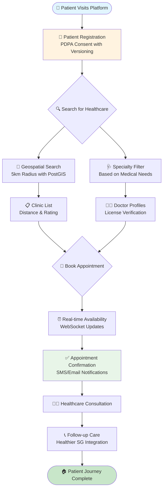
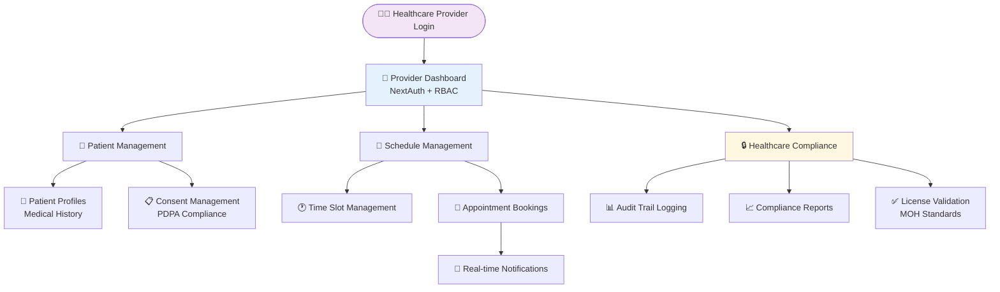
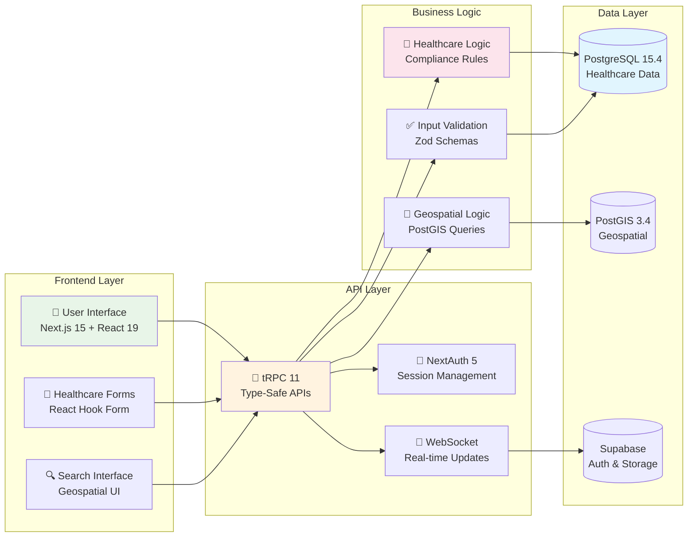
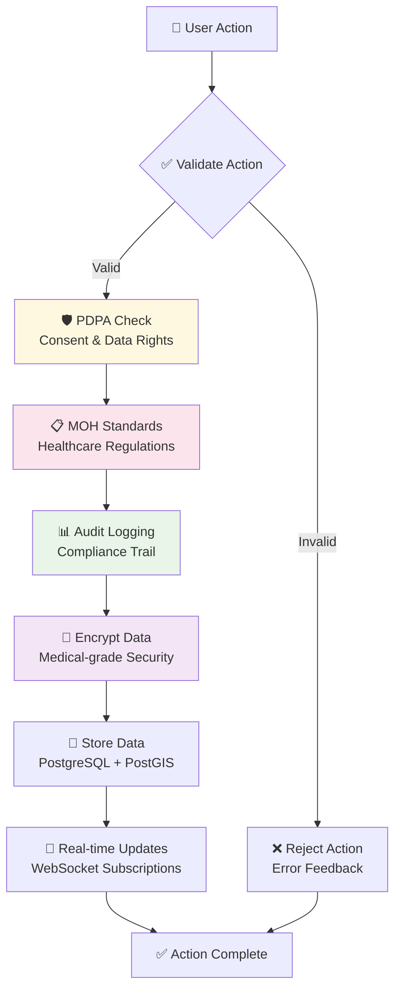

# User Interaction Flows

## Patient Journey Flow



## Healthcare Provider Dashboard Flow



## System Architecture Interaction



## Healthcare Compliance Flow



## Multi-language Support Flow

```mermaid
flowchart TD
    REQUEST[🌐 User Request] --> DETECT[🔍 Language Detection<br/>Browser + User Preference]
    
    DETECT --> LANG{Language Selection}
    
    LANG -->|English| EN[🇺🇸 English (100%)]
    LANG -->|Chinese| ZH[🇨🇳 Chinese (95%)]
    LANG -->|Malay| MS[🇲🇾 Malay (90%)]
    LANG -->|Tamil| TA[🇮🇳 Tamil (85%)]
    
    EN --> CONTENT[📄 Load Content<br/>Healthcare-specific]
    ZH --> CONTENT
    MS --> CONTENT
    TA --> CONTENT
    
    CONTENT --> DISPLAY[🖥️ Display Interface<br/>WCAG 2.2 AA Compliant]
    
    DISPLAY --> ACCESS[♿ Accessibility<br/>Screen Reader Support]
    ACCESS --> FEEDBACK[📱 User Feedback<br/>Multi-channel]
    
    style EN fill:#ffeb3b
    style ZH fill:#f44336
    style MS fill:#4caf50
    style TA fill:#ff9800
```

These flows demonstrate the comprehensive, compliant, and user-friendly nature of the Maria Family Clinic healthcare platform, designed specifically for Singapore's diverse healthcare ecosystem.
