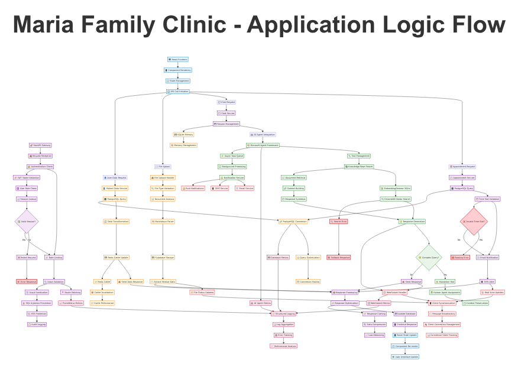

# Maria Family Clinic - Application Logic Flow

## 🎯 **Application Architecture Overview**

This comprehensive diagram illustrates the internal technical processing pipeline of the Maria Family Clinic healthcare platform, showing how requests flow through the system from frontend to backend, AI processing, database operations, and real-time communication.



## 🏗️ **System Architecture Layers**

### **🖥️ Frontend Layer (Light Blue)**
**Technology**: React 18.2.0 + TypeScript 5.0

#### **Component Rendering & State Management**
- **React Components**: Modular UI components with TypeScript type safety
- **State Management**: React Context API + Custom hooks for global state
- **State Persistence**: Local storage integration for user preferences
- **Component Lifecycle**: Efficient re-rendering with React.memo and useMemo

#### **API Call Initiation**
```typescript
// Example API call initiation
const handleAppointmentBooking = async (appointmentData) => {
  setLoading(true);
  try {
    const response = await appointmentService.create(appointmentData);
    updateAppointmentState(response.data);
  } catch (error) {
    handleBookingError(error);
  } finally {
    setLoading(false);
  }
};
```

### **🚀 Backend API Gateway (Purple)**
**Technology**: FastAPI + Python 3.12

#### **Request Processing Pipeline**
1. **Request Reception**: FastAPI router receives HTTP/WebSocket requests
2. **Authentication Check**: JWT token validation and user role verification
3. **Rate Limiting**: Protection against abuse with configurable limits
4. **Input Validation**: Pydantic schema validation for request/response
5. **Route Matching**: Dynamic routing to appropriate service handlers

#### **Authentication Flow**
```python
# FastAPI dependency for authentication
async def get_current_user(token: str = Depends(oauth2_scheme)):
    credentials_exception = HTTPException(
        status_code=status.HTTP_401_UNAUTHORIZED,
        detail="Could not validate credentials"
    )
    
    payload = jwt.decode(token, SECRET_KEY, algorithms=[ALGORITHM])
    user_id: str = payload.get("sub")
    
    user = await get_user_by_id(user_id)
    if user is None:
        raise credentials_exception
    
    return user
```

### **🧠 AI Agent Orchestration (Green)**
**Technology**: Microsoft Agent Framework + EmbeddingGemma-300m + ChromaDB

#### **AI Processing Pipeline**
1. **Framework Initialization**: Microsoft Agent Framework startup and tool loading
2. **Tool Management**: Dynamic loading of healthcare-specific tools
3. **Knowledge Base Search**: ChromaDB vector database semantic search
4. **Embedding Generation**: EmbeddingGemma-300m for text vectorization
5. **Response Generation**: Context-aware medical response creation

#### **RAG Implementation (Retrieval-Augmented Generation)**
```python
# RAG pipeline implementation
async def process_healthcare_query(query: str, context: dict):
    # 1. Generate query embedding
    query_embedding = await embedding_model.encode(query)
    
    # 2. Search knowledge base
    relevant_docs = await chroma_client.search(
        query_embeddings=[query_embedding],
        n_results=5
    )
    
    # 3. Build context
    context_text = " ".join([doc['text'] for doc in relevant_docs])
    
    # 4. Generate response
    response = await agent.generate_response(
        query=query,
        context=context_text,
        max_tokens=500
    )
    
    return response
```

### **🗄️ Database Operations (Yellow)**
**Technology**: PostgreSQL + SQLite + Redis + ChromaDB

#### **Multi-Database Architecture**
- **PostgreSQL**: Primary data persistence (patient records, appointments)
- **SQLite**: Development database and AI memory system
- **Redis**: High-performance caching and session management
- **ChromaDB**: Vector database for semantic search and RAG

#### **Database Coordination Flow**
```python
# Multi-database query coordination
async def get_patient_complete_data(patient_id: str):
    # 1. Check Redis cache first
    cached_data = await redis_client.get(f"patient:{patient_id}")
    if cached_data:
        return json.loads(cached_data)
    
    # 2. Query PostgreSQL for main data
    patient_data = await postgres_client.query(
        "SELECT * FROM patients WHERE id = ?", 
        [patient_id]
    )
    
    # 3. Query SQLite for conversation history
    conversation_history = await sqlite_client.query(
        "SELECT * FROM conversations WHERE patient_id = ?",
        [patient_id]
    )
    
    # 4. Combine and cache
    complete_data = {
        "patient": patient_data,
        "conversations": conversation_history
    }
    
    await redis_client.setex(
        f"patient:{patient_id}", 
        3600, 
        json.dumps(complete_data)
    )
    
    return complete_data
```

## 🔄 **Request Processing Flows**

### **📅 Appointment Booking Flow**

#### **Frontend Request Initiation**
```typescript
// React component for appointment booking
const AppointmentBooking: React.FC = () => {
  const [availableSlots, setAvailableSlots] = useState([]);
  
  const bookAppointment = async (slotId: string, formData: FormData) => {
    // 1. Validate form data
    // 2. Initiate booking request
    // 3. Handle response and updates
  };
};
```

#### **Backend Processing**
```python
# FastAPI endpoint for appointment booking
@app.post("/appointments/book")
async def book_appointment(
    booking_data: AppointmentBookingRequest,
    current_user: User = Depends(get_current_user)
):
    # 1. Validate time slot availability
    available = await validate_time_slot(
        booking_data.provider_id, 
        booking_data.datetime
    )
    
    if not available:
        raise HTTPException(400, "Time slot not available")
    
    # 2. Create appointment record
    appointment = await appointment_service.create({
        "patient_id": current_user.id,
        "provider_id": booking_data.provider_id,
        "datetime": booking_data.datetime,
        "notes": booking_data.notes
    })
    
    # 3. Send notifications
    await notification_service.send_appointment_confirmation(
        appointment_id=appointment.id,
        patient_email=current_user.email
    )
    
    return appointment
```

### **💬 AI Chat Processing Flow**

#### **Real-time Communication**
```typescript
// WebSocket connection for chat
const ChatInterface: React.FC = () => {
  const [messages, setMessages] = useState([]);
  const [isTyping, setIsTyping] = useState(false);
  
  const sendMessage = async (content: string) => {
    // 1. Add user message to UI
    const userMessage: Message = {
      id: Date.now(),
      content,
      sender: 'user',
      timestamp: new Date()
    };
    setMessages(prev => [...prev, userMessage]);
    
    // 2. Send to backend via WebSocket
    websocket.send(JSON.stringify({
      type: 'chat_message',
      content,
      session_id: chatSessionId
    }));
    
    // 3. Handle AI response
    setIsTyping(true);
  };
};
```

#### **AI Agent Processing**
```python
# FastAPI WebSocket endpoint for chat
@app.websocket("/ws/chat/{session_id}")
async def chat_websocket(websocket: WebSocket, session_id: str):
    await websocket.accept()
    
    try:
        while True:
            data = await websocket.receive_json()
            
            if data["type"] == "chat_message":
                # 1. Process message with AI agent
                response = await ai_agent.process_message(
                    message=data["content"],
                    session_id=session_id,
                    user_context=get_user_context(session_id)
                )
                
                # 2. Check for escalation
                if response.needs_escalation:
                    await escalate_to_human_agent(session_id, response)
                
                # 3. Send response back to user
                await websocket.send_json({
                    "type": "ai_response",
                    "content": response.content,
                    "sources": response.sources,
                    "escalated": response.needs_escalation
                })
                
    except WebSocketDisconnect:
        await cleanup_chat_session(session_id)
```

### **📄 File Upload & Processing**

#### **Document Processing Pipeline**
```python
# File upload and processing
@app.post("/files/upload")
async def upload_file(
    file: UploadFile = File(...),
    current_user: User = Depends(get_current_user)
):
    # 1. Validate file type and size
    if not validate_file_type(file.filename):
        raise HTTPException(400, "Unsupported file type")
    
    # 2. Upload to Supabase Storage
    file_url = await supabase_storage.upload(
        file_path=f"patient-documents/{current_user.id}/{file.filename}",
        file_content=await file.read()
    )
    
    # 3. Process document with Markitdown
    processed_content = await markitdown_parser.parse(
        file_url=file_url,
        file_type=file.content_type
    )
    
    # 4. Extract medical data
    medical_data = await extract_medical_information(
        processed_content
    )
    
    # 5. Store in patient profile
    await patient_service.update_medical_data(
        patient_id=current_user.id,
        medical_data=medical_data
    )
    
    return {
        "file_url": file_url,
        "extracted_data": medical_data,
        "status": "processed"
    }
```

## 🔌 **Real-time Communication Architecture**

### **WebSocket Implementation**
```python
# WebSocket connection management
class ConnectionManager:
    def __init__(self):
        self.active_connections: Dict[str, WebSocket] = {}
    
    async def connect(self, session_id: str, websocket: WebSocket):
        await websocket.accept()
        self.active_connections[session_id] = websocket
    
    def disconnect(self, session_id: str):
        self.active_connections.pop(session_id, None)
    
    async def send_message(self, session_id: str, message: dict):
        if session_id in self.active_connections:
            await self.active_connections[session_id].send_json(message)
    
    async def broadcast(self, message: dict):
        for connection in self.active_connections.values():
            await connection.send_json(message)

manager = ConnectionManager()

@app.websocket("/ws/updates")
async def websocket_endpoint(websocket: WebSocket):
    session_id = websocket.query_params.get("session_id")
    await manager.connect(session_id, websocket)
    
    try:
        while True:
            # Keep connection alive
            await websocket.receive_text()
    except WebSocketDisconnect:
        manager.disconnect(session_id)
```

## 📊 **Monitoring and Observability**

### **Prometheus Metrics Collection**
```python
# Metrics collection setup
from prometheus_client import Counter, Histogram, Gauge

# Define metrics
REQUEST_COUNT = Counter('http_requests_total', 'Total HTTP requests', ['method', 'endpoint'])
REQUEST_DURATION = Histogram('http_request_duration_seconds', 'HTTP request duration')
ACTIVE_SESSIONS = Gauge('active_sessions_total', 'Number of active sessions')
AI_RESPONSE_TIME = Histogram('ai_response_time_seconds', 'AI response processing time')

# Middleware for metrics collection
@app.middleware("http")
async def metrics_middleware(request: Request, call_next):
    start_time = time.time()
    
    response = await call_next(request)
    
    REQUEST_COUNT.labels(
        method=request.method,
        endpoint=request.url.path
    ).inc()
    
    REQUEST_DURATION.observe(time.time() - start_time)
    
    return response
```

### **Structured Logging**
```python
# Structured logging configuration
import structlog

logger = structlog.get_logger()

@app.post("/appointments/book")
async def book_appointment_endpoint(request: Request, appointment_data: AppointmentRequest):
    # Structured logging for audit trail
    logger.info(
        "appointment_booking_requested",
        user_id=request.state.user.id,
        provider_id=appointment_data.provider_id,
        requested_datetime=appointment_data.datetime,
        client_ip=request.client.host,
        user_agent=request.headers.get("user-agent")
    )
    
    try:
        result = await book_appointment(appointment_data)
        
        logger.info(
            "appointment_booking_success",
            appointment_id=result.id,
            user_id=request.state.user.id,
            processing_time_ms=result.processing_time
        )
        
        return result
        
    except Exception as e:
        logger.error(
            "appointment_booking_error",
            error=str(e),
            user_id=request.state.user.id,
            error_type=type(e).__name__
        )
        raise
```

## 🛡️ **Security and Performance**

### **Input Validation & Sanitization**
```python
# Pydantic schemas for validation
from pydantic import BaseModel, validator, Field
from typing import Optional
import re

class AppointmentBookingRequest(BaseModel):
    provider_id: str = Field(..., regex=r'^[a-zA-Z0-9-]+$')
    datetime: datetime = Field(..., description="Appointment date and time")
    notes: Optional[str] = Field(None, max_length=500)
    
    @validator('notes')
    def sanitize_notes(cls, v):
        if v:
            # Remove potential XSS vectors
            v = re.sub(r'<[^>]+>', '', v)
            # Remove SQL injection patterns
            v = re.sub(r'[\'";]', '', v)
        return v.strip()
    
    @validator('datetime')
    def validate_datetime(cls, v):
        if v < datetime.now():
            raise ValueError('Appointment datetime must be in the future')
        return v
```

### **Caching Strategy**
```python
# Redis caching implementation
import redis.asyncio as redis

class CacheService:
    def __init__(self):
        self.redis = redis.from_url("redis://localhost:6379")
    
    async def get_patient_data(self, patient_id: str):
        # Try cache first
        cached = await self.redis.get(f"patient:{patient_id}")
        if cached:
            return json.loads(cached)
        
        # Query database
        data = await self.database.get_patient(patient_id)
        
        # Cache for 1 hour
        await self.redis.setex(
            f"patient:{patient_id}", 
            3600, 
            json.dumps(data, default=str)
        )
        
        return data
    
    async def invalidate_patient_cache(self, patient_id: str):
        await self.redis.delete(f"patient:{patient_id}")
```

## 🔄 **Error Handling & Resilience**

### **Circuit Breaker Pattern**
```python
# Circuit breaker for external services
class CircuitBreaker:
    def __init__(self, failure_threshold=5, recovery_timeout=30):
        self.failure_threshold = failure_threshold
        self.recovery_timeout = recovery_timeout
        self.failure_count = 0
        self.last_failure_time = None
        self.state = 'CLOSED'  # CLOSED, OPEN, HALF_OPEN
    
    async def call(self, func, *args, **kwargs):
        if self.state == 'OPEN':
            if time.time() - self.last_failure_time > self.recovery_timeout:
                self.state = 'HALF_OPEN'
            else:
                raise Exception("Circuit breaker is OPEN")
        
        try:
            result = await func(*args, **kwargs)
            if self.state == 'HALF_OPEN':
                self.state = 'CLOSED'
                self.failure_count = 0
            return result
            
        except Exception as e:
            self.failure_count += 1
            self.last_failure_time = time.time()
            
            if self.failure_count >= self.failure_threshold:
                self.state = 'OPEN'
            
            raise e

# Usage with AI service
ai_circuit_breaker = CircuitBreaker()

@app.post("/chat/message")
async def process_chat_message(request: ChatMessageRequest):
    try:
        response = await ai_circuit_breaker.call(
            ai_agent.process_message,
            message=request.content,
            context=request.context
        )
        return response
        
    except Exception as e:
        # Fallback response when AI is unavailable
        return ChatResponse(
            content="I'm currently experiencing technical difficulties. Please try again later or contact our support team.",
            escalated=True
        )
```

## 📈 **Performance Optimization**

### **Database Connection Pooling**
```python
# PostgreSQL connection pool
from sqlalchemy.pool import QueuePool

engine = create_async_engine(
    DATABASE_URL,
    poolclass=QueuePool,
    pool_size=20,
    max_overflow=30,
    pool_pre_ping=True,
    pool_recycle=3600,
)

# Query optimization
@app.get("/appointments")
async def get_appointments(
    patient_id: str = Query(...),
    skip: int = Query(0, ge=0),
    limit: int = Query(100, ge=1, le=1000)
):
    # Use indexed columns and limit results
    query = select(Appointment).where(
        Appointment.patient_id == patient_id
    ).offset(skip).limit(limit)
    
    appointments = await session.execute(query)
    return appointments.scalars().all()
```

### **Response Compression**
```python
# Response compression middleware
from fastapi.middleware.gzip import GZipMiddleware

app.add_middleware(GZipMiddleware, minimum_size=1000)

# Response caching headers
@app.get("/patients/{patient_id}")
async def get_patient(patient_id: str):
    patient = await patient_service.get_patient(patient_id)
    
    return Response(
        content=patient.json(),
        media_type="application/json",
        headers={
            "Cache-Control": "public, max-age=300",  # 5 minutes
            "ETag": f'"{hash(patient.json())}"'
        }
    )
```

This comprehensive application logic flow demonstrates how the Maria Family Clinic platform handles complex healthcare operations with high performance, security, and reliability through modern microservices architecture, AI integration, and enterprise-grade monitoring capabilities.