# CI/CD Pipeline Monitoring and Integration

## Overview

This document outlines the comprehensive monitoring and alerting system integrated with the CI/CD pipeline for the My Family Clinic healthcare platform. The monitoring framework ensures real-time visibility into pipeline performance, deployment health, security posture, and healthcare compliance.

## Monitoring Architecture

### Comprehensive Monitoring Framework

```mermaid
graph TB
    A[CI/CD Pipeline] --> B[Pipeline Monitoring]
    A --> C[Application Monitoring]
    A --> D[Security Monitoring]
    A --> E[Compliance Monitoring]
    A --> F[Performance Monitoring]
    
    B --> G[Pipeline Metrics]
    B --> H[Deployment Success Rate]
    B --> I[Build Duration]
    B --> J[Test Coverage]
    
    C --> K[Health Checks]
    C --> L[API Response Times]
    C --> M[Error Rates]
    C --> N[Database Performance]
    
    D --> O[Vulnerability Scanning]
    D --> P[Security Incidents]
    D --> Q[Access Violations]
    D --> R[Audit Trail Analysis]
    
    E --> S[PDPA Compliance]
    E --> T[MOH Regulation Check]
    E --> U[Healthcare Data Validation]
    E --> V[Audit Trail Compliance]
    
    F --> W[Application Performance]
    F --> X[Database Performance]
    F --> Y[Infrastructure Metrics]
    F --> Z[User Experience Metrics]
    
    G --> AA[Alert Management]
    H --> AA
    I --> AA
    J --> AA
    K --> AA
    L --> AA
    M --> AA
    N --> AA
    O --> AA
    P --> AA
    Q --> AA
    R --> AA
    S --> AA
    T --> AA
    U --> AA
    V --> AA
    W --> AA
    X --> AA
    Y --> AA
    Z --> AA
```



## Pipeline Monitoring

### CI/CD Performance Metrics

```bash
#!/bin/bash
# scripts/cicd/monitoring-checks.sh

set -e

ENVIRONMENT=${1:-production}

echo "📊 Starting pipeline monitoring checks..."

# Color codes
RED='\033[0;31m'
GREEN='\033[0;32m'
YELLOW='\033[1;33m'
BLUE='\033[0;34m'
NC='\033[0m'

# Monitor pipeline health
monitor_pipeline_health() {
    echo -e "${BLUE}🏥 Checking pipeline health...${NC}"
    
    # Check if recent deployments are successful
    if [ -f "/tmp/last-deployment-status" ]; then
        LAST_STATUS=$(cat /tmp/last-deployment-status)
        if [ "$LAST_STATUS" = "success" ]; then
            echo -e "${GREEN}✅ Last deployment was successful${NC}"
        else
            echo -e "${RED}❌ Last deployment failed${NC}"
            return 1
        fi
    fi
    
    # Check pipeline execution time
    if [ -f "/tmp/pipeline-execution-time" ]; then
        EXEC_TIME=$(cat /tmp/pipeline-execution-time)
        echo -e "${BLUE}⏱️  Pipeline execution time: $EXEC_TIME seconds${NC}"
        
        # Alert if execution time is too long
        if [ "$EXEC_TIME" -gt 1800 ]; then  # 30 minutes
            echo -e "${YELLOW}⚠️  Pipeline execution time is high${NC}"
        fi
    fi
    
    # Check test success rate
    if [ -f "/tmp/test-success-rate" ]; then
        TEST_RATE=$(cat /tmp/test-success-rate)
        echo -e "${BLUE}🧪 Test success rate: $TEST_RATE%${NC}"
        
        if [ "$TEST_RATE" -lt 95 ]; then
            echo -e "${RED}❌ Test success rate is below threshold${NC}"
            return 1
        fi
    fi
    
    echo -e "${GREEN}✅ Pipeline health check passed${NC}"
}

# Monitor deployment performance
monitor_deployment_performance() {
    echo -e "${BLUE}🚀 Checking deployment performance...${NC}"
    
    # Check deployment frequency
    DEPLOY_COUNT=$(find /tmp/deployments -name "*.log" -mtime -7 2>/dev/null | wc -l)
    echo -e "${BLUE}📈 Deployments in last 7 days: $DEPLOY_COUNT${NC}"
    
    # Check mean time to recovery
    if [ -f "/tmp/incident-response-time" ]; then
        MTTR=$(cat /tmp/incident-response-time)
        echo -e "${BLUE}⏰ Mean time to recovery: $MTTR minutes${NC}"
        
        if [ "$MTTR" -gt 15 ]; then
            echo -e "${YELLOW}⚠️  MTTR is above target threshold${NC}"
        fi
    fi
    
    # Check deployment success rate
    if [ -f "/tmp/deployment-success-rate" ]; then
        SUCCESS_RATE=$(cat /tmp/deployment-success-rate)
        echo -e "${BLUE}✅ Deployment success rate: $SUCCESS_RATE%${NC}"
        
        if [ "$SUCCESS_RATE" -lt 98 ]; then
            echo -e "${RED}❌ Deployment success rate is below threshold${NC}"
            return 1
        fi
    fi
    
    echo -e "${GREEN}✅ Deployment performance check passed${NC}"
}

# Monitor code quality metrics
monitor_code_quality() {
    echo -e "${BLUE}📏 Checking code quality metrics...${NC}"
    
    # Check test coverage
    if [ -f "/tmp/test-coverage" ]; then
        COVERAGE=$(cat /tmp/test-coverage)
        echo -e "${BLUE}📊 Test coverage: $COVERAGE%${NC}"
        
        if (( $(echo "$COVERAGE < 85" | bc -l) )); then
            echo -e "${RED}❌ Test coverage is below threshold${NC}"
            return 1
        fi
    fi
    
    # Check code complexity
    if [ -f "/tmp/code-complexity" ]; then
        COMPLEXITY=$(cat /tmp/code-complexity)
        echo -e "${BLUE}🧮 Average code complexity: $COMPLEXITY${NC}"
        
        if [ "$COMPLEXITY" -gt 10 ]; then
            echo -e "${YELLOW}⚠️  Code complexity is above recommended threshold${NC}"
        fi
    fi
    
    # Check security score
    if [ -f "/tmp/security-score" ]; then
        SEC_SCORE=$(cat /tmp/security-score)
        echo -e "${BLUE}🔒 Security score: $SEC_SCORE/100${NC}"
        
        if [ "$SEC_SCORE" -lt 90 ]; then
            echo -e "${RED}❌ Security score is below threshold${NC}"
            return 1
        fi
    fi
    
    echo -e "${GREEN}✅ Code quality check passed${NC}"
}

# Execute monitoring functions
monitor_pipeline_health
monitor_deployment_performance
monitor_code_quality

echo -e "${GREEN}🎉 Pipeline monitoring completed successfully${NC}"
```

### Real-time Pipeline Alerts

```yaml
# .github/workflows/pipeline-monitoring.yml
name: Pipeline Monitoring & Alerting

on:
  schedule:
    - cron: '*/5 * * * *'  # Every 5 minutes
  workflow_dispatch:

jobs:
  pipeline-monitoring:
    name: Real-time Pipeline Monitoring
    runs-on: ubuntu-latest
    
    steps:
    - name: Checkout code
      uses: actions/checkout@v4

    - name: Comprehensive Pipeline Monitoring
      run: |
        echo "🔍 Running comprehensive pipeline monitoring..."
        
        # Monitor pipeline health
        ./scripts/cicd/monitoring-checks.sh production
        
        # Check for pipeline anomalies
        ./scripts/cicd/pipeline-anomaly-detection.sh
        
        # Monitor deployment health
        ./scripts/cicd/deployment-health-monitor.sh
        
        # Check for resource utilization
        ./scripts/cicd/resource-utilization-check.sh
        
        echo "✅ Monitoring completed"

    - name: Generate Monitoring Report
      if: always()
      run: |
        TIMESTAMP=$(date +"%Y-%m-%d %H:%M:%S")
        
        cat > pipeline-monitoring-report.md << EOF
        # Pipeline Monitoring Report
        **Generated:** $TIMESTAMP
        **Environment:** Production
        
        ## Pipeline Health Status
        - Pipeline Status: ${{ job.status }}
        - Deployment Success Rate: $(cat /tmp/deployment-success-rate 2>/dev/null || echo "N/A")%
        - Mean Time to Recovery: $(cat /tmp/incident-response-time 2>/dev/null || echo "N/A") minutes
        - Test Coverage: $(cat /tmp/test-coverage 2>/dev/null || echo "N/A")%
        
        ## Security Status
        - Security Score: $(cat /tmp/security-score 2>/dev/null || echo "N/A")/100
        - Vulnerabilities Found: $(cat /tmp/vulnerability-count 2>/dev/null || echo "0")
        - Last Security Scan: $(cat /tmp/last-security-scan 2>/dev/null || echo "N/A")
        
        ## Performance Metrics
        - Average Build Time: $(cat /tmp/avg-build-time 2>/dev/null || echo "N/A") seconds
        - API Response Time: $(cat /tmp/api-response-time 2>/dev/null || echo "N/A") ms
        - Error Rate: $(cat /tmp/error-rate 2>/dev/null || echo "0")%
        
        ## Compliance Status
        - PDPA Compliance: $(cat /tmp/pdpa-compliance 2>/dev/null || echo "Unknown")%
        - MOH Compliance: $(cat /tmp/moh-compliance 2>/dev/null || echo "Unknown")%
        - Audit Trail Status: $(cat /tmp/audit-status 2>/dev/null || echo "Unknown")
        
        ---
        *This report is automatically generated every 5 minutes*
        EOF

    - name: Upload Monitoring Report
      uses: actions/upload-artifact@v3
      if: always()
      with:
        name: pipeline-monitoring-report
        path: pipeline-monitoring-report.md

    - name: Critical Alert Check
      run: |
        # Check for critical conditions that require immediate alerts
        
        CRITICAL_CONDITIONS=()
        
        # Check deployment failure
        if [ ! -f "/tmp/deployment-success" ]; then
            CRITICAL_CONDITIONS+=("Deployment failure detected")
        fi
        
        # Check security score
        if [ -f "/tmp/security-score" ]; then
            SECURITY_SCORE=$(cat /tmp/security-score)
            if [ "$SECURITY_SCORE" -lt 70 ]; then
                CRITICAL_CONDITIONS+=("Critical security score: $SECURITY_SCORE")
            fi
        fi
        
        # Check error rate
        if [ -f "/tmp/error-rate" ]; then
            ERROR_RATE=$(cat /tmp/error-rate)
            if (( $(echo "$ERROR_RATE > 5" | bc -l) )); then
                CRITICAL_CONDITIONS+=("High error rate: $ERROR_RATE%")
            fi
        fi
        
        if [ ${#CRITICAL_CONDITIONS[@]} -gt 0 ]; then
            echo "Critical conditions detected:"
            printf '%s\n' "${CRITICAL_CONDITIONS[@]}"
            
            # Send critical alert
            ./scripts/cicd/send-critical-alert.sh
            exit 1
        fi

    - name: Performance Alert Check
      run: |
        # Check for performance degradation
        
        PERFORMANCE_ISSUES=()
        
        # Check build time
        if [ -f "/tmp/avg-build-time" ]; then
            BUILD_TIME=$(cat /tmp/avg-build-time)
            if [ "$BUILD_TIME" -gt 1200 ]; then  # 20 minutes
                PERFORMANCE_ISSUES+=("Build time degradation: $BUILD_TIME seconds")
            fi
        fi
        
        # Check response time
        if [ -f "/tmp/api-response-time" ]; then
            RESPONSE_TIME=$(cat /tmp/api-response-time)
            if [ "$RESPONSE_TIME" -gt 2000 ]; then  # 2 seconds
                PERFORMANCE_ISSUES+=("API response time degradation: $RESPONSE_TIME ms")
            fi
        fi
        
        if [ ${#PERFORMANCE_ISSUES[@]} -gt 0 ]; then
            echo "Performance issues detected:"
            printf '%s\n' "${PERFORMANCE_ISSUES[@]}"
            
            # Send performance alert
            ./scripts/cicd/send-performance-alert.sh
        fi
```

## Application Monitoring

### Health Check System

```bash
#!/bin/bash
# scripts/cicd/health-checks.sh

set -e

ENVIRONMENT=${1:-production}
APP_URL=${2:-$PRODUCTION_URL}

echo "🏥 Running health checks for $ENVIRONMENT environment..."

# Color codes
RED='\033[0;31m'
GREEN='\033[0;32m'
YELLOW='\033[1;33m'
BLUE='\033[0;34m'
NC='\033[0m'

# Check application availability
check_application_health() {
    echo -e "${BLUE}🌐 Checking application availability...${NC}"
    
    # Basic health endpoint check
    HTTP_STATUS=$(curl -s -o /dev/null -w "%{http_code}" "$APP_URL/health" || echo "000")
    
    if [ "$HTTP_STATUS" = "200" ]; then
        echo -e "${GREEN}✅ Application is responding${NC}"
    else
        echo -e "${RED}❌ Application health check failed (HTTP: $HTTP_STATUS)${NC}"
        return 1
    fi
    
    # Check response time
    RESPONSE_TIME=$(curl -s -o /dev/null -w "%{time_total}" "$APP_URL/health" || echo "999")
    echo -e "${BLUE}⏱️  Response time: ${RESPONSE_TIME}s${NC}"
    
    if (( $(echo "$RESPONSE_TIME > 3.0" | bc -l) )); then
        echo -e "${YELLOW}⚠️  Response time is slow${NC}"
    fi
}

# Check database connectivity
check_database_health() {
    echo -e "${BLUE}🗄️  Checking database connectivity...${NC}"
    
    # Use supabase CLI to check database health
    if command -v supabase &> /dev/null; then
        DB_STATUS=$(supabase db status --project-ref "$SUPABASE_PROJECT_ID" 2>/dev/null || echo "error")
        
        if [ "$DB_STATUS" != "error" ]; then
            echo -e "${GREEN}✅ Database is healthy${NC}"
        else
            echo -e "${RED}❌ Database health check failed${NC}"
            return 1
        fi
    else
        echo -e "${YELLOW}⚠️  Supabase CLI not available, skipping database check${NC}"
    fi
}

# Check API endpoints
check_api_health() {
    echo -e "${BLUE}🔌 Checking API endpoints...${NC}"
    
    # Check critical API endpoints
    API_ENDPOINTS=(
        "$APP_URL/api/health"
        "$APP_URL/api/auth/status"
        "$APP_URL/api/patients/status"
    )
    
    for endpoint in "${API_ENDPOINTS[@]}"; do
        HTTP_STATUS=$(curl -s -o /dev/null -w "%{http_code}" "$endpoint" || echo "000")
        
        if [ "$HTTP_STATUS" = "200" ]; then
            echo -e "${GREEN}✅ API endpoint healthy: $(basename "$endpoint")${NC}"
        else
            echo -e "${RED}❌ API endpoint failed: $(basename "$endpoint") (HTTP: $HTTP_STATUS)${NC}"
        fi
    done
}

# Check authentication system
check_authentication_health() {
    echo -e "${BLUE}🔐 Checking authentication system...${NC}"
    
    # Test authentication endpoints
    AUTH_STATUS=$(curl -s -o /dev/null -w "%{http_code}" "$APP_URL/api/auth/status" || echo "000")
    
    if [ "$AUTH_STATUS" = "200" ]; then
        echo -e "${GREEN}✅ Authentication system is healthy${NC}"
    else
        echo -e "${RED}❌ Authentication system health check failed${NC}"
        return 1
    fi
}

# Check healthcare-specific services
check_healthcare_services() {
    echo -e "${BLUE}🏥 Checking healthcare services...${NC}"
    
    # Check patient data service
    PATIENT_SERVICE=$(curl -s -o /dev/null -w "%{http_code}" "$APP_URL/api/patients/status" || echo "000")
    
    if [ "$PATIENT_SERVICE" = "200" ]; then
        echo -e "${GREEN}✅ Patient data service is healthy${NC}"
    else
        echo -e "${RED}❌ Patient data service health check failed${NC}"
        return 1
    fi
    
    # Check medical records service
    MEDICAL_SERVICE=$(curl -s -o /dev/null -w "%{http_code}" "$APP_URL/api/medical-records/status" || echo "000")
    
    if [ "$MEDICAL_SERVICE" = "200" ]; then
        echo -e "${GREEN}✅ Medical records service is healthy${NC}"
    else
        echo -e "${RED}❌ Medical records service health check failed${NC}"
        return 1
    fi
    
    # Check audit service
    AUDIT_SERVICE=$(curl -s -o /dev/null -w "%{http_code}" "$APP_URL/api/audit/status" || echo "000")
    
    if [ "$AUDIT_SERVICE" = "200" ]; then
        echo -e "${GREEN}✅ Audit service is healthy${NC}"
    else
        echo -e "${YELLOW}⚠️  Audit service health check failed${NC}"
    fi
}

# Check security endpoints
check_security_endpoints() {
    echo -e "${BLUE}🛡️  Checking security endpoints...${NC}"
    
    # Check security headers
    SECURITY_HEADERS=$(curl -s -I "$APP_URL" | grep -E "(X-Frame-Options|X-Content-Type-Options|X-XSS-Protection|Strict-Transport-Security)" | wc -l)
    
    if [ "$SECURITY_HEADERS" -ge 3 ]; then
        echo -e "${GREEN}✅ Security headers are properly configured${NC}"
    else
        echo -e "${YELLOW}⚠️  Some security headers are missing${NC}"
    fi
    
    # Check HTTPS enforcement
    HTTP_REDIRECT=$(curl -s -I "http://$(echo $APP_URL | sed 's|https://||')" | grep -i "location: https" | wc -l)
    
    if [ "$HTTP_REDIRECT" -gt 0 ]; then
        echo -e "${GREEN}✅ HTTPS enforcement is working${NC}"
    else
        echo -e "${RED}❌ HTTPS enforcement not working${NC}"
        return 1
    fi
}

# Execute all health checks
check_application_health
check_database_health
check_api_health
check_authentication_health
check_healthcare_services
check_security_endpoints

echo -e "${GREEN}🎉 All health checks completed successfully${NC}"
```

### Performance Monitoring

```bash
#!/bin/bash
# scripts/cicd/performance-monitoring.sh

set -e

ENVIRONMENT=${1:-production}
APP_URL=${2:-$PRODUCTION_URL}

echo "⚡ Starting performance monitoring for $ENVIRONMENT..."

# Color codes
RED='\033[0;31m'
GREEN='\033[0;32m'
YELLOW='\033[1;33m'
BLUE='\033[0;34m'
NC='\033[0m'

# Monitor page load performance
monitor_page_performance() {
    echo -e "${BLUE}📄 Monitoring page load performance...${NC}"
    
    # Use curl to measure various performance metrics
    TIMING_DATA=$(curl -w "
    time_namelookup: %{time_namelookup}\n
    time_connect: %{time_connect}\n
    time_appconnect: %{time_appconnect}\n
    time_pretransfer: %{time_pretransfer}\n
    time_redirect: %{time_redirect}\n
    time_starttransfer: %{time_starttransfer}\n
    time_total: %{time_total}\n
    speed_download: %{speed_download}\n
    size_download: %{size_download}\n" -s -o /dev/null "$APP_URL")
    
    echo "$TIMING_DATA" | while IFS= read -r line; do
        echo "  $line"
    done
    
    # Parse timing data
    TOTAL_TIME=$(echo "$TIMING_DATA" | grep "time_total:" | awk '{print $2}')
    NAMELOOKUP_TIME=$(echo "$TIMING_DATA" | grep "time_namelookup:" | awk '{print $2}')
    CONNECT_TIME=$(echo "$TIMING_DATA" | grep "time_connect:" | awk '{print $2}')
    TRANSFER_TIME=$(echo "$TIMING_DATA" | grep "time_starttransfer:" | awk '{print $2}')
    
    echo -e "${BLUE}📊 Performance Metrics:${NC}"
    echo "  Total time: ${TOTAL_TIME}s"
    echo "  DNS lookup: ${NAMELOOKUP_TIME}s"
    echo "  Connection: ${CONNECT_TIME}s"
    echo "  Transfer start: ${TRANSFER_TIME}s"
    
    # Performance thresholds
    if (( $(echo "$TOTAL_TIME > 3.0" | bc -l) )); then
        echo -e "${YELLOW}⚠️  Page load time is slow${NC}"
    else
        echo -e "${GREEN}✅ Page load time is acceptable${NC}"
    fi
    
    if (( $(echo "$NAMELOOKUP_TIME > 0.5" | bc -l) )); then
        echo -e "${YELLOW}⚠️  DNS lookup time is slow${NC}"
    fi
    
    if (( $(echo "$CONNECT_TIME > 1.0" | bc -l) )); then
        echo -e "${YELLOW}⚠️  Connection time is slow${NC}"
    fi
    
    # Store metrics for trending
    echo "$TOTAL_TIME" > /tmp/page-load-time
    echo "$NAMELOOKUP_TIME" > /tmp/dns-lookup-time
    echo "$CONNECT_TIME" > /tmp/connection-time
}

# Monitor API performance
monitor_api_performance() {
    echo -e "${BLUE}🔌 Monitoring API performance...${NC}"
    
    API_ENDPOINTS=(
        "$APP_URL/api/health"
        "$APP_URL/api/auth/status"
        "$APP_URL/api/patients/status"
    )
    
    for endpoint in "${API_ENDPOINTS[@]}"; do
        endpoint_name=$(basename "$endpoint")
        
        # Measure API response time
        RESPONSE_TIME=$(curl -w "%{time_total}" -s -o /dev/null "$endpoint")
        
        echo -e "${BLUE}  $endpoint_name: ${RESPONSE_TIME}s${NC}"
        
        # Check against thresholds
        if (( $(echo "$RESPONSE_TIME > 2.0" | bc -l) )); then
            echo -e "${YELLOW}    ⚠️  Slow response time${NC}"
        else
            echo -e "${GREEN}    ✅ Response time acceptable${NC}"
        fi
        
        # Store API performance metrics
        echo "$RESPONSE_TIME" > "/tmp/api-response-time-$endpoint_name"
    done
}

# Monitor database performance
monitor_database_performance() {
    echo -e "${BLUE}🗄️  Monitoring database performance...${NC}"
    
    # Use supabase CLI to get database metrics
    if command -v supabase &> /dev/null; then
        DB_METRICS=$(supabase db metrics --project-ref "$SUPABASE_PROJECT_ID" 2>/dev/null || echo "")
        
        if [ -n "$DB_METRICS" ]; then
            echo "Database metrics retrieved"
            # Parse and display database metrics
            echo "$DB_METRICS" | while IFS= read -r line; do
                echo "  $line"
            done
        else
            echo -e "${YELLOW}⚠️  Database metrics not available${NC}"
        fi
    else
        echo -e "${YELLOW}⚠️  Supabase CLI not available${NC}"
    fi
}

# Monitor resource utilization
monitor_resource_utilization() {
    echo -e "${BLUE}💻 Monitoring resource utilization...${NC}"
    
    # Check memory usage (if available)
    if command -v free &> /dev/null; then
        MEMORY_INFO=$(free -h)
        echo "Memory usage:"
        echo "$MEMORY_INFO" | head -2
    fi
    
    # Check disk usage
    if command -v df &> /dev/null; then
        DISK_INFO=$(df -h / | tail -1)
        DISK_USAGE=$(echo "$DISK_INFO" | awk '{print $5}' | sed 's/%//')
        
        echo "Disk usage: $DISK_USAGE%"
        
        if [ "$DISK_USAGE" -gt 80 ]; then
            echo -e "${YELLOW}⚠️  Disk usage is high${NC}"
        else
            echo -e "${GREEN}✅ Disk usage is acceptable${NC}"
        fi
    fi
    
    # Check CPU usage (if available)
    if command -v top &> /dev/null; then
        CPU_USAGE=$(top -bn1 | grep "Cpu(s)" | awk '{print $2}' | sed 's/%us,//')
        echo "CPU usage: $CPU_USAGE"
        
        CPU_NUM=$(echo "$CPU_USAGE" | cut -d'.' -f1)
        if [ "$CPU_NUM" -gt 80 ]; then
            echo -e "${YELLOW}⚠️  CPU usage is high${NC}"
        else
            echo -e "${GREEN}✅ CPU usage is acceptable${NC}"
        fi
    fi
}

# Execute performance monitoring
monitor_page_performance
monitor_api_performance
monitor_database_performance
monitor_resource_utilization

echo -e "${GREEN}🎉 Performance monitoring completed${NC}"
```

## Security Monitoring

### Continuous Security Validation

```bash
#!/bin/bash
# scripts/cicd/security-monitoring.sh

set -e

ENVIRONMENT=${1:-production}

echo "🔒 Starting security monitoring for $ENVIRONMENT..."

# Color codes
RED='\033[0;31m'
GREEN='\033[0;32m'
YELLOW='\033[1;33m'
BLUE='\033[0;34m'
NC='\033[0m'

# Monitor security vulnerabilities
monitor_vulnerabilities() {
    echo -e "${BLUE}🔍 Monitoring security vulnerabilities...${NC}"
    
    # Check for new vulnerabilities
    if [ -f "/tmp/security-scan-results" ]; then
        TOTAL_VULNS=$(cat /tmp/security-scan-results | jq '.results | length' 2>/dev/null || echo "0")
        HIGH_VULNS=$(cat /tmp/security-scan-results | jq '[.results[] | select(.severity == "HIGH")] | length' 2>/dev/null || echo "0")
        MEDIUM_VULNS=$(cat /tmp/security-scan-results | jq '[.results[] | select(.severity == "MEDIUM")] | length' 2>/dev/null || echo "0")
        
        echo -e "${BLUE}📊 Vulnerability Summary:${NC}"
        echo "  Total vulnerabilities: $TOTAL_VULNS"
        echo "  High severity: $HIGH_VULNS"
        echo "  Medium severity: $MEDIUM_VULNS"
        
        # Alert on high severity vulnerabilities
        if [ "$HIGH_VULNS" -gt 0 ]; then
            echo -e "${RED}❌ High severity vulnerabilities detected${NC}"
            return 1
        fi
        
        if [ "$MEDIUM_VULNS" -gt 5 ]; then
            echo -e "${YELLOW}⚠️  Multiple medium severity vulnerabilities${NC}"
        fi
    else
        echo -e "${YELLOW}⚠️  No security scan results available${NC}"
    fi
}

# Monitor access violations
monitor_access_violations() {
    echo -e "${BLUE}🚪 Monitoring access violations...${NC}"
    
    # Check audit logs for suspicious access patterns
    if [ -f "/tmp/audit-logs" ]; then
        # Count unauthorized access attempts
        UNAUTHORIZED_COUNT=$(grep -c "UNAUTHORIZED\|FORBIDDEN" /tmp/audit-logs 2>/dev/null || echo "0")
        
        # Count failed authentication attempts
        FAILED_AUTH_COUNT=$(grep -c "AUTHENTICATION_FAILED" /tmp/audit-logs 2>/dev/null || echo "0")
        
        echo -e "${BLUE}📊 Access Violation Summary:${NC}"
        echo "  Unauthorized access attempts: $UNAUTHORIZED_COUNT"
        echo "  Failed authentication attempts: $FAILED_AUTH_COUNT"
        
        # Alert thresholds
        if [ "$UNAUTHORIZED_COUNT" -gt 10 ]; then
            echo -e "${RED}❌ High number of unauthorized access attempts${NC}"
        fi
        
        if [ "$FAILED_AUTH_COUNT" -gt 50 ]; then
            echo -e "${RED}❌ High number of failed authentication attempts${NC}"
        fi
    else
        echo -e "${YELLOW}⚠️  Audit logs not available${NC}"
    fi
}

# Monitor security configuration
monitor_security_configuration() {
    echo -e "${BLUE}⚙️  Monitoring security configuration...${NC}"
    
    # Check SSL/TLS configuration
    SSL_GRADE=$(curl -s "https://api.ssllabs.com/api/v3/analyze?host=$(echo $PRODUCTION_URL | sed 's|https://||')&publish=off" | jq -r '.endpoints[0].grade' 2>/dev/null || echo "Unknown")
    
    echo "SSL Labs Grade: $SSL_GRADE"
    
    if [ "$SSL_GRADE" = "A" ] || [ "$SSL_GRADE" = "A+" ]; then
        echo -e "${GREEN}✅ SSL configuration is excellent${NC}"
    elif [ "$SSL_GRADE" = "B" ]; then
        echo -e "${GREEN}✅ SSL configuration is good${NC}"
    elif [ "$SSL_GRADE" = "C" ] || [ "$SSL_GRADE" = "D" ] || [ "$SSL_GRADE" = "F" ]; then
        echo -e "${RED}❌ SSL configuration needs improvement${NC}"
    else
        echo -e "${YELLOW}⚠️  SSL configuration status unknown${NC}"
    fi
    
    # Check security headers
    SECURITY_HEADERS_SCORE=0
    
    # Check for essential security headers
    HEADERS_TO_CHECK=(
        "Strict-Transport-Security"
        "X-Content-Type-Options"
        "X-Frame-Options"
        "X-XSS-Protection"
        "Content-Security-Policy"
    )
    
    for header in "${HEADERS_TO_CHECK[@]}"; do
        if curl -s -I "$PRODUCTION_URL" | grep -q "$header"; then
            ((SECURITY_HEADERS_SCORE++))
        fi
    done
    
    echo "Security headers score: $SECURITY_HEADERS_SCORE/${#HEADERS_TO_CHECK[@]}"
    
    if [ $SECURITY_HEADERS_SCORE -eq ${#HEADERS_TO_CHECK[@]} ]; then
        echo -e "${GREEN}✅ All security headers are present${NC}"
    elif [ $SECURITY_HEADERS_SCORE -gt 3 ]; then
        echo -e "${YELLOW}⚠️  Most security headers are present${NC}"
    else
        echo -e "${RED}❌ Missing critical security headers${NC}"
    fi
}

# Monitor healthcare-specific security
monitor_healthcare_security() {
    echo -e "${BLUE}🏥 Monitoring healthcare-specific security...${NC}"
    
    # Check patient data access patterns
    if [ -f "/tmp/patient-access-logs" ]; then
        # Monitor for unusual access patterns
        AFTER_HOURS_ACCESS=$(grep -c "AFTER_HOURS" /tmp/patient-access-logs 2>/dev/null || echo "0")
        BULK_ACCESS=$(grep -c "BULK_ACCESS" /tmp/patient-access-logs 2>/dev/null || echo "0")
        
        echo -e "${BLUE}📊 Healthcare Security Summary:${NC}"
        echo "  After-hours patient access: $AFTER_HOURS_ACCESS"
        echo "  Bulk patient data access: $BULK_ACCESS"
        
        # Alert on suspicious patterns
        if [ "$AFTER_HOURS_ACCESS" -gt 5 ]; then
            echo -e "${YELLOW}⚠️  Unusual after-hours access detected${NC}"
        fi
        
        if [ "$BULK_ACCESS" -gt 3 ]; then
            echo -e "${YELLOW}⚠️  Bulk data access patterns detected${NC}"
        fi
    else
        echo -e "${YELLOW}⚠️  Healthcare access logs not available${NC}"
    fi
    
    # Check encryption status
    ENCRYPTION_STATUS=$(grep -c "ENCRYPTED\|encrypted" /tmp/data-status 2>/dev/null || echo "0")
    echo "Encryption status: $ENCRYPTION_STATUS records encrypted"
    
    if [ "$ENCRYPTION_STATUS" -eq 0 ]; then
        echo -e "${RED}❌ No encryption status information available${NC}"
    else
        echo -e "${GREEN}✅ Data encryption status verified${NC}"
    fi
}

# Execute security monitoring
monitor_vulnerabilities
monitor_access_violations
monitor_security_configuration
monitor_healthcare_security

echo -e "${GREEN}🎉 Security monitoring completed${NC}"
```

### Automated Incident Response

```bash
#!/bin/bash
# scripts/cicd/incident-response.sh

set -e

INCIDENT_TYPE=${1:-security}
SEVERITY=${2:-medium}

echo "🚨 Initiating incident response for: $INCIDENT_TYPE (Severity: $SEVERITY)"

# Immediate containment measures
immediate_containment() {
    echo "🔒 Executing immediate containment measures..."
    
    case $INCIDENT_TYPE in
        "security")
            echo "  - Enabling enhanced monitoring"
            echo "  - Restricting access to sensitive areas"
            echo "  - Activating incident response team"
            ;;
        "performance")
            echo "  - Scaling up resources"
            echo "  - Enabling performance optimization mode"
            ;;
        "availability")
            echo "  - Activating failover systems"
            echo "  - Enabling backup services"
            ;;
    esac
}

# Notification procedures
send_notifications() {
    echo "📢 Sending incident notifications..."
    
    # Slack notification
    SLACK_PAYLOAD=$(cat << EOF
    {
        "text": "🚨 Healthcare Platform Incident",
        "attachments": [
            {
                "color": "danger",
                "fields": [
                    {
                        "title": "Incident Type",
                        "value": "$INCIDENT_TYPE",
                        "short": true
                    },
                    {
                        "title": "Severity",
                        "value": "$SEVERITY",
                        "short": true
                    },
                    {
                        "title": "Timestamp",
                        "value": "$(date -u +"%Y-%m-%d %H:%M:%S UTC")",
                        "short": true
                    },
                    {
                        "title": "Environment",
                        "value": "production",
                        "short": true
                    }
                ]
            }
        ]
    }
    EOF
    )
    
    # Send to Slack (if webhook is configured)
    if [ -n "$SLACK_WEBHOOK" ]; then
        curl -X POST -H 'Content-type: application/json' \
            --data "$SLACK_PAYLOAD" \
            "$SLACK_WEBHOOK"
    fi
    
    # Email notification (if configured)
    if [ -n "$ALERT_EMAIL" ]; then
        echo "Incident: $INCIDENT_TYPE" | mail -s "Healthcare Platform Alert" "$ALERT_EMAIL"
    fi
}

# Execute incident response
immediate_containment
send_notifications

echo "✅ Incident response procedures initiated"
```

## Compliance Monitoring

### Real-time Compliance Validation

```bash
#!/bin/bash
# scripts/cicd/compliance-monitoring.sh

set -e

ENVIRONMENT=${1:-production}

echo "📋 Starting compliance monitoring for $ENVIRONMENT..."

# Color codes
RED='\033[0;31m'
GREEN='\033[0;32m'
YELLOW='\033[1;33m'
BLUE='\033[0;34m'
NC='\033[0m'

# Monitor PDPA compliance
monitor_pdpa_compliance() {
    echo -e "${BLUE}🔒 Monitoring PDPA compliance...${NC}"
    
    # Check for new personal data without consent
    UNCONSENTED_DATA=$(grep -c "UNCONSENTED\|no_consent" /tmp/data-access-logs 2>/dev/null || echo "0")
    
    if [ "$UNCONSENTED_DATA" -gt 0 ]; then
        echo -e "${RED}❌ Personal data access without consent detected${NC}"
        return 1
    fi
    
    # Check data retention compliance
    EXPIRED_DATA=$(grep -c "EXPIRED_RETENTION" /tmp/data-logs 2>/dev/null || echo "0")
    
    if [ "$EXPIRED_DATA" -gt 0 ]; then
        echo -e "${YELLOW}⚠️  Data retention policy violations detected${NC}"
    fi
    
    echo -e "${GREEN}✅ PDPA compliance monitoring passed${NC}"
}

# Monitor MOH regulation compliance
monitor_moh_compliance() {
    echo -e "${BLUE}🏥 Monitoring MOH regulation compliance...${NC}"
    
    # Check medical record standards compliance
    NON_COMPLIANT_RECORDS=$(grep -c "NON_COMPLIANT_STANDARD" /tmp/medical-records 2>/dev/null || echo "0")
    
    if [ "$NON_COMPLIANT_RECORDS" -gt 0 ]; then
        echo -e "${RED}❌ Non-compliant medical records detected${NC}"
        return 1
    fi
    
    # Check healthcare provider verification
    UNVERIFIED_PROVIDERS=$(grep -c "UNVERIFIED_PROVIDER" /tmp/provider-logs 2>/dev/null || echo "0")
    
    if [ "$UNVERIFIED_PROVIDERS" -gt 0 ]; then
        echo -e "${YELLOW}⚠️  Unverified healthcare providers detected${NC}"
    fi
    
    echo -e "${GREEN}✅ MOH compliance monitoring passed${NC}"
}

# Monitor audit trail compliance
monitor_audit_compliance() {
    echo -e "${BLUE}📋 Monitoring audit trail compliance...${NC}"
    
    # Check for missing audit logs
    MISSING_AUDIT_LOGS=$(grep -c "MISSING_AUDIT_LOG" /tmp/audit-check 2>/dev/null || echo "0")
    
    if [ "$MISSING_AUDIT_LOGS" -gt 0 ]; then
        echo -e "${RED}❌ Missing audit logs detected${NC}"
        return 1
    fi
    
    # Check audit log integrity
    TAMPERED_LOGS=$(grep -c "AUDIT_LOG_TAMPERED" /tmp/audit-integrity 2>/dev/null || echo "0")
    
    if [ "$TAMPERED_LOGS" -gt 0 ]; then
        echo -e "${RED}❌ Tampered audit logs detected${NC}"
        return 1
    fi
    
    echo -e "${GREEN}✅ Audit trail compliance monitoring passed${NC}"
}

# Execute compliance monitoring
monitor_pdpa_compliance
monitor_moh_compliance
monitor_audit_compliance

echo -e "${GREEN}🎉 Compliance monitoring completed${NC}"
```

## Alert Management System

### Multi-Channel Alerting

```yaml
# .github/workflows/alert-management.yml
name: Alert Management System

on:
  schedule:
    - cron: '*/5 * * * *'  # Every 5 minutes
    - cron: '0 */4 * * *'  # Every 4 hours
    - cron: '0 9 * * 1'    # Weekly report on Monday 9 AM
  workflow_dispatch:

jobs:
  alert-management:
    name: Multi-Channel Alert Management
    runs-on: ubuntu-latest
    
    steps:
    - name: Checkout code
      uses: actions/checkout@v4

    - name: Check Alert Conditions
      run: |
        echo "🔍 Checking alert conditions..."
        
        # Critical alerts (immediate response required)
        ./scripts/cicd/check-critical-alerts.sh
        
        # Warning alerts (monitor closely)
        ./scripts/cicd/check-warning-alerts.sh
        
        # Info alerts (informational)
        ./scripts/cicd/check-info-alerts.sh

    - name: Generate Alert Summary
      if: always()
      run: |
        TIMESTAMP=$(date +"%Y-%m-%d %H:%M:%S")
        
        cat > alert-summary.md << EOF
        # Healthcare Platform Alert Summary
        **Generated:** $TIMESTAMP
        
        ## Alert Status
        - Critical Alerts: $(cat /tmp/critical-alert-count 2>/dev/null || echo "0")
        - Warning Alerts: $(cat /tmp/warning-alert-count 2>/dev/null || echo "0")
        - Info Alerts: $(cat /tmp/info-alert-count 2>/dev/null || echo "0")
        
        ## System Status
        - Pipeline Status: ${{ job.status }}
        - Application Health: $(cat /tmp/app-health-status 2>/dev/null || echo "Unknown")
        - Security Status: $(cat /tmp/security-status 2>/dev/null || echo "Unknown")
        - Compliance Status: $(cat /tmp/compliance-status 2>/dev/null || echo "Unknown")
        
        ## Recent Alerts
        $(cat /tmp/recent-alerts 2>/dev/null || echo "No recent alerts")
        
        ---
        *This summary is automatically generated*
        EOF

    - name: Send Critical Alerts
      if: $(cat /tmp/critical-alert-count 2>/dev/null || echo "0") -gt 0
      uses: 8398a7/action-slack@v3
      with:
        status: custom
        custom_payload: |
          {
            "text": "🚨 CRITICAL ALERT - Healthcare Platform",
            "attachments": [
              {
                "color": "danger",
                "fields": [
                  {
                    "title": "Critical Issues",
                    "value": "$(cat /tmp/critical-alert-count 2>/dev/null || echo '0')",
                    "short": true
                  },
                  {
                    "title": "Environment",
                    "value": "Production",
                    "short": true
                  }
                ]
              }
            ]
          }
        channel: '#healthcare-alerts'
        webhook_url: ${{ secrets.SLACK_WEBHOOK }}

    - name: Send Daily Summary
      if: github.event_name == 'schedule' && github.event.schedule == '0 9 * * 1'
      uses: 8398a7/action-slack@v3
      with:
        status: custom
        custom_payload: |
          {
            "text": "📊 Weekly Healthcare Platform Status Report",
            "attachments": [
              {
                "color": "good",
                "fields": [
                  {
                    "title": "Report Period",
                    "value": "Last 7 days",
                    "short": true
                  },
                  {
                    "title": "Total Alerts",
                    "value": "$(cat /tmp/weekly-alert-count 2>/dev/null || echo '0')",
                    "short": true
                  }
                ]
              }
            ]
          }
        channel: '#healthcare-reports'
        webhook_url: ${{ secrets.SLACK_WEBHOOK }}
```

## Dashboard Integration

### Real-time Monitoring Dashboard

```html
<!-- monitoring-dashboard.html -->
<!DOCTYPE html>
<html lang="en">
<head>
    <meta charset="UTF-8">
    <meta name="viewport" content="width=device-width, initial-scale=1.0">
    <title>Healthcare Platform Monitoring Dashboard</title>
    <script src="https://cdn.jsdelivr.net/npm/chart.js"></script>
    <style>
        body { font-family: Arial, sans-serif; margin: 20px; background-color: #f5f5f5; }
        .dashboard { display: grid; grid-template-columns: repeat(auto-fit, minmax(300px, 1fr)); gap: 20px; }
        .card { background: white; border-radius: 8px; padding: 20px; box-shadow: 0 2px 4px rgba(0,0,0,0.1); }
        .metric { display: flex; justify-content: space-between; align-items: center; margin: 10px 0; }
        .status-good { color: #28a745; }
        .status-warning { color: #ffc107; }
        .status-critical { color: #dc3545; }
        .alert-box { padding: 10px; margin: 10px 0; border-radius: 4px; }
        .alert-critical { background-color: #f8d7da; border: 1px solid #f5c6cb; }
        .alert-warning { background-color: #fff3cd; border: 1px solid #ffeaa7; }
        .alert-info { background-color: #d1ecf1; border: 1px solid #bee5eb; }
    </style>
</head>
<body>
    <h1>🏥 Healthcare Platform Monitoring Dashboard</h1>
    
    <div class="dashboard">
        <!-- Pipeline Status -->
        <div class="card">
            <h3>📊 Pipeline Status</h3>
            <div class="metric">
                <span>Deployment Success Rate</span>
                <span id="deployment-rate" class="status-good">98.5%</span>
            </div>
            <div class="metric">
                <span>Mean Time to Recovery</span>
                <span id="mttr">12 min</span>
            </div>
            <div class="metric">
                <span>Build Duration</span>
                <span id="build-duration">14.2 min</span>
            </div>
        </div>

        <!-- Application Health -->
        <div class="card">
            <h3>🏥 Application Health</h3>
            <div class="metric">
                <span>Response Time</span>
                <span id="response-time" class="status-good">1.2s</span>
            </div>
            <div class="metric">
                <span>Error Rate</span>
                <span id="error-rate" class="status-good">0.1%</span>
            </div>
            <div class="metric">
                <span>Availability</span>
                <span id="availability" class="status-good">99.9%</span>
            </div>
        </div>

        <!-- Security Status -->
        <div class="card">
            <h3>🔒 Security Status</h3>
            <div class="metric">
                <span>Security Score</span>
                <span id="security-score" class="status-good">95/100</span>
            </div>
            <div class="metric">
                <span>Vulnerabilities</span>
                <span id="vulnerabilities" class="status-good">0 High, 2 Medium</span>
            </div>
            <div class="metric">
                <span>SSL Grade</span>
                <span id="ssl-grade" class="status-good">A+</span>
            </div>
        </div>

        <!-- Compliance Status -->
        <div class="card">
            <h3>📋 Compliance Status</h3>
            <div class="metric">
                <span>PDPA Compliance</span>
                <span id="pdpa-compliance" class="status-good">100%</span>
            </div>
            <div class="metric">
                <span>MOH Compliance</span>
                <span id="moh-compliance" class="status-good">100%</span>
            </div>
            <div class="metric">
                <span>Audit Coverage</span>
                <span id="audit-coverage" class="status-good">100%</span>
            </div>
        </div>
    </div>

    <!-- Recent Alerts -->
    <div class="card" style="margin-top: 20px;">
        <h3>🚨 Recent Alerts</h3>
        <div id="alerts-container">
            <div class="alert-box alert-info">
                <strong>Info:</strong> System health check completed successfully
            </div>
        </div>
    </div>

    <script>
        // Real-time updates (example implementation)
        function updateMetrics() {
            // This would connect to your monitoring API
            fetch('/api/monitoring/metrics')
                .then(response => response.json())
                .then(data => {
                    document.getElementById('deployment-rate').textContent = data.deploymentSuccessRate + '%';
                    document.getElementById('response-time').textContent = data.responseTime + 's';
                    document.getElementById('security-score').textContent = data.securityScore + '/100';
                });
        }

        // Update metrics every 30 seconds
        setInterval(updateMetrics, 30000);
        
        // Initial load
        updateMetrics();
    </script>
</body>
</html>
```

## Implementation Checklist

### Monitoring Infrastructure Setup
- [ ] Configure monitoring endpoints in application
- [ ] Set up metrics collection system
- [ ] Configure log aggregation system
- [ ] Set up alerting rules and thresholds
- [ ] Configure notification channels (Slack, email)
- [ ] Set up monitoring dashboard

### Security Monitoring Setup
- [ ] Configure vulnerability scanning
- [ ] Set up security log analysis
- [ ] Configure intrusion detection
- [ ] Set up audit log monitoring
- [ ] Configure incident response procedures
- [ ] Set up security metrics dashboard

### Compliance Monitoring Setup
- [ ] Configure PDPA compliance monitoring
- [ ] Set up MOH regulation validation
- [ ] Configure audit trail monitoring
- [ ] Set up data retention monitoring
- [ ] Configure access control monitoring
- [ ] Set up compliance reporting

### Performance Monitoring Setup
- [ ] Configure application performance monitoring
- [ ] Set up database performance monitoring
- [ ] Configure infrastructure monitoring
- [ ] Set up user experience monitoring
- [ ] Configure capacity planning monitoring
- [ ] Set up performance alerting

## Success Metrics

### Monitoring Coverage
- **Application Monitoring**: 100% coverage
- **Security Monitoring**: Real-time coverage
- **Compliance Monitoring**: 100% validation
- **Performance Monitoring**: <5 minute intervals
- **Alert Response Time**: <2 minutes for critical alerts

### Operational Metrics
- **Mean Time to Detection (MTTD)**: <5 minutes
- **Mean Time to Response (MTTR)**: <15 minutes
- **False Positive Rate**: <5%
- **Alert Accuracy**: >95%
- **Monitoring System Uptime**: 99.9%

### Quality Metrics
- **Monitoring Dashboard Availability**: 99.9%
- **Data Accuracy**: >99%
- **Alert Relevance**: >90%
- **Coverage Completeness**: 100%
- **Response Automation**: >80%

## Continuous Improvement

### Daily Monitoring Review
1. Review all triggered alerts and their resolution
2. Analyze monitoring system performance
3. Check alert accuracy and relevance
4. Update monitoring thresholds if needed
5. Review compliance status

### Weekly Performance Analysis
1. Analyze monitoring system trends
2. Review false positive and negative rates
3. Assess alert response effectiveness
4. Update monitoring procedures
5. Optimize monitoring coverage

### Monthly Monitoring Optimization
1. Review and update monitoring dashboards
2. Optimize alerting rules and thresholds
3. Enhance monitoring coverage
4. Update incident response procedures
5. Conduct monitoring system health check

### Quarterly Monitoring Enhancement
1. Evaluate new monitoring tools and techniques
2. Enhance automation and intelligence
3. Update compliance monitoring procedures
4. Conduct comprehensive monitoring audit
5. Plan monitoring system improvements

---

This comprehensive CI/CD pipeline monitoring and integration framework ensures real-time visibility into all aspects of the healthcare platform's operation, enabling rapid response to issues while maintaining the highest standards of security, compliance, and reliability.
