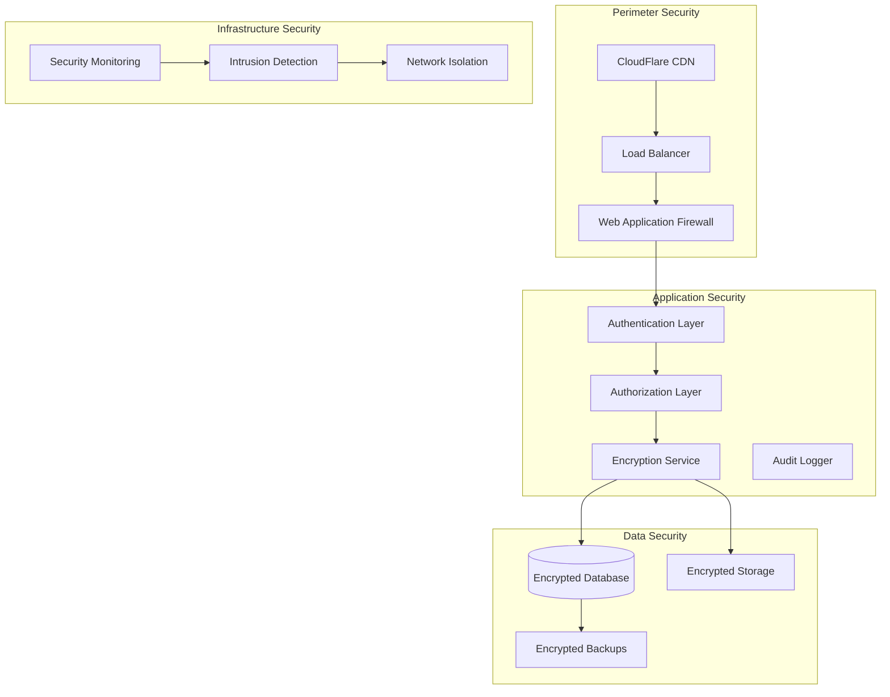

# Security & Compliance Documentation

## Overview

This document outlines the comprehensive security and compliance framework for the Healthcare Data Analytics Platform, ensuring adherence to healthcare regulations including PDPA (Personal Data Protection Act), HIPAA (Health Insurance Portability and Accountability Act), and other relevant data protection standards.

## Security Framework

### Security Architecture


## Healthcare Compliance Requirements

### PDPA (Personal Data Protection Act) Compliance

#### Data Protection Principles
1. **Consent Management**
```typescript
// consent-management.ts
interface ConsentRecord {
  id: string;
  userId: string;
  consentType: 'collection' | 'processing' | 'disclosure' | 'retention';
  purpose: string;
  granted: boolean;
  timestamp: Date;
  ipAddress: string;
  userAgent: string;
  expiryDate?: Date;
}

class ConsentManager {
  async grantConsent(userId: string, consentType: string, purpose: string): Promise<ConsentRecord> {
    const consent: ConsentRecord = {
      id: generateUUID(),
      userId,
      consentType,
      purpose,
      granted: true,
      timestamp: new Date(),
      ipAddress: await getClientIP(),
      userAgent: await getUserAgent(),
      expiryDate: new Date(Date.now() + 365 * 24 * 60 * 60 * 1000) // 1 year
    };

    await this.storeConsent(consent);
    await this.auditLog('CONSENT_GRANTED', consent);
    
    return consent;
  }

  async revokeConsent(userId: string, consentType: string): Promise<void> {
    await this.updateConsentStatus(userId, consentType, false);
    await this.auditLog('CONSENT_REVOKED', { userId, consentType });
  }
}
```

2. **Data Minimization**
```sql
-- Data minimization policies
-- Only store necessary patient information

-- Patient table with minimal required fields
CREATE TABLE patients (
  id UUID PRIMARY KEY,
  medical_record_number VARCHAR(50) UNIQUE NOT NULL,
  date_of_birth DATE NOT NULL,
  gender VARCHAR(10),
  -- Encrypted PII fields
  encrypted_name BYTEA,
  encrypted_contact BYTEA,
  created_at TIMESTAMP WITH TIME ZONE DEFAULT NOW(),
  updated_at TIMESTAMP WITH TIME ZONE DEFAULT NOW()
);

-- Data retention policy
-- Automatically purge data based on retention schedule
CREATE OR REPLACE FUNCTION enforce_data_retention()
RETURNS TRIGGER AS $$
BEGIN
  -- Delete audit logs older than 7 years (2555 days)
  DELETE FROM audit_logs 
  WHERE created_at < NOW() - INTERVAL '2555 days';
  
  -- Delete temporary data older than 90 days
  DELETE FROM temp_exports 
  WHERE created_at < NOW() - INTERVAL '90 days';
  
  RETURN NULL;
END;
$$ LANGUAGE plpgsql;

-- Schedule retention cleanup
SELECT cron.schedule('data-retention-cleanup', '0 0 1 * *', 'SELECT enforce_data_retention()');
```

3. **Right to be Forgotten**
```typescript
// right-to-erasure.ts
class DataErasureService {
  async processErasureRequest(userId: string): Promise<ErasureReport> {
    const report: ErasureReport = {
      userId,
      requestDate: new Date(),
      status: 'processing',
      dataTypesProcessed: [],
      errors: []
    };

    try {
      // Anonymize patient records
      await this.anonymizePatientRecords(userId);
      report.dataTypesProcessed.push('patient_records');

      // Remove personally identifiable information
      await this.removePII(userId);
      report.dataTypesProcessed.push('pii_data');

      // Delete audit logs for this user
      await this.removeAuditLogs(userId);
      report.dataTypesProcessed.push('audit_logs');

      // Update consent records
      await this.invalidateConsents(userId);
      report.dataTypesProcessed.push('consent_records');

      report.status = 'completed';
      await this.auditLog('DATA_ERASURE_COMPLETED', report);
      
    } catch (error) {
      report.status = 'failed';
      report.errors.push(error.message);
      await this.auditLog('DATA_ERASURE_FAILED', { userId, error: error.message });
    }

    return report;
  }

  private async anonymizePatientRecords(userId: string): Promise<void> {
    // Replace with anonymous placeholder
    await db.query(`
      UPDATE patients 
      SET 
        encrypted_name = $1,
        encrypted_contact = $2,
        medical_record_number = $3
      WHERE id = $4
    `, [
      this.encrypt('ANONYMIZED'),
      this.encrypt(''),
      `ANON_${Date.now()}`,
      userId
    ]);
  }
}
```

### HIPAA Compliance

#### Administrative Safeguards
```typescript
// administrative-safeguards.ts
class AdministrativeSafeguards {
  // Security Officer designation
  private securityOfficer = {
    name: 'Chief Information Security Officer',
    contact: 'ciso@healthcare-app.com',
    responsibilities: [
      'Conduct risk assessments',
      'Implement security policies',
      'Train workforce',
      'Incident response management'
    ]
  };

  // Workforce training and access management
  async implementWorkforceTraining() {
    const trainingModules = [
      'HIPAA Privacy Rule Basics',
      'Handling Protected Health Information (PHI)',
      'Security Incident Response',
      'Data Breach Prevention',
      'Password Security Best Practices'
    ];

    for (const module of trainingModules) {
      await this.createTrainingModule(module);
    }
  }

  // Access control policy
  async manageAccessControl() {
    const roles = {
      'healthcare_provider': {
        permissions: ['read_patient_data', 'create_encounters', 'write_notes'],
        restrictions: ['no_pii_export', 'audit_required']
      },
      'admin': {
        permissions: ['full_system_access', 'user_management'],
        restrictions: ['mfa_required', 'privileged_access_logging']
      },
      'patient': {
        permissions: ['read_own_data', 'download_records'],
        restrictions: ['limited_scope', 'consent_required']
      }
    };

    return roles;
  }
}
```

#### Physical Safeguards
```bash
#!/bin/bash
# physical-security.sh

echo "🏢 Implementing physical security measures..."

# Secure server room access
# Note: Physical security is managed by cloud provider (Supabase)
# Ensure data center certifications: SOC 2, ISO 27001

# Secure workstation policies
cat > /etc/security/workstation-policy.txt << EOF
Healthcare Workstation Security Policy:

1. Clean Desk Policy:
   - No PHI displayed when unattended
   - Lock screen when away
   - Secure storage of physical documents

2. Access Control:
   - Multi-factor authentication required
   - Role-based access only
   - Session timeout after 15 minutes of inactivity

3. Device Security:
   - Full disk encryption enabled
   - Automatic security updates
   - Antivirus software installed and updated

4. Incident Response:
   - Report lost/stolen devices immediately
   - Document all security incidents
   - Follow incident response procedures
EOF

# Screen lock configuration
gsettings set org.gnome.desktop.screensaver lock-enabled true
gsettings set org.gnome.desktop.screensaver lock-delay 300  # 5 minutes
gsettings set org.gnome.desktop.session idle-delay 900      # 15 minutes

echo "✅ Physical security measures implemented"
```

#### Technical Safeguards
```typescript
// technical-safeguards.ts
class TechnicalSafeguards {
  // Access control
  async implementAccessControl() {
    return {
      uniqueUserIdentification: true,
      emergencyAccessProcedure: true,
      automaticLogoff: '15 minutes',
      encryptionAndDecryption: 'AES-256',
      auditControls: true,
      integrity: 'Checksum validation',
      transmissionSecurity: 'TLS 1.3'
    };
  }

  // Audit controls
  async createAuditSystem() {
    const auditConfig = {
      logLevel: 'comprehensive',
      logFormat: 'structured',
      retentionPeriod: '6 years', // HIPAA requirement
      realTimeMonitoring: true,
      alertThresholds: {
        failedLogins: 3,
        unauthorizedAccess: 1,
        dataExport: 1,
        adminActions: 1
      }
    };

    return auditConfig;
  }

  // Data integrity
  async implementDataIntegrity() {
    // Database triggers for integrity checks
    const integrityTriggers = `
      CREATE OR REPLACE FUNCTION validate_patient_data_integrity()
      RETURNS TRIGGER AS $$
      BEGIN
        -- Validate date ranges
        IF NEW.date_of_birth > CURRENT_DATE THEN
          RAISE EXCEPTION 'Invalid date of birth';
        END IF;
        
        -- Validate medical record number format
        IF NOT NEW.medical_record_number ~ '^[A-Z0-9]{8,12}$' THEN
          RAISE EXCEPTION 'Invalid medical record number format';
        END IF;
        
        -- Calculate record checksum
        NEW.record_checksum := md5(
          COALESCE(NEW.encrypted_name, '') ||
          COALESCE(NEW.encrypted_contact, '') ||
          NEW.medical_record_number
        );
        
        RETURN NEW;
      END;
      $$ LANGUAGE plpgsql;
    `;

    return integrityTriggers;
  }

  // Transmission security
  async implementTransmissionSecurity() {
    const tlsConfig = {
      minimumVersion: '1.3',
      cipherSuites: [
        'TLS_AES_256_GCM_SHA384',
        'TLS_CHACHA20_POLY1305_SHA256',
        'TLS_AES_128_GCM_SHA256'
      ],
      certificateValidation: 'strict',
      certificatePinning: true,
      hstsEnabled: true,
      hstsMaxAge: 31536000, // 1 year
      includeSubDomains: true,
      preload: true
    };

    return tlsConfig;
  }
}
```

## Data Encryption

### Encryption at Rest
```typescript
// encryption-at-rest.ts
import { createCipher, createDecipher, randomBytes, createHash } from 'crypto';

class HealthcareEncryption {
  private readonly algorithm = 'aes-256-gcm';
  private readonly keyDerivation = 'pbkdf2';
  private readonly iterations = 100000;
  private readonly keyLength = 32;

  constructor(private masterKey: string) {}

  async encryptSensitiveData(data: string): Promise<EncryptedData> {
    const salt = randomBytes(16);
    const iv = randomBytes(12);
    
    // Derive encryption key from master key
    const key = await this.deriveKey(this.masterKey, salt);
    
    // Encrypt data
    const cipher = createCipher(this.algorithm, key);
    cipher.setAAD(Buffer.from('healthcare-app'));
    
    let encrypted = cipher.update(data, 'utf8', 'hex');
    encrypted += cipher.final('hex');
    
    const authTag = cipher.getAuthTag();
    
    return {
      encrypted,
      iv: iv.toString('hex'),
      salt: salt.toString('hex'),
      authTag: authTag.toString('hex'),
      algorithm: this.algorithm
    };
  }

  async decryptSensitiveData(encryptedData: EncryptedData): Promise<string> {
    const { encrypted, iv, salt, authTag } = encryptedData;
    
    // Derive same key
    const key = await this.deriveKey(this.masterKey, Buffer.from(salt, 'hex'));
    
    // Decrypt data
    const decipher = createDecipher(this.algorithm, key);
    decipher.setAAD(Buffer.from('healthcare-app'));
    decipher.setAuthTag(Buffer.from(authTag, 'hex'));
    
    let decrypted = decipher.update(encrypted, 'hex', 'utf8');
    decrypted += decipher.final('utf8');
    
    return decrypted;
  }

  private async deriveKey(masterKey: string, salt: Buffer): Promise<Buffer> {
    return new Promise((resolve, reject) => {
      createHash('sha256').update(masterKey).digest().then(() => {
        // Use built-in crypto for key derivation
        import('crypto').then(crypto => {
          crypto.pbkdf2(
            masterKey,
            salt,
            this.iterations,
            this.keyLength,
            'sha256',
            (err, derivedKey) => {
              if (err) reject(err);
              else resolve(derivedKey);
            }
          );
        });
      });
    });
  }
}

// Patient data encryption schema
const patientEncryptionSchema = {
  fields: [
    {
      name: 'fullName',
      encrypted: true,
      searchable: false
    },
    {
      name: 'contactInfo',
      encrypted: true,
      searchable: false
    },
    {
      name: 'medicalHistory',
      encrypted: true,
      searchable: false
    },
    {
      name: 'dateOfBirth',
      encrypted: false,
      searchable: true
    },
    {
      name: 'gender',
      encrypted: false,
      searchable: true
    }
  ]
};
```

### Encryption in Transit
```yaml
# nginx-ssl-config.yml
server:
  listen: 443 ssl http2;
  ssl_certificate: /etc/letsencrypt/live/healthcare-app.com/fullchain.pem;
  ssl_certificate_key: /etc/letsencrypt/live/healthcare-app.com/privkey.pem;
  
  # SSL/TLS Configuration
  ssl_protocols: TLSv1.3;
  ssl_ciphers: ECDHE-ECDSA-AES128-GCM-SHA256:ECDHE-RSA-AES128-GCM-SHA256:ECDHE-ECDSA-AES256-GCM-SHA384:ECDHE-RSA-AES256-GCM-SHA384;
  ssl_prefer_server_ciphers: off;
  
  # SSL Session Configuration
  ssl_session_cache: shared:SSL:50m;
  ssl_session_timeout: 1d;
  ssl_session_tickets: off;
  
  # OCSP Stapling
  ssl_stapling: on;
  ssl_stapling_verify: on;
  ssl_trusted_certificate: /etc/letsencrypt/live/healthcare-app.com/chain.pem;
  
  # HSTS (HTTP Strict Transport Security)
  add_header Strict-Transport-Security "max-age=63072000; includeSubDomains; preload";
  
  # Security Headers
  add_header X-Frame-Options "DENY" always;
  add_header X-Content-Type-Options "nosniff" always;
  add_header X-XSS-Protection "1; mode=block" always;
  add_header Referrer-Policy "strict-origin-when-cross-origin" always;
  add_header Permissions-Policy "camera=(), microphone=(), geolocation=()" always;
```

## Authentication & Authorization

### Multi-Factor Authentication
```typescript
// mfa-implementation.ts
import speakeasy from 'speakeasy';
import QRCode from 'qrcode';

class HealthcareMFA {
  async setupMFA(userId: string): Promise<MFASetupResponse> {
    const secret = speakeasy.generateSecret({
      name: `Healthcare Platform (${userId})`,
      issuer: 'Healthcare Platform',
      length: 32
    });

    // Store secret securely (encrypted)
    await this.storeMFASecret(userId, secret.base32);

    // Generate QR code
    const qrCode = await QRCode.toDataURL(secret.otpauth_url);

    return {
      secret: secret.base32,
      qrCode,
      backupCodes: await this.generateBackupCodes(userId)
    };
  }

  async verifyMFA(userId: string, token: string, backupCode?: string): Promise<boolean> {
    const secret = await this.getMFASecret(userId);
    
    // Verify TOTP token
    const verified = speakeasy.totp.verify({
      secret,
      encoding: 'base32',
      token,
      window: 1 // Allow 30-second window
    });

    if (verified) {
      await this.auditLog('MFA_SUCCESS', { userId });
      return true;
    }

    // Check backup codes if primary fails
    if (backupCode) {
      const backupValid = await this.verifyBackupCode(userId, backupCode);
      if (backupValid) {
        await this.auditLog('MFA_BACKUP_CODE_SUCCESS', { userId });
        return true;
      }
    }

    await this.auditLog('MFA_FAILURE', { userId, token });
    return false;
  }

  private async generateBackupCodes(userId: string): Promise<string[]> {
    const codes = [];
    for (let i = 0; i < 8; i++) {
      const code = Math.random().toString(36).substring(2, 8).toUpperCase();
      codes.push(code);
      await this.storeBackupCode(userId, code);
    }
    return codes;
  }
}
```

### Role-Based Access Control
```typescript
// rbac-implementation.ts
interface Permission {
  resource: string;
  action: 'create' | 'read' | 'update' | 'delete' | 'export';
  conditions?: Record<string, any>;
}

interface Role {
  id: string;
  name: string;
  permissions: Permission[];
  restrictions: string[];
}

class HealthcareRBAC {
  private readonly roles: Role[] = [
    {
      id: 'healthcare_provider',
      name: 'Healthcare Provider',
      permissions: [
        { resource: 'patient_records', action: 'read' },
        { resource: 'patient_records', action: 'update', conditions: { assigned_patients: true } },
        { resource: 'encounters', action: 'create' },
        { resource: 'encounters', action: 'read' },
        { resource: 'encounters', action: 'update' }
      ],
      restrictions: ['no_pii_export', 'audit_required', 'session_timeout_15min']
    },
    {
      id: 'admin',
      name: 'System Administrator',
      permissions: [
        { resource: '*', action: '*' }
      ],
      restrictions: ['mfa_required', 'privileged_access_logging', 'break_glass_procedure']
    },
    {
      id: 'patient',
      name: 'Patient',
      permissions: [
        { resource: 'own_records', action: 'read' },
        { resource: 'own_records', action: 'export' }
      ],
      restrictions: ['own_data_only', 'consent_required']
    }
  ];

  async checkPermission(userId: string, resource: string, action: string): Promise<boolean> {
    const userRoles = await this.getUserRoles(userId);
    
    for (const roleId of userRoles) {
      const role = this.roles.find(r => r.id === roleId);
      if (!role) continue;

      // Check for wildcard permissions
      if (role.permissions.some(p => p.resource === '*' && p.action === '*')) {
        return true;
      }

      // Check specific permissions
      const permission = role.permissions.find(p => 
        p.resource === resource && p.action === action
      );

      if (permission) {
        // Check conditions
        if (permission.conditions) {
          return await this.evaluateConditions(userId, permission.conditions);
        }
        return true;
      }
    }

    return false;
  }

  private async evaluateConditions(userId: string, conditions: Record<string, any>): Promise<boolean> {
    for (const [condition, value] of Object.entries(conditions)) {
      switch (condition) {
        case 'assigned_patients':
          const assigned = await this.getAssignedPatients(userId);
          if (!assigned.length) return false;
          break;
        case 'own_data_only':
          // Implemented in query layer
          break;
      }
    }
    return true;
  }
}
```

## Security Monitoring

### Intrusion Detection System
```typescript
// ids-implementation.ts
class HealthcareIDS {
  private readonly alertThresholds = {
    failedLoginAttempts: 5,
    unusualAccessPatterns: 3,
    dataExports: 1,
    adminActions: 1,
    apiRateLimit: 100
  };

  async monitorAccessPatterns(userId: string): Promise<SecurityAlert[]> {
    const alerts: SecurityAlert[] = [];
    
    // Check for unusual access patterns
    const accessHistory = await this.getAccessHistory(userId, '24h');
    const uniqueIPs = new Set(accessHistory.map(a => a.ipAddress));
    
    if (uniqueIPs.size > 5) {
      alerts.push({
        type: 'UNUSUAL_ACCESS_PATTERN',
        severity: 'medium',
        description: `User accessed from ${uniqueIPs.size} different IPs`,
        userId,
        timestamp: new Date()
      });
    }

    // Check for after-hours access
    const now = new Date();
    const hour = now.getHours();
    if (hour < 6 || hour > 22) {
      alerts.push({
        type: 'AFTER_HOURS_ACCESS',
        severity: 'low',
        description: 'Access during non-business hours',
        userId,
        timestamp: now
      });
    }

    return alerts;
  }

  async detectDataExfiltration(userId: string): Promise<SecurityAlert[]> {
    const alerts: SecurityAlert[] = [];
    
    // Monitor for large data exports
    const recentExports = await this.getDataExports(userId, '1h');
    const totalSize = recentExports.reduce((sum, export) => sum + export.size, 0);
    
    if (totalSize > 100 * 1024 * 1024) { // 100MB threshold
      alerts.push({
        type: 'POTENTIAL_DATA_EXFILTRATION',
        severity: 'high',
        description: `Large data export detected: ${totalSize} bytes`,
        userId,
        timestamp: new Date()
      });
    }

    return alerts;
  }

  async generateSecurityReport(): Promise<SecurityReport> {
    const report: SecurityReport = {
      period: {
        start: new Date(Date.now() - 24 * 60 * 60 * 1000),
        end: new Date()
      },
      alerts: await this.getAllSecurityAlerts(),
      incidents: await this.getSecurityIncidents(),
      compliance: await this.checkComplianceStatus(),
      recommendations: []
    };

    // Generate recommendations
    if (report.alerts.length > 50) {
      report.recommendations.push('Consider implementing additional access controls');
    }

    return report;
  }
}
```

### Security Incident Response
```typescript
// incident-response.ts
class SecurityIncidentResponse {
  private readonly incidentTypes = {
    data_breach: {
      severity: 'critical',
      response_time: '15 minutes',
      notification_required: ['security_officer', 'compliance_officer', 'dpo']
    },
    unauthorized_access: {
      severity: 'high',
      response_time: '1 hour',
      notification_required: ['security_officer']
    },
    system_compromise: {
      severity: 'critical',
      response_time: '5 minutes',
      notification_required: ['security_officer', 'cto', 'ceo']
    }
  };

  async respondToIncident(incidentType: string, details: any): Promise<IncidentResponse> {
    const config = this.incidentTypes[incidentType];
    if (!config) {
      throw new Error(`Unknown incident type: ${incidentType}`);
    }

    // Log incident
    const incident = await this.logIncident(incidentType, details);

    // Immediate containment actions
    await this.executeContainmentActions(incidentType, details);

    // Notify stakeholders
    await this.notifyStakeholders(config.notification_required, incident);

    // Begin investigation
    await this.initiateInvestigation(incident);

    // Update incident status
    await this.updateIncidentStatus(incident.id, 'responding');

    return incident;
  }

  private async executeContainmentActions(incidentType: string, details: any): Promise<void> {
    switch (incidentType) {
      case 'unauthorized_access':
        // Disable affected user accounts
        if (details.userId) {
          await this.disableUserAccount(details.userId);
        }
        // Reset passwords for affected users
        if (details.userIds) {
          for (const userId of details.userIds) {
            await this.requirePasswordReset(userId);
          }
        }
        break;

      case 'system_compromise':
        // Enable maintenance mode
        await this.enableMaintenanceMode();
        // Block suspicious IPs
        if (details.ipAddresses) {
          for (const ip of details.ipAddresses) {
            await this.blockIPAddress(ip);
          }
        }
        break;

      case 'data_breach':
        // Revoke all active sessions
        await this.revokeAllSessions();
        // Enable enhanced monitoring
        await this.enableEnhancedMonitoring();
        break;
    }
  }

  async generateIncidentReport(incidentId: string): Promise<IncidentReport> {
    const incident = await this.getIncident(incidentId);
    const timeline = await this.getIncidentTimeline(incidentId);
    const affectedSystems = await this.getAffectedSystems(incidentId);
    const remediationActions = await this.getRemediationActions(incidentId);

    return {
      incident,
      executiveSummary: await this.generateExecutiveSummary(incident),
      technicalDetails: {
        timeline,
        affectedSystems,
        rootCause: await this.determineRootCause(incident),
        remediation: remediationActions
      },
      complianceImpact: await this.assessComplianceImpact(incident),
      lessonsLearned: await this.extractLessonsLearned(incident)
    };
  }
}
```

## Audit Logging

### Comprehensive Audit System
```sql
-- healthcare-audit-schema.sql

-- Create comprehensive audit log table
CREATE TABLE healthcare_audit_logs (
  id UUID DEFAULT gen_random_uuid() PRIMARY KEY,
  event_id VARCHAR(50) NOT NULL,
  user_id UUID REFERENCES auth.users(id),
  user_role TEXT NOT NULL,
  session_id VARCHAR(100),
  action TEXT NOT NULL,
  resource_type TEXT NOT NULL,
  resource_id TEXT,
  patient_id UUID, -- Link to patient if applicable
  details JSONB NOT NULL,
  ip_address INET,
  user_agent TEXT,
  http_method TEXT,
  endpoint TEXT,
  response_status INTEGER,
  processing_time_ms INTEGER,
  risk_level TEXT CHECK (risk_level IN ('low', 'medium', 'high', 'critical')),
  compliance_category TEXT, -- PDPA, HIPAA, etc.
  data_classification TEXT, -- PII, PHI, Sensitive
  created_at TIMESTAMP WITH TIME ZONE DEFAULT NOW()
);

-- Index for performance
CREATE INDEX idx_audit_logs_user_date ON healthcare_audit_logs(user_id, created_at DESC);
CREATE INDEX idx_audit_logs_patient ON healthcare_audit_logs(patient_id, created_at DESC);
CREATE INDEX idx_audit_logs_action ON healthcare_audit_logs(action, created_at DESC);
CREATE INDEX idx_audit_logs_risk ON healthcare_audit_logs(risk_level, created_at DESC);
CREATE INDEX idx_audit_logs_compliance ON healthcare_audit_logs(compliance_category, created_at DESC);

-- Enable RLS
ALTER TABLE healthcare_audit_logs ENABLE ROW LEVEL SECURITY;

-- Policy: Only security officers and admins can read audit logs
CREATE POLICY "Security officers can view audit logs"
  ON healthcare_audit_logs FOR SELECT
  TO authenticated
  USING (
    EXISTS (
      SELECT 1 FROM user_roles 
      WHERE user_id = auth.uid() 
      AND role IN ('security_officer', 'admin')
    )
  );

-- Policy: System can insert audit logs
CREATE POLICY "System can insert audit logs"
  ON healthcare_audit_logs FOR INSERT
  TO service_role
  WITH CHECK (true);

-- Audit log view for compliance reporting
CREATE VIEW v_compliance_audit_summary AS
SELECT 
  DATE_TRUNC('month', created_at) as report_month,
  compliance_category,
  action,
  COUNT(*) as event_count,
  COUNT(DISTINCT user_id) as unique_users,
  COUNT(DISTINCT patient_id) as unique_patients_affected,
  COUNT(CASE WHEN risk_level = 'critical' THEN 1 END) as critical_events,
  COUNT(CASE WHEN risk_level = 'high' THEN 1 END) as high_risk_events
FROM healthcare_audit_logs
WHERE created_at >= NOW() - INTERVAL '12 months'
GROUP BY DATE_TRUNC('month', created_at), compliance_category, action
ORDER BY report_month DESC, compliance_category, action;
```

### Real-time Audit Processing
```typescript
// audit-processor.ts
class HealthcareAuditProcessor {
  async processAuditEvent(event: AuditEvent): Promise<void> {
    // Enrich event with additional context
    const enrichedEvent = await this.enrichAuditEvent(event);
    
    // Determine risk level
    const riskLevel = await this.assessRiskLevel(enrichedEvent);
    
    // Determine compliance categories
    const complianceCategories = this.identifyComplianceCategories(enrichedEvent);
    
    // Classify data involved
    const dataClassification = this.classifyInvolvedData(enrichedEvent);
    
    // Store audit record
    await this.storeAuditRecord({
      ...enrichedEvent,
      risk_level: riskLevel,
      compliance_category: complianceCategories,
      data_classification: dataClassification
    });
    
    // Check for real-time alerts
    await this.checkRealTimeAlerts(enrichedEvent, riskLevel);
    
    // Update compliance metrics
    await this.updateComplianceMetrics(enrichedEvent);
  }

  private async enrichAuditEvent(event: AuditEvent): Promise<EnrichedAuditEvent> {
    const sessionInfo = await this.getSessionInfo(event.sessionId);
    const userContext = await this.getUserContext(event.userId);
    
    return {
      ...event,
      user_role: userContext.role,
      department: userContext.department,
      session_duration: sessionInfo.duration,
      geographic_location: await this.getGeographicLocation(event.ipAddress),
      device_fingerprint: sessionInfo.deviceFingerprint
    };
  }

  private async assessRiskLevel(event: EnrichedAuditEvent): Promise<string> {
    let riskScore = 0;
    
    // Base risk by action
    const actionRisks = {
      'login': 1,
      'read_patient_data': 2,
      'update_patient_data': 3,
      'delete_patient_data': 5,
      'export_patient_data': 4,
      'admin_access': 5,
      'system_config': 5
    };
    
    riskScore += actionRisks[event.action] || 0;
    
    // Increase risk for after-hours access
    const hour = new Date().getHours();
    if (hour < 6 || hour > 22) riskScore += 2;
    
    // Increase risk for new geographic location
    if (event.geographic_location !== event.user_context?.usual_location) {
      riskScore += 3;
    }
    
    // Increase risk for bulk operations
    if (event.details?.bulk_operation) riskScore += 3;
    
    // Classify risk level
    if (riskScore >= 7) return 'critical';
    if (riskScore >= 5) return 'high';
    if (riskScore >= 3) return 'medium';
    return 'low';
  }
}
```

## Security Testing

### Penetration Testing Schedule
```yaml
# security-testing-schedule.yml
penetration_testing:
  frequency: quarterly
  scope:
    - web_application
    - mobile_application
    - api_endpoints
    - infrastructure
    - social_engineering
  
  testing_types:
    black_box:
      frequency: quarterly
      external_provider: true
      report_required: true
    
    white_box:
      frequency: semiannually
      internal_team: true
      code_review: true
    
    gray_box:
      frequency: annually
      hybrid_approach: true

vulnerability_scanning:
  automated_scanning:
    frequency: weekly
    tools:
      - trivy
      - snyk
      - owasp_zap
    
  manual_testing:
    frequency: monthly
    focus_areas:
      - authentication_bypass
      - authorization_flaws
      - injection_attacks
      - sensitive_data_exposure
```

### Security Test Cases
```typescript
// security-test-cases.ts
describe('Healthcare Application Security Tests', () => {
  describe('Authentication Security', () => {
    test('should enforce strong password requirements', async () => {
      const weakPasswords = ['password', '123456', 'qwerty'];
      
      for (const password of weakPasswords) {
        const response = await request(app)
          .post('/api/auth/register')
          .send({
            email: 'test@example.com',
            password: password
          });
        
        expect(response.status).toBe(400);
        expect(response.body.message).toContain('Password does not meet security requirements');
      }
    });

    test('should implement account lockout after failed attempts', async () => {
      const email = 'test@example.com';
      
      // Attempt 5 failed logins
      for (let i = 0; i < 5; i++) {
        await request(app)
          .post('/api/auth/login')
          .send({
            email,
            password: 'wrong_password'
          });
      }
      
      // 6th attempt should be locked
      const response = await request(app)
        .post('/api/auth/login')
        .send({
          email,
          password: 'wrong_password'
        });
      
      expect(response.status).toBe(429); // Too Many Requests
      expect(response.body.message).toContain('Account temporarily locked');
    });

    test('should require MFA for sensitive operations', async () => {
      const response = await request(app)
        .post('/api/patient/export-data')
        .set('Authorization', `Bearer ${userToken}`)
        .send({ patientId: '123' });
      
      expect(response.status).toBe(401);
      expect(response.body.message).toContain('Multi-factor authentication required');
    });
  });

  describe('Authorization Security', () => {
    test('should enforce role-based access control', async () => {
      // Patient trying to access another patient's data
      const patientToken = await getPatientToken('patient-1');
      
      const response = await request(app)
        .get('/api/patient/patient-2/records')
        .set('Authorization', `Bearer ${patientToken}`);
      
      expect(response.status).toBe(403);
      expect(response.body.message).toContain('Access denied');
    });

    test('should prevent privilege escalation', async () => {
      const patientToken = await getPatientToken('patient-1');
      
      const response = await request(app)
        .post('/api/admin/users')
        .set('Authorization', `Bearer ${patientToken}`)
        .send({
          email: 'newuser@example.com',
          role: 'admin'
        });
      
      expect(response.status).toBe(403);
    });
  });

  describe('Data Protection Security', () => {
    test('should encrypt sensitive patient data', async () => {
      const response = await request(app)
        .post('/api/patient')
        .set('Authorization', `Bearer ${providerToken}`)
        .send({
          name: 'John Doe',
          contact: '+1234567890',
          medicalRecordNumber: 'MRN-12345'
        });
      
      // Verify data is encrypted in database
      const storedData = await db.query(
        'SELECT encrypted_name, encrypted_contact FROM patients WHERE id = $1',
        [response.body.id]
      );
      
      expect(storedData.rows[0].encrypted_name).not.toBe('John Doe');
      expect(storedData.rows[0].encrypted_contact).not.toBe('+1234567890');
    });

    test('should implement data retention policies', async () => {
      // Create test data with expired timestamp
      await db.query(`
        INSERT INTO temp_exports (id, data, created_at) 
        VALUES ($1, $2, $3)
      `, [genUUID(), 'test data', new Date(Date.now() - 100 * 24 * 60 * 60 * 1000)]);
      
      // Run cleanup
      await cleanupService.cleanExpiredData();
      
      // Verify data is deleted
      const result = await db.query(
        'SELECT * FROM temp_exports WHERE id = $1',
        [testId]
      );
      
      expect(result.rows.length).toBe(0);
    });
  });
});
```

---

## Compliance Monitoring Dashboard

### Compliance KPIs
```typescript
// compliance-kpis.ts
const complianceMetrics = {
  pdpa: {
    consentRate: {
      target: 100,
      current: 98.5,
      trend: 'stable'
    },
    dataErasureRequests: {
      target: 'Processed within 30 days',
      current: 'Processed within 15 days average',
      trend: 'improving'
    },
    breachNotificationTime: {
      target: 'Within 72 hours',
      current: 'Within 48 hours',
      trend: 'stable'
    }
  },
  
  hipaa: {
    auditLogCompleteness: {
      target: 100,
      current: 99.8,
      trend: 'stable'
    },
    securityIncidentResponse: {
      target: 'Within required timeframe',
      current: '100% within timeframe',
      trend: 'stable'
    },
    workforceTraining: {
      target: 100,
      current: 96.2,
      trend: 'improving'
    }
  },
  
  security: {
    vulnerabilityAssessmentScore: {
      target: 'A rating',
      current: 'A- rating',
      trend: 'stable'
    },
    penetrationTestResults: {
      target: 'No critical findings',
      current: 'No critical findings',
      trend: 'stable'
    },
    incidentResponseTime: {
      target: '< 15 minutes',
      current: '12 minutes average',
      trend: 'improving'
    }
  }
};

async function generateComplianceReport(): Promise<ComplianceReport> {
  return {
    period: 'Q4 2025',
    overallComplianceScore: 97.3,
    summary: {
      pdpa: 'Compliant',
      hipaa: 'Compliant', 
      security: 'Mostly Compliant',
      recommendations: [
        'Complete workforce training for remaining 3.8%',
        'Implement additional monitoring for after-hours access',
        'Consider upgrading vulnerability scan rating to A'
      ]
    },
    metrics: complianceMetrics
  };
}
```

---

## Next Steps for Implementation

### Immediate Actions (Week 1)
1. Implement encryption at rest and in transit
2. Set up comprehensive audit logging
3. Configure MFA for all users
4. Establish security monitoring
5. Create incident response procedures

### Short-term Actions (Month 1)
1. Conduct penetration testing
2. Complete workforce security training
3. Implement data retention policies
4. Set up compliance monitoring dashboard
5. Perform security configuration audit

### Long-term Actions (Quarter 1)
1. Achieve compliance certifications
2. Implement advanced threat detection
3. Conduct regular security assessments
4. Establish security governance framework
5. Create security awareness program

---

## Success Metrics

### Security Metrics
- **Vulnerability Assessment Score**: A rating or higher
- **Penetration Test Results**: Zero critical findings
- **Security Incident Response Time**: <15 minutes
- **Audit Log Completeness**: >99%

### Compliance Metrics
- **PDPA Compliance**: 100% compliance score
- **HIPAA Compliance**: All safeguards implemented
- **Data Breach Response**: Within 72 hours
- **Workforce Training**: 100% completion rate

### Performance Metrics
- **False Positive Rate**: <5%
- **Security System Availability**: >99.9%
- **User Experience Impact**: Minimal friction
- **Cost of Compliance**: Within budget allocation