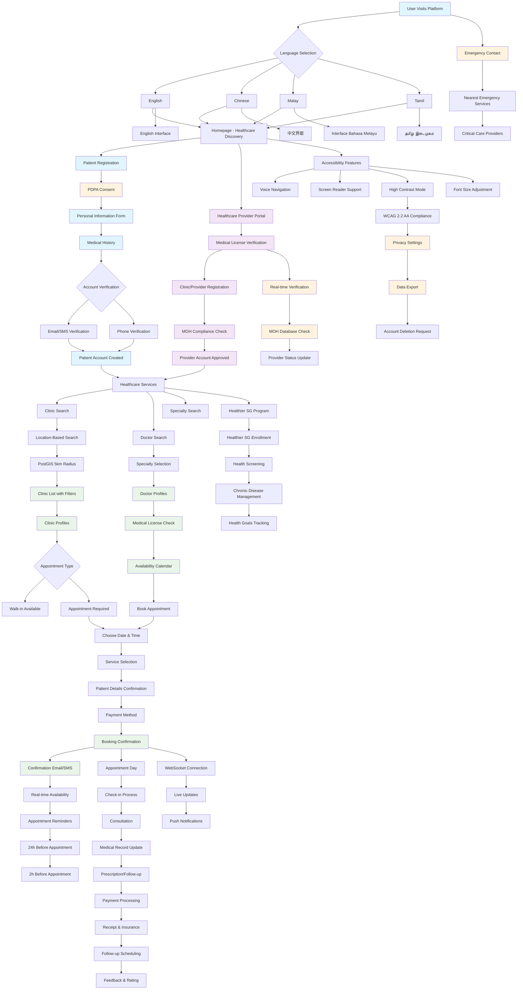
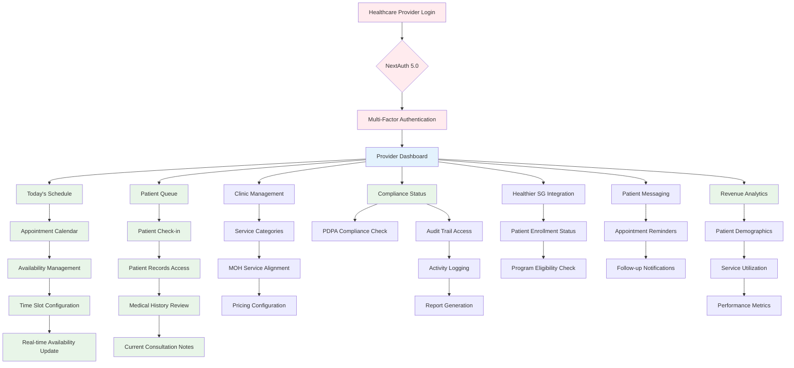
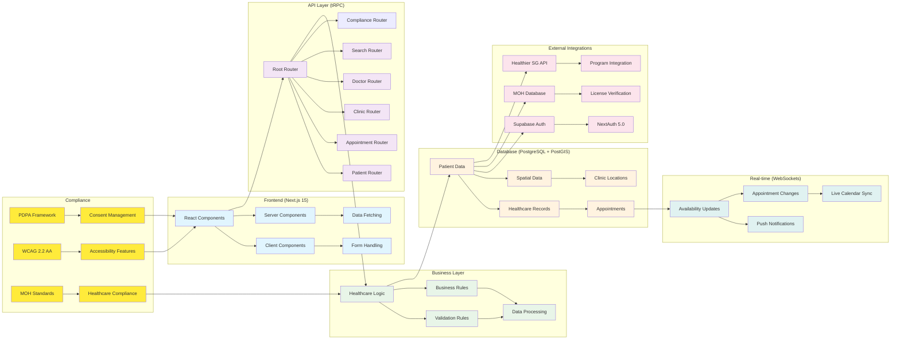

# User Interaction Flows for Healthcare Platform

## Patient Journey Flow

```mermaid
graph TD
    %% Entry Points
    A[User Visits Platform] --> B{Language Selection}
    B --> C[English]
    B --> D[Chinese]
    B --> E[Malay]
    B --> F[Tamil]
    
    %% Home and Search
    C --> G[Homepage - Healthcare Discovery]
    D --> G
    E --> G
    F --> G
    
    %% Patient Registration
    G --> H[Patient Registration]
    H --> I[PDPA Consent]
    I --> J[Personal Information Form]
    J --> K[Medical History]
    K --> L{Account Verification}
    L --> M[Email/SMS Verification]
    L --> N[Phone Verification]
    M --> O[Patient Account Created]
    N --> O
    
    %% Healthcare Provider Registration
    G --> P[Healthcare Provider Portal]
    P --> Q[Medical License Verification]
    Q --> R[Clinic/Provider Registration]
    R --> S[MOH Compliance Check]
    S --> T[Provider Account Approved]
    
    %% Core Healthcare Services
    O --> U[Healthcare Services]
    T --> U
    
    %% Service Options
    U --> V[Clinic Search]
    U --> W[Doctor Search]
    U --> X[Specialty Search]
    U --> Y[Healthier SG Program]
    
    %% Clinic Search Flow
    V --> Z[Location-Based Search]
    Z --> AA[PostGIS 5km Radius]
    AA --> BB[Clinic List with Filters]
    BB --> CC[Clinic Profiles]
    CC --> DD{Appointment Type}
    DD --> EE[Walk-in Available]
    DD --> FF[Appointment Required]
    
    %% Doctor Search Flow
    W --> GG[Specialty Selection]
    GG --> HH[Doctor Profiles]
    HH --> II[Medical License Check]
    II --> JJ[Availability Calendar]
    JJ --> KK[Book Appointment]
    
    %% Appointment Booking
    FF --> LL[Choose Date & Time]
    KK --> LL
    LL --> MM[Service Selection]
    MM --> NN[Patient Details Confirmation]
    NN --> OO[Payment Method]
    OO --> PP[Booking Confirmation]
    PP --> QQ[Confirmation Email/SMS]
    
    %% Real-time Updates
    QQ --> RR[Real-time Availability]
    RR --> SS[Appointment Reminders]
    SS --> TT[24h Before Appointment]
    TT --> UU[2h Before Appointment]
    
    %% Consultation Process
    PP --> VV[Appointment Day]
    VV --> WW[Check-in Process]
    WW --> XX[Consultation]
    XX --> YY[Medical Record Update]
    YY --> ZZ[Prescription/Follow-up]
    
    %% Post-Consultation
    ZZ --> AAA[Payment Processing]
    AAA --> BBB[Receipt & Insurance]
    BBB --> CCC[Follow-up Scheduling]
    CCC --> DDD[Feedback & Rating]
    
    %% Healthier SG Integration
    Y --> EEE[Healthier SG Enrollment]
    EEE --> FFF[Health Screening]
    FFF --> GGG[Chronic Disease Management]
    GGG --> HHH[Health Goals Tracking]
    
    %% Emergency Features
    A --> III[Emergency Contact]
    III --> JJJ[Nearest Emergency Services]
    JJJ --> KKK[Critical Care Providers]
    
    %% Support and Accessibility
    G --> LLL[Accessibility Features]
    LLL --> MMM[Voice Navigation]
    LLL --> NNN[Screen Reader Support]
    LLL --> OOO[High Contrast Mode]
    LLL --> PPP[Font Size Adjustment]
    
    %% Multi-language Support
    C --> QQQ[English Interface]
    D --> RRR[中文界面]
    E --> SSS[Interface Bahasa Melayu]
    F --> TTT[தமிழ் இடைமுகம்]
    
    %% Data Flow and Privacy
    OOO --> UUU[WCAG 2.2 AA Compliance]
    UUU --> VVV[Privacy Settings]
    VVV --> WWW[Data Export]
    WWW --> XXX[Account Deletion Request]
    
    %% Compliance and Verification
    Q --> YYY[Real-time Verification]
    YYY --> ZZZ[MOH Database Check]
    ZZZ --> AAAA[Provider Status Update]
    
    %% Real-time Subscriptions
    PP --> BBBB[WebSocket Connection]
    BBBB --> CCCC[Live Updates]
    CCCC --> DDDD[Push Notifications]
    
    %% Style definitions
    classDef patientFlow fill:#e1f5fe
    classDef providerFlow fill:#f3e5f5
    classDef systemFlow fill:#e8f5e8
    classDef complianceFlow fill:#fff3e0
    
    class A,H,I,J,K,O,O,O patientFlow
    class P,Q,R,S,T providerFlow
    class BB,CC,HH,II,JJ,PP,QQ systemFlow
    class I,III,YYY,ZZZ,VVV,WWW complianceFlow
```

## Healthcare Provider Dashboard Flow

```mermaid
graph TD
    %% Provider Login
    A[Healthcare Provider Login] --> B{NextAuth 5.0}
    B --> C[Multi-Factor Authentication]
    C --> D[Provider Dashboard]
    
    %% Dashboard Overview
    D --> E[Today's Schedule]
    D --> F[Patient Queue]
    D --> G[Revenue Analytics]
    D --> H[Compliance Status]
    
    %% Patient Management
    F --> I[Patient Check-in]
    I --> J[Patient Records Access]
    J --> K[Medical History Review]
    K --> L[Current Consultation Notes]
    
    %% Appointment Management
    E --> M[Appointment Calendar]
    M --> N[Availability Management]
    N --> O[Time Slot Configuration]
    O --> P[Real-time Availability Update]
    
    %% Clinic Operations
    D --> Q[Clinic Management]
    Q --> R[Service Categories]
    R --> S[MOH Service Alignment]
    S --> T[Pricing Configuration]
    
    %% Compliance and Reporting
    H --> U[PDPA Compliance Check]
    H --> V[Audit Trail Access]
    V --> W[Activity Logging]
    W --> X[Report Generation]
    
    %% Integration Features
    D --> Y[Healthier SG Integration]
    Y --> Z[Patient Enrollment Status]
    Z --> AA[Program Eligibility Check]
    
    %% Communication
    D --> BB[Patient Messaging]
    BB --> CC[Appointment Reminders]
    CC --> DD[Follow-up Notifications]
    
    %% Data and Analytics
    G --> EE[Patient Demographics]
    EE --> FF[Service Utilization]
    FF --> GG[Performance Metrics]
    
    %% Style definitions
    classDef login fill:#ffebee
    classDef dashboard fill:#e3f2fd
    classDef management fill:#e8f5e8
    classDef compliance fill:#fff3e0
    
    class A,B,C login
    class D dashboard
    class E,F,G,H,I,J,K,L,M,N,O,P management
    class U,V,W,X complianceFlow
```

## System Architecture Interaction Flow

```mermaid
graph LR
    %% Frontend Layer
    subgraph "Frontend (Next.js 15)"
        A[React Components] --> B[Client Components]
        A --> C[Server Components]
        B --> D[Form Handling]
        C --> E[Data Fetching]
    end
    
    %% API Layer
    subgraph "API Layer (tRPC)"
        F[Root Router] --> G[Patient Router]
        F --> H[Appointment Router]
        F --> I[Clinic Router]
        F --> J[Doctor Router]
        F --> K[Search Router]
        F --> L[Compliance Router]
    end
    
    %% Business Logic
    subgraph "Business Layer"
        M[Healthcare Logic] --> N[Validation Rules]
        M --> O[Business Rules]
        N --> P[Data Processing]
        O --> P
    end
    
    %% Database Layer
    subgraph "Database (PostgreSQL + PostGIS)"
        Q[Patient Data] --> R[Healthcare Records]
        Q --> S[Spatial Data]
        R --> T[Appointments]
        S --> U[Clinic Locations]
    end
    
    %% External Services
    subgraph "External Integrations"
        V[Supabase Auth] --> W[NextAuth 5.0]
        X[MOH Database] --> Y[License Verification]
        Z[Healthier SG API] --> AA[Program Integration]
    end
    
    %% Real-time Features
    subgraph "Real-time (WebSockets)"
        BB[Availability Updates] --> CC[Push Notifications]
        DD[Appointment Changes] --> EE[Live Calendar Sync]
    end
    
    %% Compliance Layer
    subgraph "Compliance"
        FF[PDPA Framework] --> GG[Consent Management]
        HH[WCAG 2.2 AA] --> II[Accessibility Features]
        JJ[MOH Standards] --> KK[Healthcare Compliance]
    end
    
    %% Data Flow
    A --> F
    F --> M
    M --> Q
    Q --> V
    Q --> X
    Q --> Z
    
    %% Real-time Updates
    T --> BB
    BB --> DD
    
    %% Compliance Integration
    GG --> A
    II --> A
    KK --> M
    
    %% Style definitions
    classDef frontend fill:#e1f5fe
    classDef api fill:#f3e5f5
    classDef business fill:#e8f5e8
    classDef database fill:#fff3e0
    classDef external fill:#fce4ec
    classDef realtime fill:#e0f2f1
    classDef compliance fill:#ffeb3b
    
    class A,B,C,D,E frontend
    class F,G,H,I,J,K api
    class M,N,O,P business
    class Q,R,S,T,U database
    class V,W,X,Y,Z,AA external
    class BB,CC,DD,EE realtime
    class FF,GG,HH,II,JJ,KK compliance
```