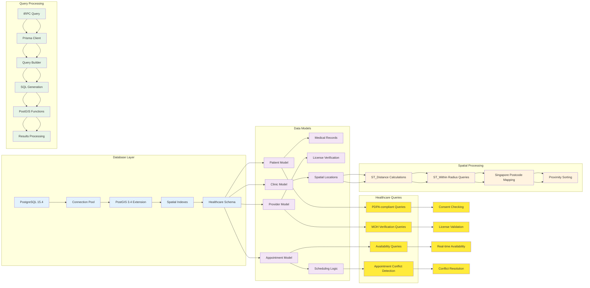
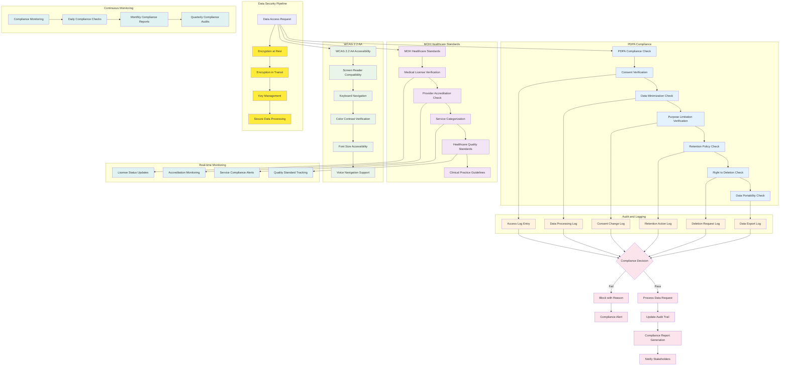

# Application Logic Flow for Healthcare Platform

## Core Application Data Flow

```mermaid
graph TD
    %% Request Entry Points
    A[HTTP Request] --> B{Next.js Route Handler}
    B --> C[Server Component]
    B --> D[API Route]
    B --> E[tRPC Handler]
    
    %% Authentication Flow
    C --> F[Session Check]
    D --> F
    E --> F
    F --> G{Authenticated?}
    G -->|Yes| H[Role-based Access Control]
    G -->|No| I[Redirect to Login]
    I --> J[NextAuth 5.0 Process]
    J --> K[Multi-Factor Auth]
    K --> H
    
    %% Data Validation
    H --> L[Input Validation]
    L --> M{Zod Schema Validation}
    M -->|Valid| N[Process Request]
    M -->|Invalid| O[Validation Error Response]
    
    %% Healthcare Business Logic
    N --> P[Healthcare Context]
    P --> Q[PDPA Compliance Check]
    Q --> R{Medical Data?}
    R -->|Yes| S[Enhanced Security]
    R -->|No| T[Standard Processing]
    S --> U[Medical-grade Encryption]
    T --> V[Standard Encryption]
    
    %% Database Operations
    U --> W[Prisma ORM]
    V --> W
    W --> X[Connection Pool]
    X --> Y{Query Type}
    Y -->|Read| Z[SELECT Operations]
    Y -->|Write| AA[INSERT/UPDATE Operations]
    Y -->|Spatial| BB[PostGIS Queries]
    
    %% PostGIS Spatial Operations
    BB --> CC[Geometry Calculations]
    CC --> DD[Distance Computations]
    DD --> EE[Spatial Index Lookup]
    EE --> FF[5km Radius Search]
    FF --> GG[Clinic Proximity Results]
    
    %% Healthcare-Specific Processing
    Z --> HH[Data Serialization]
    AA --> II[Transaction Management]
    HH --> JJ[Healthcare Enrichment]
    II --> JJ
    JJ --> KK[Compliance Metadata]
    
    %% Real-time Updates
    KK --> LL{Real-time Required?}
    LL -->|Yes| MM[WebSocket Emission]
    LL -->|No| NN[Response Preparation]
    MM --> OO[Push Notification]
    OO --> NN
    
    %% Response Processing
    NN --> PP[Data Sanitization]
    PP --> QQ[Compliance Logging]
    QQ --> RR[Response Formatting]
    RR --> SS[Client Response]
    
    %% Error Handling
    O --> TT[Error Logging]
    SS --> UU[Performance Monitoring]
    TT --> VV[Audit Trail Entry]
    UU --> WW[Analytics Tracking]
    
    %% Healthcare Compliance Workflows
    subgraph "PDPA Compliance"
        Q --> XX[Consent Verification]
        XX --> YY[Data Minimization]
        YY --> ZZ[Right to Deletion]
    end
    
    subgraph "MOH Healthcare Standards"
        PP --> AAA[Medical License Verification]
        AAA --> BBB[Service Categorization]
        BBB --> CCC[Provider Accreditation]
    end
    
    subgraph "Data Encryption Pipeline"
        U --> DDD[At Rest Encryption]
        DDD --> EEE[AES-256 Encryption]
        EEE --> FFF[Key Management]
    end
    
    subgraph "Audit and Logging"
        VV --> GGG[Healthcare Audit Trail]
        GGG --> HHH[Access Logging]
        HHH --> III[Compliance Reporting]
    end
    
    subgraph "Real-time Subscriptions"
        MM --> JJJ[Live Availability]
        MM --> KKK[Appointment Updates]
        MM --> LLL[Patient Queue Status]
    end
    
    %% Style definitions
    classDef entry fill:#e1f5fe
    classDef auth fill:#f3e5f5
    classDef validation fill:#e8f5e8
    classDef business fill:#fff3e0
    classDef database fill:#fce4ec
    classDef compliance fill:#ffeb3b
    classDef realtime fill:#e0f2f1
    classDef response fill:#f1f8e9
    
    class A,B,C,D,E entry
    class F,G,H,I,J,K auth
    class L,M,N,O validation
    class P,Q,R,S,T,U,V business
    class W,X,Y,Z,AA,BB,CC,DD,EE,FF,GG database
    class XX,YY,ZZ,AAA,BBB,CCC,DDD,EEE,FFF,GGG,HHH,III compliance
    class MM,OO,JJJ,KKK,LLL realtime
    class PP,QQ,RR,SS,UU,WW response
```

## Database Operations and Data Processing Flow

## API Architecture and Service Integration Flow

```mermaid
graph TD
    %% API Gateway
    A[API Gateway] --> B[Rate Limiting]
    B --> C[Authentication Middleware]
    C --> D[Request Routing]
    
    %% tRPC Routers
    subgraph "Healthcare API Routers (29 Total)"
        E[Patient Router] --> F[Registration Endpoint]
        E --> G[Profile Management]
        E --> H[Medical History]
        
        I[Clinic Router] --> J[Search Endpoints]
        I --> K[Profile Management]
        I --> L[Spatial Queries]
        
        M[Doctor Router] --> N[Profile Endpoints]
        M --> O[Specialty Search]
        M --> P[Availability]
        
        Q[Appointment Router] --> R[Booking Logic]
        Q --> S[Schedule Management]
        Q --> T[Conflict Resolution]
        
        U[Search Router] --> V[Geospatial Search]
        U --> W[Filter Logic]
        U --> X[Result Ranking]
        
        Y[Compliance Router] --> Z[PDPA Endpoints]
        Y --> AA[Consent Management]
        Y --> BB[Audit Logging]
    end
    
    %% Business Logic Layer
    subgraph "Healthcare Business Logic"
        CC[Healthcare Validators] --> DD[Medical Rule Engine]
        DD --> EE[Business Rule Processor]
        EE --> FF[Compliance Checker]
    end
    
    %% External Service Integration
    subgraph "External Integrations"
        GG[Supabase Services] --> HH[Authentication]
        GG --> II[Real-time Database]
        
        JJ[MOH APIs] --> KK[License Verification]
        JJ --> LL[Provider Database]
        
        MM[Healthier SG API] --> NN[Program Integration]
        MM --> OO[Enrollment Tracking]
        
        PP[Notification Services] --> QQ[Email Service]
        PP --> RR[SMS Service]
        PP --> SS[Push Notifications]
    end
    
    %% Data Processing Pipeline
    D --> E
    D --> I
    D --> M
    D --> Q
    D --> U
    D --> Y
    
    E --> CC
    I --> CC
    M --> CC
    Q --> CC
    U --> CC
    Y --> CC
    
    CC --> GG
    CC --> JJ
    CC --> MM
    CC --> PP
    
    %% Real-time Features
    GG --> TT[WebSocket Manager]
    TT --> UU[Live Updates]
    UU --> VV[Push Notifications]
    
    %% Response Processing
    FF --> WW[Response Formatter]
    WW --> XX[Data Sanitizer]
    XX --> YY[Compliance Logger]
    YY --> ZZ[Client Response]
    
    %% Error Handling
    AAAA[Error Handler] --> BBBB[Healthcare Error Mapping]
    BBBB --> CCCC[Compliance Alerting]
    CCCC --> DDDD[Audit Trail]
    
    %% Style definitions
    classDef gateway fill:#e1f5fe
    classDef router fill:#f3e5f5
    classDef business fill:#e8f5e8
    classDef external fill:#ffeb3b
    classDef processing fill:#e0f2f1
    classDef realtime fill:#fce4ec
    
    class A,B,C,D gateway
    class E,F,G,H,I,J,K,L,M,N,O,P,Q,R,S,T,U,V,W,X,Y,Z,AA,BB router
    class CC,DD,EE,FF business
    class GG,HH,II,JJ,KK,LL,MM,NN,OO,PP,QQ,RR,SS external
    class WW,XX,YY,ZZ,AAAA,BBBB,CCCC,DDDD processing
    class TT,UU,VV realtime
```

## Healthcare Compliance Workflow Integration

