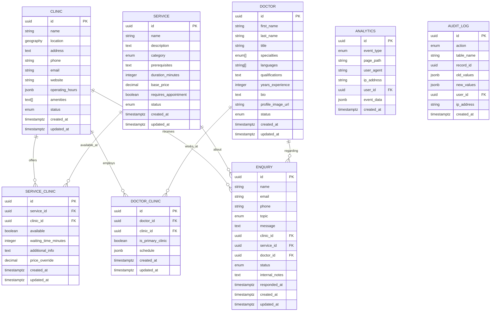

# System Architecture Diagram: My Family Clinic Website

## Architecture Overview Diagram

## Data Flow Architecture

## Component Architecture

## Database Schema Architecture

## Security Architecture

## Performance Architecture

## Deployment Architecture

## Integration Points

This comprehensive system architecture diagram provides a visual representation of all major components, their relationships, and data flows within the My Family Clinic website system. It serves as a reference for development teams and stakeholders to understand the overall system design and integration points.