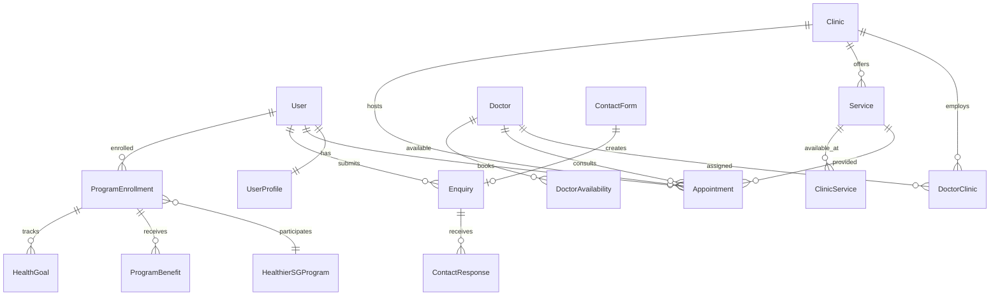

# System Architecture Documentation

## Overview

The My Family Clinic system is a modern, scalable healthcare management platform built with Next.js 14, designed to support Singapore's healthcare ecosystem including Healthier SG program integration. This document outlines the complete system architecture, component relationships, and design patterns.

## Architecture Principles

### 1. **Healthcare-First Design**
- HIPAA/PDPA compliance built-in
- End-to-end encryption for patient data
- Immutable audit trails
- Zero-trust security model

### 2. **Scalability & Performance**
- Horizontal scaling capability
- Database sharding support
- CDN integration for global distribution
- Real-time data synchronization

### 3. **Integration-Ready**
- Microservices architecture
- API-first design
- Event-driven communication
- Healthcare standard compliance (HL7, FHIR)

### 4. **Accessibility & Compliance**
- WCAG 2.2 AA compliance
- Multi-language support (English, Chinese, Malay, Tamil)
- Mobile-first responsive design
- Cross-platform compatibility

---

## High-Level Architecture

```mermaid
graph TB
    subgraph "Client Layer"
        WebApp[Next.js Web Application]
        MobileApp[Mobile App (React Native)]
        AdminPanel[Admin Dashboard]
    end
    
    subgraph "API Gateway"
        Gateway[API Gateway/Load Balancer]
        Auth[Authentication Service]
        RateLimit[Rate Limiting]
    end
    
    subgraph "Application Layer"
        NextJS[Next.js Server]
        TRPC[tRPC API Layer]
        WebSocket[WebSocket Server]
        Queue[Message Queue]
    end
    
    subgraph "Business Logic"
        DoctorAPI[Doctor Service]
        ClinicAPI[Clinic Service]
        AppointmentAPI[Appointment Service]
        ContactAPI[Contact Service]
        AnalyticsAPI[Analytics Service]
        EligibilityAPI[Eligibility Service]
    end
    
    subgraph "Data Layer"
        PostgreSQL[(PostgreSQL Database)]
        Redis[(Redis Cache)]
        FileStorage[File Storage]
        SearchIndex[Search Index]
    end
    
    subgraph "External Integrations"
        MyInfo[MyInfo SingPass]
        GovAPI[Government APIs]
        PaymentGateway[Payment Gateway]
        SMSGateway[SMS Gateway]
        EmailService[Email Service]
        GoogleMaps[Google Maps API]
    end
    
    subgraph "Monitoring & Security"
        Logging[Centralized Logging]
        Monitoring[Performance Monitoring]
        Security[Security Services]
        Backup[Backup Services]
    end
    
    WebApp --> Gateway
    MobileApp --> Gateway
    AdminPanel --> Gateway
    
    Gateway --> Auth
    Gateway --> RateLimit
    Gateway --> NextJS
    
    NextJS --> TRPC
    TRPC --> DoctorAPI
    TRPC --> ClinicAPI
    TRPC --> AppointmentAPI
    TRPC --> ContactAPI
    TRPC --> AnalyticsAPI
    TRPC --> EligibilityAPI
    
    NextJS --> WebSocket
    NextJS --> Queue
    
    DoctorAPI --> PostgreSQL
    ClinicAPI --> PostgreSQL
    AppointmentAPI --> PostgreSQL
    ContactAPI --> PostgreSQL
    AnalyticsAPI --> PostgreSQL
    EligibilityAPI --> PostgreSQL
    
    DoctorAPI --> Redis
    ClinicAPI --> Redis
    AppointmentAPI --> Redis
    
    NextJS --> FileStorage
    NextJS --> SearchIndex
    
    Gateway --> MyInfo
    Gateway --> GovAPI
    Gateway --> PaymentGateway
    Gateway --> SMSGateway
    Gateway --> EmailService
    Gateway --> GoogleMaps
    
    NextJS --> Logging
    NextJS --> Monitoring
    NextJS --> Security
    NextJS --> Backup
```

---

## Technology Stack

### Frontend Technologies

#### **Next.js 14** - React Framework
- **App Router**: Modern file-based routing
- **Server Components**: Optimized performance and SEO
- **API Routes**: Built-in API endpoints
- **Image Optimization**: Automatic image optimization
- **Internationalization**: Multi-language support

#### **React 19** - UI Library
- **Concurrent Features**: Improved rendering performance
- **Suspense**: Better error handling and loading states
- **Hooks**: Custom hooks for reusable logic
- **Context**: Global state management

#### **TypeScript** - Type Safety
- **Strict Mode**: Enhanced type checking
- **Generics**: Reusable type-safe components
- **Utility Types**: Built-in TypeScript utilities
- **Type Inference**: Automatic type detection

#### **Tailwind CSS** - Styling
- **Utility-First**: Rapid UI development
- **Responsive Design**: Mobile-first approach
- **Dark Mode**: Automatic theme switching
- **Custom Design System**: Consistent styling

#### **Radix UI** - Component Library
- **Headless Components**: Customizable primitives
- **Accessibility**: WCAG compliant components
- **Theming**: Easy customization
- **Keyboard Navigation**: Built-in keyboard support

### Backend Technologies

#### **tRPC** - Type-Safe APIs
- **End-to-End Types**: Type safety across client/server
- **Real-time Subscriptions**: WebSocket support
- **Input Validation**: Zod schema validation
- **Error Handling**: Comprehensive error management

#### **Prisma ORM** - Database Layer
- **Type Safety**: Generated TypeScript types
- **Migration System**: Schema version control
- **Connection Pooling**: Database optimization
- **Query Optimization**: Efficient database queries

#### **PostgreSQL** - Primary Database
- **ACID Compliance**: Reliable transactions
- **JSON Support**: Flexible data storage
- **Full-Text Search**: Built-in search capabilities
- **Extensions**: PostGIS, UUID, etc.

#### **Redis** - Caching Layer
- **In-Memory Storage**: Fast data access
- **Pub/Sub**: Real-time notifications
- **Session Storage**: User session management
- **Rate Limiting**: API rate limiting

### Infrastructure & DevOps

#### **Vercel** - Hosting Platform
- **Edge Network**: Global CDN
- **Automatic Scaling**: Serverless functions
- **Preview Deployments**: Branch-specific deployments
- **Analytics**: Built-in performance monitoring

#### **Supabase** - Backend Services
- **Database Hosting**: Managed PostgreSQL
- **Authentication**: Built-in auth services
- **Real-time**: WebSocket subscriptions
- **Storage**: File storage and CDN

---

## Component Architecture

### 1. Frontend Architecture

#### **Page Structure**
```
src/app/
├── (auth)/
│   ├── login/
│   ├── register/
│   └── forgot-password/
├── (dashboard)/
│   ├── dashboard/
│   ├── appointments/
│   ├── profile/
│   └── settings/
├── (public)/
│   ├── clinics/
│   ├── doctors/
│   ├── services/
│   └── contact/
├── admin/
│   ├── dashboard/
│   ├── clinics/
│   ├── doctors/
│   └── analytics/
└── api/
    └── trpc/
```

#### **Component Hierarchy**
```
App
├── Layout
│   ├── Header
│   ├── Navigation
│   └── Footer
├── Pages
│   ├── DoctorList
│   │   ├── SearchFilter
│   │   ├── DoctorCard
│   │   └── Pagination
│   ├── ClinicDetails
│   │   ├── ClinicInfo
│   │   ├── DoctorList
│   │   ├── Services
│   │   └── Reviews
│   └── AppointmentBooking
│       ├── ServiceSelection
│       ├── DoctorSelection
│       ├── DateTimePicker
│       └── Confirmation
└── SharedComponents
    ├── UI (Radix-based)
    ├── Forms
    ├── Charts
    └── Accessibility
```

#### **State Management**
- **Local State**: React useState/useReducer
- **Server State**: TanStack Query with tRPC
- **Global State**: Zustand for app-wide state
- **Form State**: React Hook Form with Zod validation

### 2. Backend Architecture

#### **tRPC Router Structure**
```
src/server/api/
├── root.ts                 # Root router
├── trpc.ts                 # tRPC configuration
├── routers/
│   ├── auth.ts             # Authentication
│   ├── doctor.ts           # Doctor management
│   ├── clinic.ts           # Clinic management
│   ├── appointment.ts      # Appointment booking
│   ├── service.ts          # Service management
│   ├── contact.ts          # Contact forms
│   ├── analytics.ts        # Analytics data
│   ├── eligibility.ts      # Healthier SG eligibility
│   └── healthiier-sg.ts    # Healthier SG program
├── middleware/
│   ├── auth.ts             # Authentication middleware
│   ├── rateLimit.ts        # Rate limiting
│   └── validation.ts       # Input validation
└── utils/
    ├── database.ts         # Database utilities
    ├── cache.ts            # Cache management
    └── logging.ts          # Logging utilities
```

#### **Database Layer**
- **Prisma Schema**: Type-safe database models
- **Migrations**: Version-controlled schema changes
- **Connection Pool**: Optimized database connections
- **Query Optimization**: Efficient data access patterns

---

## Data Architecture

### Database Schema Overview

#### **Core Entities**

1. **User Management**
   - Users, UserProfiles, UserPreferences
   - Authentication, Sessions, VerificationTokens
   - Role-based access control

2. **Healthcare Providers**
   - Doctors, Specialties, Qualifications
   - Clinics, Services, OperatingHours
   - Doctor-Clinic relationships

3. **Patient Management**
   - Appointments, MedicalHistory
   - HealthProfiles, EligibilityAssessments
   - Reviews, Ratings

4. **Healthier SG Program**
   - ProgramEnrollment, Benefits, Claims
   - HealthGoals, Activities, Milestones
   - ClinicParticipation, PerformanceMetrics

5. **Contact & Communication**
   - ContactForms, Enquiries, Responses
   - Templates, Routing, Escalations
   - Multi-channel communication

#### **Data Relationships**



### Data Flow Patterns

#### **1. Appointment Booking Flow**
```
Patient → Doctor Search → Doctor Selection → 
Date/Time Selection → Service Selection → 
Confirmation → Appointment Created → 
Notifications Sent → Calendar Updated
```

#### **2. Healthier SG Enrollment Flow**
```
User → Eligibility Assessment → Score Calculation → 
Enrollment Approval → Benefit Assignment → 
Goal Setting → Activity Tracking → 
Progress Monitoring → Milestone Achievement
```

#### **3. Contact Form Processing Flow**
```
Form Submission → Validation → Spam Check → 
Category Assignment → Routing → Agent Assignment → 
Response → Resolution → Feedback → 
Analytics Recording
```

---

## Integration Architecture

### External Service Integration

#### **Government Integrations**

1. **MyInfo SingPass**
   - Identity verification
   - Personal data retrieval
   - Address verification
   - NRIC validation

2. **MOH (Ministry of Health) APIs**
   - Healthier SG program data
   - Clinic accreditation status
   - Doctor license verification
   - Service coverage verification

3. **NRIC Verification Service**
   - Identity validation
   - Duplicate check
   - Format validation
   - Address matching

#### **Third-Party Services**

1. **Payment Processing**
   - Stripe integration
   - Payment intent handling
   - Refund processing
   - Subscription management

2. **Communication Services**
   - Twilio SMS
   - SendGrid email
   - WhatsApp Business API
   - Push notifications

3. **Location Services**
   - Google Maps API
   - Geocoding services
   - Distance calculation
   - Route optimization

4. **Analytics & Monitoring**
   - Google Analytics
   - Sentry error tracking
   - LogRocket user sessions
   - Performance monitoring

### API Integration Patterns

#### **1. RESTful APIs**
```typescript
// Standard REST pattern
GET    /api/clinics           // List clinics
GET    /api/clinics/:id       // Get clinic details
POST   /api/clinics           // Create clinic
PUT    /api/clinics/:id       // Update clinic
DELETE /api/clinics/:id       // Delete clinic
```

#### **2. tRPC APIs**
```typescript
// Type-safe RPC pattern
clinic.getAll()              // List clinics
clinic.getById({ id })       // Get clinic details
clinic.create({ data })      // Create clinic
clinic.update({ id, data })  // Update clinic
clinic.delete({ id })        // Delete clinic
```

#### **3. Real-time Updates**
```typescript
// WebSocket subscriptions
appointment.onStatusChange()  // Live appointment updates
doctor.onAvailabilityChange() // Availability changes
contact.onEnquiryUpdate()     // Enquiry status updates
```

---

## Security Architecture

### Authentication & Authorization

#### **Authentication Flow**
```
1. User initiates login
2. Redirect to authentication provider
3. Provider validates credentials
4. JWT token issued with user claims
5. Token stored securely (httpOnly cookie)
6. Subsequent requests include token
7. Token validated on each request
8. Role-based permissions enforced
```

#### **Authorization Levels**
- **Public**: Public information (clinic listings, services)
- **Authenticated**: Logged-in user actions (booking, profile)
- **Patient**: Patient-specific actions (medical records)
- **Provider**: Healthcare provider actions (schedule management)
- **Admin**: Administrative actions (user management)
- **Super Admin**: System administration (configuration)

### Data Protection

#### **Encryption Strategy**
- **At Rest**: AES-256 encryption for database
- **In Transit**: TLS 1.3 for all communications
- **Application Level**: Field-level encryption for PII
- **Key Management**: AWS KMS / HashiCorp Vault

#### **Privacy Compliance**
- **PDPA**: Personal Data Protection Act compliance
- **GDPR**: European data protection (for international users)
- **HIPAA**: Healthcare data protection standards
- **MOH Guidelines**: Singapore healthcare data requirements

### Security Measures

#### **Input Validation**
- Server-side validation using Zod schemas
- SQL injection prevention via Prisma ORM
- XSS protection via content sanitization
- CSRF protection via tokens

#### **Audit & Monitoring**
- Comprehensive audit logging
- Real-time security monitoring
- Automated threat detection
- Incident response procedures

---

## Performance Architecture

### Caching Strategy

#### **Multi-Level Caching**
1. **Browser Cache**: Static assets, images
2. **CDN Cache**: Global content delivery
3. **Application Cache**: Redis for frequently accessed data
4. **Database Cache**: Query result caching
5. **API Cache**: Response caching for public data

#### **Cache Invalidation**
- **Time-based**: Expire cache after specific duration
- **Event-based**: Invalidate on data changes
- **Tag-based**: Invalidate related cache entries
- **Manual**: Admin-triggered cache clearing

### Database Optimization

#### **Query Optimization**
- **Indexing Strategy**: Composite indexes for common queries
- **Query Analysis**: Regular EXPLAIN ANALYZE reviews
- **Connection Pooling**: Efficient database connections
- **Read Replicas**: Distribute read load

#### **Data Architecture**
- **Normalization**: Eliminate data redundancy
- **Partitioning**: Large table partitioning
- **Archiving**: Historical data archival
- **Sharding**: Horizontal scaling preparation

### Frontend Performance

#### **Optimization Techniques**
- **Code Splitting**: Dynamic imports for route-based splitting
- **Image Optimization**: Next.js Image component
- **Bundle Analysis**: Regular bundle size monitoring
- **Progressive Loading**: Lazy loading for non-critical content

#### **Core Web Vitals**
- **LCP (Largest Contentful Paint)**: < 2.5s target
- **FID (First Input Delay)**: < 100ms target
- **CLS (Cumulative Layout Shift)**: < 0.1 target

---

## Scalability Architecture

### Horizontal Scaling

#### **Application Layer**
- **Load Balancing**: Multiple application instances
- **Auto Scaling**: Based on CPU/memory usage
- **Container Orchestration**: Docker + Kubernetes
- **Edge Functions**: Serverless for specific operations

#### **Database Scaling**
- **Read Replicas**: Distribute read operations
- **Connection Pooling**: Efficient connection management
- **Database Sharding**: Horizontal data partitioning
- **CQRS**: Separate read/write operations

### Microservices Preparation

#### **Service Boundaries**
- **User Service**: Authentication and user management
- **Provider Service**: Doctor and clinic management
- **Appointment Service**: Booking and scheduling
- **Communication Service**: Notifications and messaging
- **Analytics Service**: Data collection and reporting

#### **Communication Patterns**
- **Event Sourcing**: Immutable event log
- **Message Queues**: Asynchronous communication
- **API Gateway**: Centralized routing
- **Service Discovery**: Dynamic service location

---

## Deployment Architecture

### Environment Strategy

#### **Development Environment**
- **Local Development**: Docker Compose setup
- **Feature Branches**: Individual feature testing
- **Automated Testing**: CI/CD pipeline integration
- **Database Seeding**: Sample data for testing

#### **Staging Environment**
- **Pre-production Testing**: Full system testing
- **Performance Testing**: Load and stress testing
- **Security Testing**: Vulnerability assessment
- **User Acceptance Testing**: Stakeholder validation

#### **Production Environment**
- **High Availability**: Multi-zone deployment
- **Disaster Recovery**: Automated backups
- **Monitoring**: Real-time system monitoring
- **Scaling**: Automatic horizontal scaling

### CI/CD Pipeline

#### **Code Quality Gates**
1. **Linting**: ESLint + Prettier validation
2. **Type Checking**: TypeScript compilation
3. **Unit Testing**: Jest/Vitest test execution
4. **Integration Testing**: API endpoint testing
5. **Security Scanning**: Vulnerability assessment
6. **Performance Testing**: Load testing validation

#### **Deployment Process**
1. **Build**: Compile and bundle application
2. **Test**: Run automated test suite
3. **Security Scan**: Vulnerability assessment
4. **Deploy**: Blue-green deployment strategy
5. **Verify**: Health check validation
6. **Monitor**: Post-deployment monitoring

---

## Monitoring & Observability

### Application Monitoring

#### **Metrics Collection**
- **Application Metrics**: Response times, error rates
- **Business Metrics**: User engagement, conversion rates
- **Infrastructure Metrics**: CPU, memory, disk usage
- **Custom Metrics**: Healthcare-specific KPIs

#### **Alerting Strategy**
- **Performance Alerts**: Response time thresholds
- **Error Alerts**: Error rate thresholds
- **Business Alerts**: Unusual activity patterns
- **Infrastructure Alerts**: Resource utilization

### Logging Strategy

#### **Log Levels**
- **ERROR**: Critical errors requiring attention
- **WARN**: Warning conditions
- **INFO**: General information
- **DEBUG**: Detailed debugging information

#### **Log Aggregation**
- **Structured Logging**: JSON format for easy parsing
- **Centralized Collection**: ELK stack or similar
- **Search & Analysis**: Full-text search capabilities
- **Retention Policy**: Configurable log retention

### Health Checks

#### **Application Health**
- **Database Connectivity**: Connection status check
- **External API Status**: Integration health
- **Memory Usage**: Memory leak detection
- **Response Times**: Performance monitoring

#### **Business Health**
- **Appointment Success Rate**: Booking completion rate
- **User Registration Rate**: New user signup rate
- **Service Availability**: Core service uptime
- **Error Rates**: Application error monitoring

---

## Disaster Recovery

### Backup Strategy

#### **Data Backup**
- **Database Backups**: Daily automated backups
- **File Storage Backups**: Synchronized backups
- **Configuration Backups**: Infrastructure as Code
- **Code Backups**: Version control repositories

#### **Recovery Procedures**
- **RTO (Recovery Time Objective)**: < 4 hours
- **RPO (Recovery Point Objective)**: < 1 hour
- **Automated Recovery**: Script-based recovery process
- **Manual Procedures**: Documented manual steps

### Business Continuity

#### **High Availability**
- **Multi-Region Deployment**: Geographic redundancy
- **Load Balancing**: Traffic distribution
- **Failover Procedures**: Automatic failover
- **Data Synchronization**: Real-time data replication

#### **Incident Response**
- **Response Team**: Dedicated incident response team
- **Communication Plan**: Stakeholder notification
- **Root Cause Analysis**: Post-incident review
- **Prevention Measures**: Process improvements

---

## Future Architecture Considerations

### Emerging Technologies

#### **AI/ML Integration**
- **Predictive Analytics**: Health outcome prediction
- **Natural Language Processing**: Automated triage
- **Computer Vision**: Medical image analysis
- **Recommendation Systems**: Personalized care suggestions

#### **Blockchain Integration**
- **Medical Records**: Immutable health records
- **Consent Management**: Transparent consent tracking
- **Supply Chain**: Drug traceability
- **Insurance Claims**: Automated claim processing

### Scalability Roadmap

#### **Phase 1: Current Architecture**
- Monolithic Next.js application
- Single database instance
- Basic caching layer

#### **Phase 2: Microservices**
- Service decomposition
- Independent scaling
- Event-driven architecture

#### **Phase 3: Global Scale**
- Multi-region deployment
- Edge computing
- Advanced AI integration

---

## Conclusion

The My Family Clinic architecture is designed to be:
- **Scalable**: Can handle growth from thousands to millions of users
- **Secure**: Healthcare-grade security and compliance
- **Performant**: Optimized for fast response times
- **Maintainable**: Clean architecture and comprehensive documentation
- **Extensible**: Ready for future feature additions and integrations

This architecture provides a solid foundation for building a world-class healthcare management platform that meets the needs of Singapore's healthcare ecosystem while maintaining the highest standards of security, performance, and user experience.