# Database Schema Documentation

## Overview

This document provides comprehensive documentation for the My Family Clinic database schema. The system uses PostgreSQL 15 with Prisma ORM, designed to support Singapore's healthcare ecosystem including the Healthier SG program integration.

## Database Technology Stack

### Core Technologies
- **PostgreSQL 15**: Primary database engine
- **Prisma ORM**: Type-safe database access layer
- **PostGIS Extension**: Geospatial data support
- **Redis**: Caching and session storage
- **Connection Pooling**: PgBouncer for connection management

### Schema Design Principles
1. **Healthcare Compliance**: PDPA, GDPR, and MOH compliant design
2. **Data Integrity**: Comprehensive constraints and validations
3. **Performance**: Optimized indexes and query patterns
4. **Scalability**: Horizontal scaling ready
5. **Audit Trail**: Complete change tracking

---

## Schema Architecture

### Database Overview

```mermaid
graph TD
    subgraph "Authentication & Users"
        users[users]
        accounts[accounts]
        sessions[sessions]
        user_profiles[user_profiles]
        user_preferences[user_preferences]
    end
    
    subgraph "Healthcare Providers"
        clinics[clinics]
        clinic_services[clinic_services]
        clinic_languages[clinic_languages]
        operating_hours[operating_hours]
        clinic_reviews[clinic_reviews]
    end
    
    subgraph "Medical Professionals"
        doctors[doctors]
        doctor_clinics[doctor_clinics]
        doctor_specialties[doctor_specialties]
        doctor_availability[doctor_availability]
        doctor_appointments[doctor_appointments]
        doctor_education[doctor_education]
        doctor_certifications[doctor_certifications]
    end
    
    subgraph "Services & Treatments"
        service_categories[service_categories]
        services[services]
        service_availability[service_availability]
        service_synonyms[service_synonyms]
        clinic_service_pricing[clinic_service_pricing]
    end
    
    subgraph "Patient Management"
        appointments[appointments]
        patient_medical_history[patient_medical_history]
        reviews[reviews]
        search_logs[search_logs]
    end
    
    subgraph "Healthier SG Program"
        healthier_sg_programs[healthier_sg_programs]
        program_enrollments[program_enrollments]
        eligibility_assessments[eligibility_assessments]
        health_profiles[health_profiles]
        health_goals[health_goals]
        program_benefits[program_benefits]
        benefit_claims[benefit_claims]
    end
    
    subgraph "Contact & Communication"
        contact_categories[contact_categories]
        contact_forms[contact_forms]
        enquiries[enquiries]
        contact_responses[contact_responses]
        contact_assignments[contact_assignments]
    end
    
    subgraph "Analytics & Audit"
        analytics_events[analytics_events]
        audit_logs[audit_logs]
        performance_metrics[performance_metrics]
        search_analytics[search_analytics]
    end
    
    users --> user_profiles
    users --> user_preferences
    clinics --> clinic_services
    clinics --> clinic_languages
    clinics --> operating_hours
    clinics --> clinic_reviews
    doctors --> doctor_clinics
    doctors --> doctor_specialties
    doctors --> doctor_availability
    doctors --> doctor_appointments
    doctors --> doctor_education
    doctors --> doctor_certifications
    service_categories --> services
    services --> service_availability
    services --> service_synonyms
    users --> appointments
    users --> program_enrollments
    users --> eligibility_assessments
    users --> contact_forms
    users --> enquiries
    users --> analytics_events
    users --> audit_logs
```



---

## Core Entity Models

### User Management

#### Users Table
```sql
CREATE TABLE users (
    id UUID PRIMARY KEY DEFAULT gen_random_uuid(),
    email VARCHAR(255) UNIQUE NOT NULL,
    name VARCHAR(255),
    image VARCHAR(500),
    email_verified TIMESTAMP WITH TIME ZONE,
    role user_role DEFAULT 'PATIENT',
    created_at TIMESTAMP WITH TIME ZONE DEFAULT NOW(),
    updated_at TIMESTAMP WITH TIME ZONE DEFAULT NOW()
);
```

**Description**: Core user authentication and basic information
**Indexes**: `idx_users_email`, `idx_users_role`, `idx_users_created_at`
**Relationships**: 
- One-to-One: `user_profiles`, `user_preferences`
- One-to-Many: `appointments`, `enquiries`, `program_enrollments`

#### User Profiles Table
```sql
CREATE TABLE user_profiles (
    id UUID PRIMARY KEY DEFAULT gen_random_uuid(),
    user_id UUID UNIQUE REFERENCES users(id) ON DELETE CASCADE,
    phone VARCHAR(20),
    address TEXT,
    postal_code VARCHAR(10),
    date_of_birth DATE,
    gender gender,
    nric VARCHAR(20), -- Encrypted Singapore NRIC
    preferred_language VARCHAR(10) DEFAULT 'en',
    emergency_contact VARCHAR(100),
    medical_conditions TEXT[],
    allergies TEXT[],
    created_at TIMESTAMP WITH TIME ZONE DEFAULT NOW(),
    updated_at TIMESTAMP WITH TIME ZONE DEFAULT NOW()
);
```

**Description**: Extended user profile information including medical data
**Privacy**: NRIC field is encrypted at application level
**Compliance**: PDPA compliant data handling

#### User Preferences Table
```sql
CREATE TABLE user_preferences (
    id UUID PRIMARY KEY DEFAULT gen_random_uuid(),
    user_id UUID UNIQUE REFERENCES users(id) ON DELETE CASCADE,
    email_notifications BOOLEAN DEFAULT true,
    sms_notifications BOOLEAN DEFAULT false,
    newsletter_subscription BOOLEAN DEFAULT false,
    theme VARCHAR(20) DEFAULT 'light',
    language VARCHAR(10) DEFAULT 'en',
    accessibility_settings JSONB DEFAULT '{}',
    search_history JSONB DEFAULT '[]',
    favorites UUID[] DEFAULT '{}',
    created_at TIMESTAMP WITH TIME ZONE DEFAULT NOW(),
    updated_at TIMESTAMP WITH TIME ZONE DEFAULT NOW()
);
```

**Description**: User preference settings and personalization
**Features**: WCAG accessibility preferences, search history tracking

---

### Healthcare Providers

#### Clinics Table
```sql
CREATE TABLE clinics (
    id UUID PRIMARY KEY DEFAULT gen_random_uuid(),
    name VARCHAR(255) NOT NULL,
    description TEXT,
    address TEXT NOT NULL,
    postal_code VARCHAR(10) NOT NULL,
    phone VARCHAR(20),
    email VARCHAR(255),
    website VARCHAR(500),
    latitude DOUBLE PRECISION NOT NULL,
    longitude DOUBLE PRECISION NOT NULL,
    location GEOGRAPHY(POINT, 4326), -- PostGIS geography type
    operating_hours JSONB DEFAULT '{}',
    facilities TEXT[] DEFAULT '{}',
    accreditation_status VARCHAR(50) DEFAULT 'pending',
    emergency_phone VARCHAR(20),
    after_hours_phone VARCHAR(20),
    established_year INTEGER,
    license_number VARCHAR(100),
    license_expiry DATE,
    is_active BOOLEAN DEFAULT true,
    is_verified BOOLEAN DEFAULT false,
    rating DECIMAL(3,2) DEFAULT 0,
    review_count INTEGER DEFAULT 0,
    created_at TIMESTAMP WITH TIME ZONE DEFAULT NOW(),
    updated_at TIMESTAMP WITH TIME ZONE DEFAULT NOW()
);
```

**Description**: Healthcare clinic information with geospatial support
**Features**: PostGIS integration for location-based queries
**Indexes**: `idx_clinics_location`, `idx_clinics_active`, `idx_clinics_postal_code`

#### Clinic Services Table
```sql
CREATE TABLE clinic_services (
    id UUID PRIMARY KEY DEFAULT gen_random_uuid(),
    clinic_id UUID REFERENCES clinics(id) ON DELETE CASCADE,
    service_id UUID REFERENCES services(id) ON DELETE CASCADE,
    is_available BOOLEAN DEFAULT true,
    estimated_duration INTEGER, -- Duration in minutes
    price DECIMAL(10,2),
    currency VARCHAR(3) DEFAULT 'SGD',
    base_price DECIMAL(10,2),
    final_price DECIMAL(10,2),
    is_healthier_sg_covered BOOLEAN DEFAULT false,
    healthier_sg_price DECIMAL(10,2),
    medisave_covered BOOLEAN DEFAULT false,
    medisave_amount DECIMAL(10,2),
    medishield_covered BOOLEAN DEFAULT false,
    medishield_deductible DECIMAL(10,2),
    chas_covered BOOLEAN DEFAULT false,
    chas_tier chas_tier,
    chas_subsidy DECIMAL(10,2),
    insurance_covered BOOLEAN DEFAULT false,
    discount_percentage DECIMAL(5,2),
    promotional_price DECIMAL(10,2),
    age_restrictions JSONB DEFAULT '{}',
    gender_restrictions TEXT[] DEFAULT '{}',
    appointment_required BOOLEAN DEFAULT true,
    walk_in_allowed BOOLEAN DEFAULT false,
    service_days JSONB DEFAULT '[]',
    service_hours JSONB DEFAULT '{}',
    quality_rating DECIMAL(3,2) DEFAULT 0,
    patient_count INTEGER DEFAULT 0,
    status clinic_service_status DEFAULT 'ACTIVE',
    notes TEXT,
    created_at TIMESTAMP WITH TIME ZONE DEFAULT NOW(),
    updated_at TIMESTAMP WITH TIME ZONE DEFAULT NOW(),
    UNIQUE(clinic_id, service_id)
);
```

**Description**: Clinic-specific service offerings with pricing and insurance details
**Features**: Healthier SG integration, CHAS subsidy support
**Indexes**: `idx_clinic_services_available`, `idx_clinic_services_price`, `idx_clinic_services_healthier_sg`

---

### Medical Professionals

#### Doctors Table
```sql
CREATE TABLE doctors (
    id UUID PRIMARY KEY DEFAULT gen_random_uuid(),
    name VARCHAR(255) NOT NULL,
    email VARCHAR(255) UNIQUE,
    phone VARCHAR(20),
    medical_license VARCHAR(100) UNIQUE NOT NULL,
    nric VARCHAR(20), -- Encrypted Singapore NRIC
    specialties TEXT[] DEFAULT '{}',
    languages TEXT[] DEFAULT '{}',
    qualifications TEXT[] DEFAULT '{}',
    experience_years INTEGER,
    bio TEXT,
    medical_school VARCHAR(255),
    graduation_year INTEGER,
    specializations TEXT[] DEFAULT '{}',
    board_certifications TEXT[] DEFAULT '{}',
    professional_memberships TEXT[] DEFAULT '{}',
    achievements TEXT[] DEFAULT '{}',
    awards TEXT[] DEFAULT '{}',
    publications TEXT[] DEFAULT '{}',
    research_interests TEXT[] DEFAULT '{}',
    career_highlights JSONB DEFAULT '[]',
    previous_positions JSONB DEFAULT '[]',
    profile_image VARCHAR(500),
    consultation_fee DECIMAL(10,2),
    currency VARCHAR(3) DEFAULT 'SGD',
    is_active BOOLEAN DEFAULT true,
    is_verified BOOLEAN DEFAULT false,
    verification_date TIMESTAMP WITH TIME ZONE,
    verification_notes TEXT,
    rating DECIMAL(3,2) DEFAULT 0,
    review_count INTEGER DEFAULT 0,
    patient_satisfaction DECIMAL(3,2),
    appointment_completion_rate DECIMAL(5,2),
    total_appointments INTEGER DEFAULT 0,
    specialization_popularity DECIMAL(5,2) DEFAULT 0,
    language_preference JSONB DEFAULT '{}',
    privacy_settings JSONB DEFAULT '{}',
    gdpr_consent BOOLEAN DEFAULT false,
    pdpa_consent BOOLEAN DEFAULT false,
    last_privacy_review TIMESTAMP WITH TIME ZONE,
    confidentiality_level confidentiality_level DEFAULT 'STANDARD',
    data_retention_period INTEGER, -- Days to retain data
    preferred_contact_method VARCHAR(20),
    communication_preferences JSONB DEFAULT '{}',
    emergency_contact VARCHAR(100),
    emergency_phone VARCHAR(20),
    cme_points INTEGER DEFAULT 0,
    last_cme_update TIMESTAMP WITH TIME ZONE,
    professional_development JSONB DEFAULT '[]',
    emergency_availability BOOLEAN DEFAULT false,
    on_call_schedule JSONB,
    created_at TIMESTAMP WITH TIME ZONE DEFAULT NOW(),
    updated_at TIMESTAMP WITH TIME ZONE DEFAULT NOW()
);
```

**Description**: Comprehensive doctor information with professional details
**Privacy**: NRIC and sensitive data encrypted
**Compliance**: PDPA and medical confidentiality standards
**Features**: Multi-language support, specialization tracking

#### Doctor Availability Table
```sql
CREATE TABLE doctor_availability (
    id UUID PRIMARY KEY DEFAULT gen_random_uuid(),
    doctor_id UUID REFERENCES doctors(id) ON DELETE CASCADE,
    clinic_id UUID REFERENCES clinics(id) ON DELETE CASCADE,
    date DATE NOT NULL,
    start_time TIME NOT NULL,
    end_time TIME NOT NULL,
    is_available BOOLEAN DEFAULT true,
    availability_type availability_type DEFAULT 'REGULAR',
    appointment_type VARCHAR(50),
    max_appointments INTEGER,
    booked_appointments INTEGER DEFAULT 0,
    available_slots INTEGER DEFAULT 1,
    location VARCHAR(100),
    room_number VARCHAR(20),
    slot_duration INTEGER DEFAULT 30, -- Minutes
    break_duration INTEGER DEFAULT 0,
    buffer_time INTEGER DEFAULT 0,
    is_emergency BOOLEAN DEFAULT false,
    is_walk_in BOOLEAN DEFAULT false,
    is_telehealth BOOLEAN DEFAULT false,
    age_restrictions JSONB DEFAULT '{}',
    gender_restrictions TEXT[] DEFAULT '{}',
    conditions_json JSONB DEFAULT '[]',
    status availability_slot_status DEFAULT 'ACTIVE',
    last_updated TIMESTAMP WITH TIME ZONE DEFAULT NOW(),
    updated_by VARCHAR(100),
    notes TEXT,
    created_at TIMESTAMP WITH TIME ZONE DEFAULT NOW(),
    updated_at TIMESTAMP WITH TIME ZONE DEFAULT NOW()
);
```

**Description**: Doctor availability slots for appointment booking
**Features**: Multiple appointment types, telehealth support
**Performance**: Optimized for real-time availability queries

---

### Services & Treatments

#### Service Categories Table
```sql
CREATE TABLE service_categories (
    id UUID PRIMARY KEY DEFAULT gen_random_uuid(),
    name VARCHAR(255) UNIQUE NOT NULL,
    display_name VARCHAR(255) NOT NULL,
    description TEXT,
    parent_id UUID REFERENCES service_categories(id),
    level INTEGER DEFAULT 0,
    sort_order INTEGER DEFAULT 0,
    moh_code_prefix VARCHAR(20),
    moh_category_name VARCHAR(255),
    ht_category VARCHAR(100),
    ht_priority ht_priority DEFAULT 'STANDARD',
    healthier_sg_category VARCHAR(100),
    healthier_sg_level VARCHAR(50),
    translations JSONB DEFAULT '{}',
    is_active BOOLEAN DEFAULT true,
    is_subsidized BOOLEAN DEFAULT false,
    priority_level INTEGER DEFAULT 0,
    service_count INTEGER DEFAULT 0,
    average_price DECIMAL(10,2),
    created_at TIMESTAMP WITH TIME ZONE DEFAULT NOW(),
    updated_at TIMESTAMP WITH TIME ZONE DEFAULT NOW()
);
```

**Description**: Hierarchical service categorization with government alignment
**Features**: Multi-level hierarchy, MOH code mapping
**Integration**: Healthier SG program alignment

#### Services Table
```sql
CREATE TABLE services (
    id UUID PRIMARY KEY DEFAULT gen_random_uuid(),
    name VARCHAR(255) UNIQUE NOT NULL,
    description TEXT,
    category_id UUID REFERENCES service_categories(id) ON DELETE RESTRICT,
    subcategory VARCHAR(100),
    specialty_area VARCHAR(100),
    moh_code VARCHAR(50),
    icd10_codes TEXT[] DEFAULT '{}',
    cpt_codes TEXT[] DEFAULT '{}',
    typical_duration_min INTEGER,
    complexity_level service_complexity DEFAULT 'BASIC',
    urgency_level urgency_level DEFAULT 'ROUTINE',
    base_price DECIMAL(10,2),
    price_range_min DECIMAL(10,2),
    price_range_max DECIMAL(10,2),
    currency VARCHAR(3) DEFAULT 'SGD',
    is_subsidized BOOLEAN DEFAULT false,
    is_healthier_sg_covered BOOLEAN DEFAULT false,
    healthier_sg_services TEXT[] DEFAULT '{}',
    medisave_coverage JSONB DEFAULT '{}',
    medishield_coverage JSONB DEFAULT '{}',
    insurance_coverage JSONB DEFAULT '{}',
    medical_description TEXT,
    patient_friendly_desc TEXT,
    process_steps JSONB DEFAULT '[]',
    preparation_steps JSONB DEFAULT '[]',
    post_care_instructions JSONB DEFAULT '[]',
    success_rates JSONB DEFAULT '{}',
    risk_factors JSONB DEFAULT '[]',
    age_requirements JSONB DEFAULT '{}',
    gender_requirements JSONB DEFAULT '[]',
    translations JSONB DEFAULT '{}',
    synonyms TEXT[] DEFAULT '{}',
    search_terms TEXT[] DEFAULT '{}',
    common_search_phrases TEXT[] DEFAULT '{}',
    terminology JSONB DEFAULT '{}',
    common_questions JSONB DEFAULT '[]',
    is_active BOOLEAN DEFAULT true,
    sort_order INTEGER DEFAULT 0,
    tags TEXT[] DEFAULT '{}',
    priority_level INTEGER DEFAULT 0,
    view_count INTEGER DEFAULT 0,
    booking_count INTEGER DEFAULT 0,
    last_booked_at TIMESTAMP WITH TIME ZONE,
    created_at TIMESTAMP WITH TIME ZONE DEFAULT NOW(),
    updated_at TIMESTAMP WITH TIME ZONE DEFAULT NOW()
);
```

**Description**: Comprehensive medical service definitions
**Features**: Multi-language support, medical coding integration
**Search**: Optimized for healthcare search queries

---

### Patient Management

#### Appointments Table
```sql
CREATE TABLE appointments (
    id UUID PRIMARY KEY DEFAULT gen_random_uuid(),
    clinic_id UUID REFERENCES clinics(id) ON DELETE RESTRICT,
    doctor_id UUID REFERENCES doctors(id) ON DELETE RESTRICT,
    service_id UUID REFERENCES services(id) ON DELETE RESTRICT,
    patient_id UUID REFERENCES users(id) ON DELETE CASCADE,
    appointment_date DATE NOT NULL,
    start_time TIME NOT NULL,
    end_time TIME NOT NULL,
    status appointment_status DEFAULT 'PENDING',
    symptoms TEXT,
    notes TEXT,
    is_urgent BOOLEAN DEFAULT false,
    confirmation_number VARCHAR(20) UNIQUE,
    is_cancelled BOOLEAN DEFAULT false,
    cancelled_at TIMESTAMP WITH TIME ZONE,
    cancellation_reason TEXT,
    cancelled_by VARCHAR(20),
    is_rescheduled BOOLEAN DEFAULT false,
    original_date DATE,
    original_time TIME,
    reschedule_reason TEXT,
    doctor_notes TEXT,
    patient_feedback TEXT,
    patient_rating INTEGER CHECK (patient_rating >= 1 AND patient_rating <= 5),
    reminder_sent BOOLEAN DEFAULT false,
    reminder_sent_at TIMESTAMP WITH TIME ZONE,
    confirmation_required BOOLEAN DEFAULT true,
    consultation_fee DECIMAL(10,2),
    is_paid BOOLEAN DEFAULT false,
    payment_method VARCHAR(50),
    created_at TIMESTAMP WITH TIME ZONE DEFAULT NOW(),
    updated_at TIMESTAMP WITH TIME ZONE DEFAULT NOW()
);
```

**Description**: Appointment booking and management
**Features**: Rescheduling, cancellation tracking, patient feedback
**Business Logic**: Automatic confirmation number generation

#### Patient Medical History Table
```sql
CREATE TABLE patient_medical_history (
    id UUID PRIMARY KEY DEFAULT gen_random_uuid(),
    patient_id UUID REFERENCES users(id) ON DELETE CASCADE,
    condition_name VARCHAR(255) NOT NULL,
    diagnosed_date DATE,
    status medical_condition_status DEFAULT 'ACTIVE',
    severity severity_level,
    notes TEXT,
    medication TEXT,
    is_chronic BOOLEAN DEFAULT false,
    is_genetic BOOLEAN DEFAULT false,
    family_history BOOLEAN DEFAULT false,
    verified_by VARCHAR(100), -- Doctor who verified
    verification_date TIMESTAMP WITH TIME ZONE,
    icd10_code VARCHAR(10),
    created_at TIMESTAMP WITH TIME ZONE DEFAULT NOW(),
    updated_at TIMESTAMP WITH TIME ZONE DEFAULT NOW()
);
```

**Description**: Patient medical history and conditions
**Privacy**: Sensitive medical information with access controls
**Compliance**: Healthcare data protection standards

---

### Healthier SG Program

#### Healthier SG Programs Table
```sql
CREATE TABLE healthier_sg_programs (
    id UUID PRIMARY KEY DEFAULT gen_random_uuid(),
    name VARCHAR(255) NOT NULL,
    display_name VARCHAR(255) NOT NULL,
    description TEXT,
    program_type healthier_sg_program_type NOT NULL,
    target_demographic VARCHAR(100),
    eligibility_criteria JSONB DEFAULT '{}',
    benefits JSONB DEFAULT '[]',
    duration_months INTEGER,
    cost DECIMAL(10,2),
    moh_approved BOOLEAN DEFAULT false,
    moh_approval_date DATE,
    max_participants INTEGER,
    current_participants INTEGER DEFAULT 0,
    start_date DATE,
    end_date DATE,
    is_active BOOLEAN DEFAULT true,
    registration_deadline DATE,
    moh_service_codes TEXT[] DEFAULT '{}',
    created_at TIMESTAMP WITH TIME ZONE DEFAULT NOW(),
    updated_at TIMESTAMP WITH TIME ZONE DEFAULT NOW()
);
```

**Description**: Healthier SG program definitions
**Integration**: MOH approval tracking and service code mapping
**Capacity**: Participant limits and enrollment tracking

#### Program Enrollments Table
```sql
CREATE TABLE program_enrollments (
    id UUID PRIMARY KEY DEFAULT gen_random_uuid(),
    user_id UUID REFERENCES users(id) ON DELETE CASCADE,
    program_id UUID REFERENCES healthier_sg_programs(id) ON DELETE CASCADE,
    clinic_id UUID REFERENCES clinics(id) ON DELETE CASCADE,
    doctor_id UUID REFERENCES doctors(id) ON DELETE CASCADE,
    enrollment_date TIMESTAMP WITH TIME ZONE DEFAULT NOW(),
    status enrollment_status DEFAULT 'PENDING',
    enrollment_method enrollment_method DEFAULT 'ONLINE',
    eligibility_score INTEGER,
    risk_category VARCHAR(50),
    consent_given BOOLEAN DEFAULT false,
    consent_date TIMESTAMP WITH TIME ZONE,
    withdrawal_date TIMESTAMP WITH TIME ZONE,
    withdrawal_reason TEXT,
    completion_date TIMESTAMP WITH TIME ZONE,
    completion_status completion_status DEFAULT 'IN_PROGRESS',
    last_active_date TIMESTAMP WITH TIME ZONE,
    engagement_score DECIMAL(5,2) DEFAULT 0,
    health_improvement DECIMAL(5,2) DEFAULT 0,
    cost_savings DECIMAL(10,2) DEFAULT 0,
    moh_reporting_required BOOLEAN DEFAULT false,
    created_at TIMESTAMP WITH TIME ZONE DEFAULT NOW(),
    updated_at TIMESTAMP WITH TIME ZONE DEFAULT NOW(),
    UNIQUE(user_id, program_id)
);
```

**Description**: Individual patient enrollment in Healthier SG programs
**Features**: Engagement tracking, health improvement metrics
**Reporting**: MOH compliance reporting support

#### Eligibility Assessments Table
```sql
CREATE TABLE eligibility_assessments (
    id UUID PRIMARY KEY DEFAULT gen_random_uuid(),
    user_id UUID REFERENCES users(id) ON DELETE CASCADE,
    questionnaire_responses JSONB,
    evaluation_result JSONB,
    eligibility_status eligibility_status NOT NULL,
    assessment_date TIMESTAMP WITH TIME ZONE DEFAULT NOW(),
    assessment_version VARCHAR(10) DEFAULT '1.0',
    is_valid BOOLEAN DEFAULT true,
    expires_at TIMESTAMP WITH TIME ZONE,
    age_at_assessment INTEGER,
    residency_status VARCHAR(50),
    medical_conditions TEXT[] DEFAULT '{}',
    risk_profile JSONB,
    processed_by VARCHAR(100),
    processing_notes TEXT,
    validation_errors JSONB DEFAULT '[]',
    my_info_verified BOOLEAN DEFAULT false,
    my_info_data JSONB,
    integration_data JSONB DEFAULT '{}',
    ip_address INET,
    user_agent TEXT,
    session_id VARCHAR(255),
    time_spent_minutes INTEGER,
    created_at TIMESTAMP WITH TIME ZONE DEFAULT NOW(),
    updated_at TIMESTAMP WITH TIME ZONE DEFAULT NOW()
);
```

**Description**: Healthier SG eligibility assessment results
**Features**: MyInfo integration, comprehensive audit trail
**Privacy**: IP address and session tracking for compliance

---

### Contact & Communication

#### Contact Categories Table
```sql
CREATE TABLE contact_categories (
    id UUID PRIMARY KEY DEFAULT gen_random_uuid(),
    name VARCHAR(100) UNIQUE NOT NULL,
    display_name VARCHAR(255) NOT NULL,
    description TEXT,
    requires_auth BOOLEAN DEFAULT false,
    requires_verification BOOLEAN DEFAULT false,
    priority contact_category_priority DEFAULT 'STANDARD',
    department contact_department NOT NULL,
    form_fields JSONB DEFAULT '[]',
    validation_rules JSONB DEFAULT '{}',
    auto_response BOOLEAN DEFAULT true,
    response_template TEXT,
    default_assignee VARCHAR(100),
    routing_rules JSONB DEFAULT '[]',
    escalation_rules JSONB DEFAULT '[]',
    response_sla_hours INTEGER DEFAULT 24,
    resolution_sla_days INTEGER DEFAULT 7,
    is_active BOOLEAN DEFAULT true,
    sort_order INTEGER DEFAULT 0,
    icon VARCHAR(100),
    color VARCHAR(20),
    created_at TIMESTAMP WITH TIME ZONE DEFAULT NOW(),
    updated_at TIMESTAMP WITH TIME ZONE DEFAULT NOW()
);
```

**Description**: Contact form categories with routing and SLA settings
**Features**: Automated routing, escalation rules, SLA tracking

#### Contact Forms Table
```sql
CREATE TABLE contact_forms (
    id UUID PRIMARY KEY DEFAULT gen_random_uuid(),
    reference_number VARCHAR(20) UNIQUE NOT NULL,
    category_id UUID REFERENCES contact_categories(id) ON DELETE RESTRICT,
    template_id UUID REFERENCES contact_form_templates(id),
    subject VARCHAR(255) NOT NULL,
    message TEXT NOT NULL,
    form_data JSONB DEFAULT '{}',
    contact_name VARCHAR(255) NOT NULL,
    contact_email VARCHAR(255) NOT NULL,
    contact_phone VARCHAR(20),
    preferred_contact_method contact_method DEFAULT 'EMAIL',
    user_id UUID REFERENCES users(id) ON DELETE SET NULL,
    patient_id UUID REFERENCES users(id) ON DELETE SET NULL,
    clinic_id UUID REFERENCES clinics(id) ON DELETE SET NULL,
    doctor_id UUID REFERENCES doctors(id) ON DELETE SET NULL,
    service_id UUID REFERENCES services(id) ON DELETE SET NULL,
    medical_information TEXT,
    urgency_level urgency_level DEFAULT 'ROUTINE',
    appointment_urgency appointment_urgency DEFAULT 'STANDARD',
    submission_source contact_source DEFAULT 'WEB_FORM',
    user_agent TEXT,
    ip_address INET,
    referrer_url TEXT,
    session_id VARCHAR(255),
    privacy_consent BOOLEAN DEFAULT false,
    marketing_consent BOOLEAN DEFAULT false,
    data_retention_consent BOOLEAN DEFAULT false,
    consent_version VARCHAR(20),
    gdpr_consent BOOLEAN DEFAULT false,
    pdpa_consent BOOLEAN DEFAULT false,
    status contact_status DEFAULT 'SUBMITTED',
    processing_notes TEXT,
    auto_processed BOOLEAN DEFAULT false,
    spam_check_result spam_check_result DEFAULT 'PENDING',
    duplicate_check BOOLEAN DEFAULT false,
    duplicate_of_id UUID,
    response_required BOOLEAN DEFAULT true,
    auto_response_sent BOOLEAN DEFAULT false,
    response_due TIMESTAMP WITH TIME ZONE,
    response_sent TIMESTAMP WITH TIME ZONE,
    first_response_time INTEGER, -- Minutes
    priority contact_priority DEFAULT 'NORMAL',
    assigned_agent_id VARCHAR(100),
    assigned_department contact_department DEFAULT 'GENERAL',
    created_by VARCHAR(100),
    created_at TIMESTAMP WITH TIME ZONE DEFAULT NOW(),
    updated_at TIMESTAMP WITH TIME ZONE DEFAULT NOW()
);
```

**Description**: Contact form submissions with comprehensive tracking
**Features**: Duplicate detection, spam filtering, automated responses
**Compliance**: PDPA/GDPR consent tracking

---

### Analytics & Audit

#### Analytics Events Table
```sql
CREATE TABLE analytics_events (
    id UUID PRIMARY KEY DEFAULT gen_random_uuid(),
    user_id UUID REFERENCES users(id) ON DELETE SET NULL,
    session_id VARCHAR(255),
    event_type VARCHAR(100) NOT NULL,
    event_category VARCHAR(50),
    event_action VARCHAR(100),
    event_label VARCHAR(255),
    event_value DECIMAL(15,5),
    page_url TEXT,
    page_title VARCHAR(255),
    referrer_url TEXT,
    user_agent TEXT,
    ip_address INET,
    device_type device_type,
    browser_type VARCHAR(50),
    os_type VARCHAR(50),
    screen_resolution VARCHAR(20),
    custom_dimensions JSONB DEFAULT '{}',
    timestamp TIMESTAMP WITH TIME ZONE DEFAULT NOW()
);
```

**Description**: Comprehensive analytics event tracking
**Features**: User behavior tracking, custom dimensions
**Performance**: Partitioned by date for query optimization

#### Audit Logs Table
```sql
CREATE TABLE audit_logs (
    id UUID PRIMARY KEY DEFAULT gen_random_uuid(),
    user_id UUID REFERENCES users(id) ON DELETE SET NULL,
    entity_type VARCHAR(100) NOT NULL,
    entity_id UUID,
    action VARCHAR(100) NOT NULL,
    field_name VARCHAR(100),
    old_value TEXT,
    new_value TEXT,
    table_name VARCHAR(100),
    record_id UUID,
    ip_address INET,
    user_agent TEXT,
    session_id VARCHAR(255),
    data_sensitivity data_sensitivity DEFAULT 'STANDARD',
    access_reason TEXT,
    gdpr_relevant BOOLEAN DEFAULT false,
    pdpa_relevant BOOLEAN DEFAULT false,
    consent_version VARCHAR(20),
    timestamp TIMESTAMP WITH TIME ZONE DEFAULT NOW()
);
```

**Description**: Comprehensive audit trail for compliance
**Features**: Field-level change tracking, data sensitivity classification
**Compliance**: PDPA, GDPR, and healthcare audit requirements

---

## Database Indexes & Performance

### Primary Indexes

#### User-Related Indexes
```sql
-- Users table
CREATE INDEX idx_users_email ON users(email);
CREATE INDEX idx_users_role ON users(role);
CREATE INDEX idx_users_created_at ON users(created_at);

-- User profiles
CREATE INDEX idx_user_profiles_nric ON user_profiles(nric);
CREATE INDEX idx_user_profiles_postal ON user_profiles(postal_code);
```

#### Healthcare Provider Indexes
```sql
-- Clinics
CREATE INDEX idx_clinics_location ON clinics USING GIST(location);
CREATE INDEX idx_clinics_active ON clinics(is_active);
CREATE INDEX idx_clinics_postal ON clinics(postal_code);
CREATE INDEX idx_clinics_rating ON clinics(rating);

-- Doctor availability
CREATE INDEX idx_doctor_availability_date ON doctor_availability(doctor_id, date);
CREATE INDEX idx_doctor_availability_time ON doctor_availability(date, start_time);
CREATE INDEX idx_doctor_availability_status ON doctor_availability(is_available);
```

#### Search Optimization Indexes
```sql
-- Full-text search indexes
CREATE INDEX idx_services_search ON services USING GIN(to_tsvector('english', name || ' ' || COALESCE(description, '')));
CREATE INDEX idx_doctors_search ON doctors USING GIN(to_tsvector('english', name || ' ' || COALESCE(bio, '')));
CREATE INDEX idx_clinics_search ON clinics USING GIN(to_tsvector('english', name || ' ' || COALESCE(description, '')));

-- Geospatial indexes
CREATE INDEX idx_clinics_coords ON clinics(latitude, longitude);
CREATE INDEX idx_clinics_location_gin ON clinics USING GIST(location);
```

### Composite Indexes

#### Common Query Patterns
```sql
-- Appointment queries
CREATE INDEX idx_appointments_patient_date ON appointments(patient_id, appointment_date);
CREATE INDEX idx_appointments_doctor_status ON appointments(doctor_id, status);
CREATE INDEX idx_appointments_clinic_date ON appointments(clinic_id, appointment_date);

-- Service availability queries
CREATE INDEX idx_clinic_services_active_price ON clinic_services(is_available, price);
CREATE INDEX idx_clinic_services_healthier_sg ON clinic_services(clinic_id, service_id, is_healthier_sg_covered);

-- Contact form queries
CREATE INDEX idx_contact_forms_status_date ON contact_forms(status, created_at);
CREATE INDEX idx_contact_forms_category_status ON contact_forms(category_id, status);
```

---

## Data Relationships

### Primary Relationships

#### User Relationships
- **One-to-One**: Users → UserProfiles, Users → UserPreferences
- **One-to-Many**: Users → Appointments, Users → Enquiries, Users → ProgramEnrollments
- **Many-to-Many**: Users ↔ Services (through appointments)

#### Healthcare Provider Relationships
- **One-to-Many**: Clinics → ClinicServices, Clinics → Doctors
- **Many-to-Many**: Doctors ↔ Clinics (through DoctorClinics)
- **One-to-Many**: Services → ServiceCategories

#### Appointment Relationships
- **Many-to-One**: Appointments → Users, Appointments → Clinics, Appointments → Doctors
- **One-to-Many**: Appointments → PatientMedicalHistory

### Foreign Key Constraints

#### Referential Integrity
```sql
-- User constraints
ALTER TABLE user_profiles ADD CONSTRAINT fk_user_profiles_user 
    FOREIGN KEY (user_id) REFERENCES users(id) ON DELETE CASCADE;

-- Healthcare provider constraints
ALTER TABLE clinic_services ADD CONSTRAINT fk_clinic_services_clinic 
    FOREIGN KEY (clinic_id) REFERENCES clinics(id) ON DELETE CASCADE;

ALTER TABLE clinic_services ADD CONSTRAINT fk_clinic_services_service 
    FOREIGN KEY (service_id) REFERENCES services(id) ON DELETE CASCADE;

-- Appointment constraints
ALTER TABLE appointments ADD CONSTRAINT fk_appointments_patient 
    FOREIGN KEY (patient_id) REFERENCES users(id) ON DELETE CASCADE;

ALTER TABLE appointments ADD CONSTRAINT fk_appointments_clinic 
    FOREIGN KEY (clinic_id) REFERENCES clinics(id) ON DELETE RESTRICT;
```

---

## Database Functions & Triggers

### Utility Functions

#### Automatic Fields
```sql
-- Updated at trigger function
CREATE OR REPLACE FUNCTION update_updated_at_column()
RETURNS TRIGGER AS $$
BEGIN
    NEW.updated_at = NOW();
    RETURN NEW;
END;
$$ language 'plpgsql';

-- Apply to all tables with updated_at
CREATE TRIGGER update_users_updated_at BEFORE UPDATE ON users
    FOR EACH ROW EXECUTE FUNCTION update_updated_at_column();

CREATE TRIGGER update_clinics_updated_at BEFORE UPDATE ON clinics
    FOR EACH ROW EXECUTE FUNCTION update_updated_at_column();
```

#### Geospatial Functions
```sql
-- Distance calculation function
CREATE OR REPLACE FUNCTION calculate_distance(
    lat1 DOUBLE PRECISION,
    lon1 DOUBLE PRECISION,
    lat2 DOUBLE PRECISION,
    lon2 DOUBLE PRECISION
)
RETURNS DOUBLE PRECISION AS $$
BEGIN
    RETURN ST_Distance(
        ST_SetSRID(ST_MakePoint(lon1, lat1), 4326)::geography,
        ST_SetSRID(ST_MakePoint(lon2, lat2), 4326)::geography
    ) / 1000; -- Convert to kilometers
END;
$$ LANGUAGE plpgsql;
```

#### Audit Triggers
```sql
-- Audit log trigger function
CREATE OR REPLACE FUNCTION log_data_changes()
RETURNS TRIGGER AS $$
BEGIN
    IF TG_OP = 'DELETE' THEN
        INSERT INTO audit_logs (
            user_id, entity_type, entity_id, action,
            old_value, table_name, record_id
        ) VALUES (
            current_setting('app.current_user_id', true),
            TG_TABLE_NAME,
            OLD.id,
            'DELETE',
            row_to_json(OLD),
            TG_TABLE_SCHEMA || '.' || TG_TABLE_NAME,
            OLD.id
        );
        RETURN OLD;
    ELSIF TG_OP = 'UPDATE' THEN
        INSERT INTO audit_logs (
            user_id, entity_type, entity_id, action,
            field_name, old_value, new_value,
            table_name, record_id
        ) VALUES (
            current_setting('app.current_user_id', true),
            TG_TABLE_NAME,
            NEW.id,
            'UPDATE',
            TG_ARGV[0],
            row_to_json(OLD),
            row_to_json(NEW),
            TG_TABLE_SCHEMA || '.' || TG_TABLE_NAME,
            NEW.id
        );
        RETURN NEW;
    ELSIF TG_OP = 'INSERT' THEN
        INSERT INTO audit_logs (
            user_id, entity_type, entity_id, action,
            new_value, table_name, record_id
        ) VALUES (
            current_setting('app.current_user_id', true),
            TG_TABLE_NAME,
            NEW.id,
            'INSERT',
            row_to_json(NEW),
            TG_TABLE_SCHEMA || '.' || TG_TABLE_NAME,
            NEW.id
        );
        RETURN NEW;
    END IF;
    RETURN NULL;
END;
$$ LANGUAGE plpgsql;
```

---

## Data Migration Strategy

### Migration Principles

1. **Zero Downtime**: All migrations should be backward compatible
2. **Data Integrity**: Preserve existing data during schema changes
3. **Testing**: Test migrations on staging environment first
4. **Rollback**: Prepare rollback procedures for each migration
5. **Documentation**: Document all schema changes

### Sample Migration Workflow

#### Step 1: Create Migration
```bash
# Generate migration file
npx prisma migrate dev --name add-healthier-sg-programs

# Review migration file
cat prisma/migrations/20251105_add_healthier_sg_programs/migration.sql
```

#### Step 2: Apply Migration
```bash
# Apply to development
npx prisma migrate deploy

# Apply to staging
npx prisma migrate deploy --schema=prisma/staging/schema.prisma

# Apply to production
npx prisma migrate deploy --schema=prisma/production/schema.prisma
```

### Data Seeding

#### Test Data Generation
```sql
-- Sample clinic data
INSERT INTO clinics (name, address, latitude, longitude) VALUES
('Singapore General Hospital', 'Outram Road', 1.2799, 103.8337),
('National University Hospital', '5 Lower Kent Ridge Rd', 1.2932, 103.7835);

-- Sample doctor data
INSERT INTO doctors (name, medical_license, specialties) VALUES
('Dr. John Smith', 'M12345A', ARRAY['Cardiology', 'Internal Medicine']),
('Dr. Jane Doe', 'M67890B', ARRAY['Pediatrics', 'Family Medicine']);

-- Sample services
INSERT INTO services (name, category_id, typical_duration_min) VALUES
('General Consultation', 'cat-general', 30),
('Cardiology Checkup', 'cat-cardiology', 60);
```

---

## Security & Compliance

### Data Encryption

#### At Rest Encryption
```sql
-- Enable encryption for sensitive columns
ALTER TABLE user_profiles ALTER COLUMN nric TYPE bytea 
    USING encrypt(nric, 'encryption-key');

ALTER TABLE doctors ALTER COLUMN nric TYPE bytea 
    USING encrypt(nric, 'encryption-key');
```

#### Field-Level Encryption
```typescript
// Application-level encryption
import { encrypt, decrypt } from '@/lib/encryption';

const encryptNRIC = (nric: string): string => {
    return encrypt(nric, process.env.ENCRYPTION_KEY!);
};

const decryptNRIC = (encryptedNric: string): string => {
    return decrypt(encryptedNric, process.env.ENCRYPTION_KEY!);
};
```

### Access Control

#### Row Level Security (RLS)
```sql
-- Enable RLS on sensitive tables
ALTER TABLE user_profiles ENABLE ROW LEVEL SECURITY;
ALTER TABLE patient_medical_history ENABLE ROW LEVEL SECURITY;
ALTER TABLE appointments ENABLE ROW LEVEL SECURITY;

-- Create policies
CREATE POLICY user_own_profile ON user_profiles
    FOR ALL USING (user_id = current_user_id());

CREATE POLICY doctor_own_appointments ON appointments
    FOR SELECT USING (
        doctor_id IN (
            SELECT id FROM doctors WHERE user_id = current_user_id()
        )
    );
```

### Data Retention

#### Automatic Cleanup
```sql
-- Data retention function
CREATE OR REPLACE FUNCTION cleanup_expired_data()
RETURNS void AS $$
BEGIN
    -- Delete audit logs older than 7 years
    DELETE FROM audit_logs 
    WHERE timestamp < NOW() - INTERVAL '7 years';
    
    -- Delete session data older than 30 days
    DELETE FROM sessions 
    WHERE expires < NOW() - INTERVAL '30 days';
    
    -- Archive old appointments
    INSERT INTO appointment_archives 
    SELECT * FROM appointments 
    WHERE appointment_date < NOW() - INTERVAL '2 years';
    
    DELETE FROM appointments 
    WHERE appointment_date < NOW() - INTERVAL '2 years';
END;
$$ LANGUAGE plpgsql;

-- Schedule cleanup (requires pg_cron extension)
SELECT cron.schedule('cleanup-expired-data', '0 2 * * 0', 'SELECT cleanup_expired_data();');
```

---

## Backup & Recovery

### Backup Strategy

#### Automated Backups
```bash
#!/bin/bash
# Daily backup script

# Database backup
pg_dump $DATABASE_URL \
    --format=custom \
    --compress=6 \
    --verbose \
    --file="backup_$(date +%Y%m%d_%H%M%S).dump"

# Upload to S3
aws s3 cp backup_*.dump s3://myfamilyclinic-backups/database/

# Cleanup old backups (keep last 30 days)
find . -name "backup_*.dump" -mtime +30 -delete
```

#### Point-in-Time Recovery
```bash
# Restore from specific point in time
pg_restore \
    --verbose \
    --clean \
    --no-owner \
    --no-privileges \
    --host=$DB_HOST \
    --port=5432 \
    --username=$DB_USER \
    --dbname=$DB_NAME \
    backup_file.dump
```

### Disaster Recovery

#### Recovery Procedures
1. **Database Failure**: Restore from latest backup
2. **Data Corruption**: Point-in-time recovery
3. **Complete Disaster**: Full infrastructure rebuild

#### Recovery Time Objectives (RTO)
- **Critical Services**: < 1 hour
- **Full System Recovery**: < 4 hours
- **Data Recovery**: < 2 hours

---

## Monitoring & Maintenance

### Database Monitoring

#### Key Metrics
- Connection pool utilization
- Query performance statistics
- Database size and growth
- Index usage statistics
- Lock wait times

#### Monitoring Queries
```sql
-- Check active connections
SELECT count(*) as active_connections, 
       state 
FROM pg_stat_activity 
GROUP BY state;

-- Check slow queries
SELECT query, mean_exec_time, calls, total_exec_time
FROM pg_stat_statements 
WHERE mean_exec_time > 1000
ORDER BY mean_exec_time DESC;

-- Check table sizes
SELECT schemaname, tablename, 
       pg_size_pretty(pg_total_relation_size(schemaname||'.'||tablename)) as size
FROM pg_tables 
WHERE schemaname = 'public'
ORDER BY pg_total_relation_size(schemaname||'.'||tablename) DESC;
```

### Maintenance Tasks

#### Regular Maintenance
```sql
-- Update table statistics
ANALYZE;

-- Reindex fragmented indexes
REINDEX DATABASE my_family_clinic;

-- Clean up orphaned data
DELETE FROM sessions WHERE expires < NOW() - INTERVAL '30 days';
DELETE FROM search_logs WHERE created_at < NOW() - INTERVAL '90 days';
```

---

## Performance Optimization

### Query Optimization

#### Common Query Patterns

##### 1. Doctor Search with Location
```sql
-- Optimized doctor search with distance calculation
SELECT d.*, 
       calculate_distance(d.latitude, d.longitude, $1, $2) as distance,
       dc.name as clinic_name
FROM doctors d
JOIN doctor_clinics dci ON d.id = dci.doctor_id
JOIN clinics dc ON dci.clinic_id = dc.id
WHERE d.specialties && $3
  AND calculate_distance(d.latitude, d.longitude, $1, $2) <= $4
ORDER BY distance ASC
LIMIT 20;
```

##### 2. Appointment Availability Check
```sql
-- Check doctor availability for specific date/time
SELECT da.*, d.name as doctor_name
FROM doctor_availability da
JOIN doctors d ON da.doctor_id = d.id
WHERE da.date = $1
  AND da.start_time <= $2
  AND da.end_time >= $3
  AND da.is_available = true
  AND da.booked_appointments < da.max_appointments
ORDER BY da.start_time ASC;
```

##### 3. Clinic Service Search
```sql
-- Find clinics offering specific service with Healthier SG coverage
SELECT c.*, cs.price, cs.is_healthier_sg_covered
FROM clinics c
JOIN clinic_services cs ON c.id = cs.clinic_id
WHERE cs.service_id = $1
  AND cs.is_available = true
  AND c.is_active = true
  AND ($2 OR cs.is_healthier_sg_covered)
ORDER BY cs.price ASC
LIMIT 50;
```

### Index Maintenance

#### Index Usage Analysis
```sql
-- Check index usage
SELECT schemaname, tablename, indexname, idx_scan, idx_tup_read, idx_tup_fetch
FROM pg_stat_user_indexes
ORDER BY idx_scan DESC;

-- Find unused indexes
SELECT schemaname, tablename, indexname
FROM pg_stat_user_indexes
WHERE idx_scan = 0
  AND indexname NOT LIKE '%_pkey';
```

---

## Conclusion

The My Family Clinic database schema is designed to:

1. **Support Healthcare Operations**: Comprehensive data model for healthcare providers, patients, and services
2. **Ensure Compliance**: PDPA, GDPR, and MOH compliant design with audit trails
3. **Enable Scale**: Optimized for performance with proper indexing and query patterns
4. **Maintain Integrity**: Strong referential integrity and data validation
5. **Facilitate Integration**: Ready for integration with government systems and third-party services

The schema provides a solid foundation for building a world-class healthcare management platform that meets Singapore's healthcare ecosystem requirements while maintaining the highest standards of security, performance, and data integrity.