# User-Application Interaction Flow Diagram

## Mermaid Diagram: Complete User Journey

```mermaid
flowchart TD
    %% User Entry Points
    User[👤 User] --> WebApp[🌐 Chat Interface]
    
    %% Session Management
    WebApp --> SessionCheck{📋 Session Exists?}
    SessionCheck -->|No| CreateSession[🔄 Create New Session]
    CreateSession --> StoreSession[💾 Store in PostgreSQL]
    SessionCheck -->|Yes| SendMessage[💬 Send Message]
    StoreSession --> SendMessage
    
    %% Message Submission
    SendMessage --> WebSocketCheck{🔌 WebSocket Available?}
    WebSocketCheck -->|Yes| WebSocket[📡 Real-time WebSocket]
    WebSocketCheck -->|No| RESTAPI[📡 REST API]
    WebSocket --> Backend[⚡ FastAPI Backend]
    RESTAPI --> Backend
    
    %% Attachment Processing
    Backend --> AttachmentCheck{📎 Attachments?}
    AttachmentCheck -->|Yes| ProcessAttachment[📄 Process with Markitdown]
    AttachmentCheck -->|No| ContextRetrieval[🔍 Retrieve Context]
    ProcessAttachment --> ContextRetrieval
    
    %% Context & Memory
    ContextRetrieval --> RedisCache{⚡ Redis Cache Hit?}
    RedisCache -->|Yes| GetCachedContext[📦 Get Cached Context]
    RedisCache -->|No| GetDBContext[📊 Get from PostgreSQL]
    GetCachedContext --> AgentContext[🧠 Prepare Agent Context]
    GetDBContext --> AgentContext
    
    %% AI Agent Orchestration
    AgentContext --> EmbeddingCheck{🔤 Need Embeddings?}
    EmbeddingCheck -->|Yes| GenerateEmbedding[🧮 Generate EmbeddingGemma-300m]
    EmbeddingCheck -->|No| VectorSearch[🔍 Chroma Vector Search]
    GenerateEmbedding --> VectorSearch
    
    %% Vector Database Search
    VectorSearch --> ChromaDB[(🗄️ Chroma Vector DB)]
    ChromaDB --> SimilaritySearch[🎯 Similarity Search]
    SimilaritySearch --> TopKCheck{📊 Top-K Results?}
    TopKCheck -->|Yes| RetrieveDocs[📑 Retrieve Documents]
    TopKCheck -->|No| NoResults[🚫 No Relevant Docs]
    
    %% Agent Framework Processing
    RetrieveDocs --> AgentFramework[🤖 Microsoft Agent Framework]
    NoResults --> AgentFramework
    
    %% Decision Points
    AgentFramework --> EscalationCheck{❗ Escalation Needed?}
    
    %% Escalation Path
    EscalationCheck -->|Yes| EscalationTicket[🎫 Create Escalation Ticket]
    EscalationTicket --> HumanAgent[👨‍💼 Human Agent]
    HumanAgent --> EscalationResponse[📝 Manual Response]
    EscalationResponse --> StoreResponse[💾 Store Response]
    
    %% AI Response Path
    EscalationCheck -->|No| AIResponse[🤖 Generate AI Response]
    AIResponse --> GenerateCitations[📚 Generate Citations]
    GenerateCitations --> StoreResponse
    
    %% Response Storage
    StoreResponse --> MemoryUpdate[🔄 Update Conversation Memory]
    MemoryUpdate --> CacheUpdate[⚡ Update Redis Cache]
    CacheUpdate --> MetricsUpdate[📊 Update Prometheus Metrics]
    MetricsUpdate --> LogInteraction[📝 Structured Logging]
    
    %% Response Delivery
    LogInteraction --> ResponseCheck{📡 Response Channel?}
    ResponseCheck -->|WebSocket| WebSocketSend[📡 Send via WebSocket]
    ResponseCheck -->|REST| HTTPReturn[📡 HTTP Response]
    WebSocketSend --> WebApp
    HTTPReturn --> WebApp
    
    %% Display Response
    WebApp --> DisplayCheck{🎨 Response Type?}
    DisplayCheck -->|Citation| ShowCitation[📚 Display Sources]
    DisplayCheck -->|Escalation| ShowEscalation[🎫 Show Escalation Notice]
    DisplayCheck -->|Regular| ShowMessage[💬 Show AI Message]
    
    ShowCitation --> User
    ShowEscalation --> User
    ShowMessage --> User
    
    %% Monitoring & Analytics
    LogInteraction --> MonitoringStack[📊 Monitoring Stack]
    MonitoringStack --> Prometheus[(📈 Prometheus Metrics)]
    MonitoringStack --> Grafana[📉 Grafana Dashboards]
    
    %% Styling
    classDef userClass fill:#e1f5fe,stroke:#01579b,stroke-width:2px
    classDef frontendClass fill:#f3e5f5,stroke:#4a148c,stroke-width:2px
    classDef backendClass fill:#e8f5e8,stroke:#1b5e20,stroke-width:2px
    classDef databaseClass fill:#fff3e0,stroke:#e65100,stroke-width:2px
    classDef aiClass fill:#fce4ec,stroke:#880e4f,stroke-width:2px
    classDef decisionClass fill:#fff8e1,stroke:#f57f17,stroke-width:2px
    
    class User userClass
    class WebApp,SendMessage,DisplayCheck frontendClass
    class Backend,AgentFramework,ProcessAttachment backendClass
    class PostgreSQL,RedisCache,ChromaDB,StoreResponse databaseClass
    class AIResponse,AgentContext,GenerateEmbedding,VectorSearch aiClass
    class SessionCheck,WebSocketCheck,AttachmentCheck,EscalationCheck,ResponseCheck decisionClass
```

## Interaction Flow Description

### 1. **Session Initialization**
- User accesses chat interface
- System checks for existing session
- Creates new session if none exists
- Stores session in PostgreSQL database

### 2. **Message Submission**
- User sends message with optional attachments
- Frontend checks for WebSocket availability
- Falls back to REST API if WebSocket unavailable
- Sends message to FastAPI backend

### 3. **Attachment Processing**
- Backend processes any document attachments using Markitdown
- Extracts and processes text content
- Prepares content for vector search

### 4. **Context Retrieval**
- System retrieves conversation history from PostgreSQL
- Checks Redis cache for frequently accessed context
- Combines current message with conversation history

### 5. **Vector Search & RAG**
- Generates embeddings using EmbeddingGemma-300m
- Performs similarity search in Chroma vector database
- Retrieves top-K most relevant documents
- Prepares context for AI agent

### 6. **AI Agent Processing**
- Microsoft Agent Framework processes the query
- Uses retrieved context and documents
- Considers conversation history and user intent

### 7. **Response Generation**
- **Escalation Path**: If escalation needed, creates ticket for human agent
- **AI Response Path**: Generates AI-powered response with citations
- Both paths store responses in database for conversation continuity

### 8. **Response Delivery**
- Response sent back via WebSocket or REST API
- Frontend displays appropriate interface (citations, escalation notice, or message)
- User receives real-time or immediate response

### 9. **System Monitoring**
- All interactions logged with structured logging
- Prometheus collects metrics for monitoring
- Grafana dashboards provide real-time insights
- Performance and usage analytics tracked

### Key Decision Points

1. **Session Management**: Determines if new session creation needed
2. **Communication Channel**: Chooses WebSocket vs REST API
3. **Attachment Processing**: Handles document attachments when present
4. **Cache Strategy**: Uses Redis for performance optimization
5. **Escalation Logic**: Determines if human agent intervention needed
6. **Response Channel**: Selects appropriate delivery method

This flow ensures intelligent, context-aware customer support with seamless user experience and comprehensive system monitoring.
